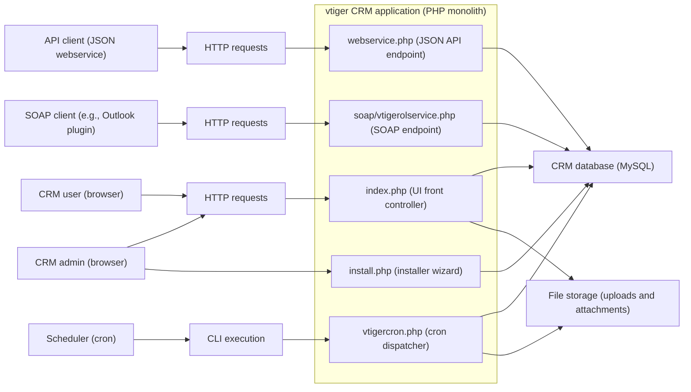
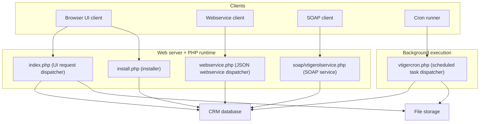
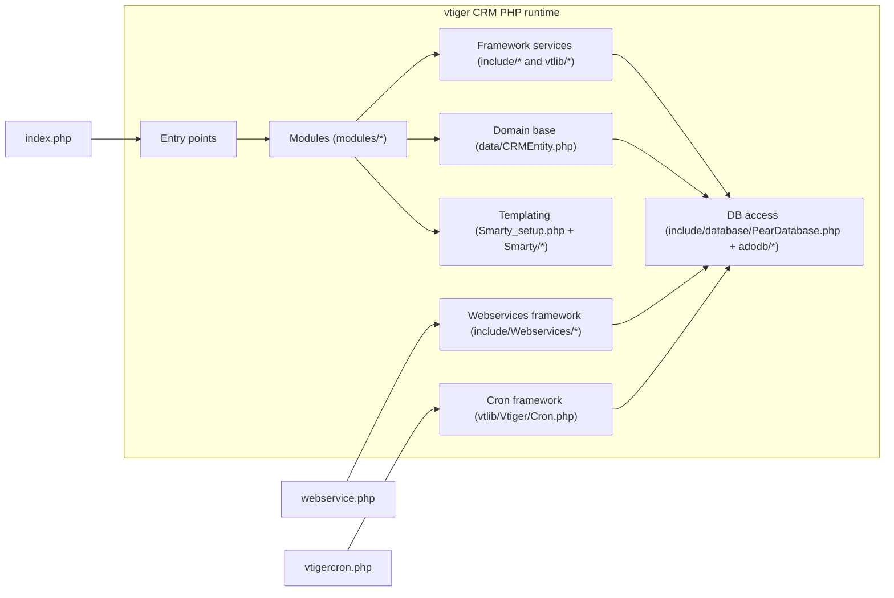
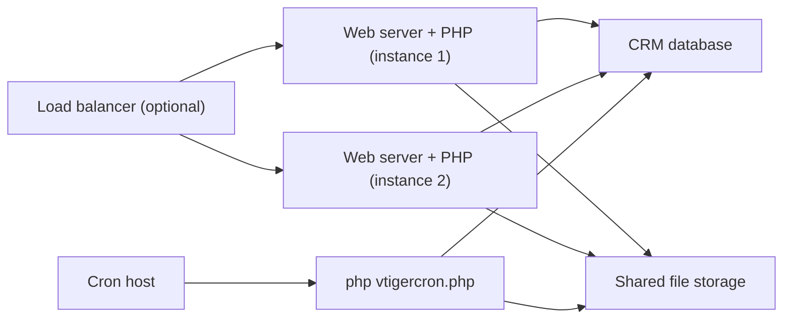
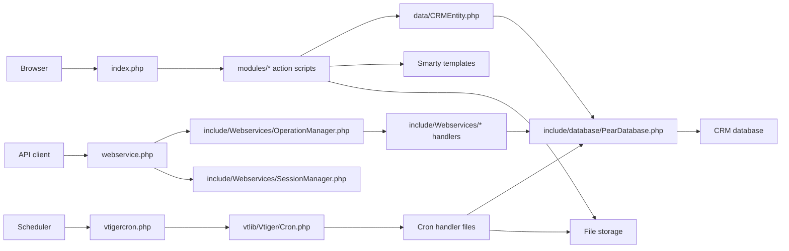

# vtiger CRM (v5.4.0) — High-Level Design (HLD)

## Overview
This document provides a high-level design for the vtiger CRM v5.4.0 codebase in this repository. The system is a server-rendered, monolithic PHP web application that is typically hosted behind a PHP-capable web server and persists CRM data in a relational database (commonly MySQL). Its primary interactive entrypoint is `index.php`, which dispatches requests to module action scripts under `modules/<ModuleName>/...`. In addition to the browser UI, the system exposes a JSON webservice endpoint (`webservice.php`) and executes scheduled/background tasks via a cron dispatcher (`vtigercron.php`) and additional scripts under `cron/`. Initial installation and setup are handled by `install.php` and files under `install/`.

The “done” state for this HLD is a code-backed description of how requests enter the system, which major subsystems participate in handling them, where data is stored, and what the main integration surfaces are (UI, JSON webservices, and legacy SOAP).

## Architecture Diagram
The following diagrams visualize the main architectural views of the system. Each diagram is accompanied by a short explanation and uses names that correspond to concrete entrypoint and framework files in this repository such as `index.php`, `webservice.php`, `vtigercron.php`, `include/database/PearDatabase.php`, and `data/CRMEntity.php`.

### Context Diagram (System Boundary and External Actors)
This diagram shows the system boundary around the vtiger CRM PHP application and the primary external actors and systems it interacts with.

In concrete terms, the web UI is served through `index.php`, API clients call `webservice.php` (which dispatches to handlers under `include/Webservices/`), SOAP clients call `soap/vtigerolservice.php` (built on NuSOAP in `include/nusoap/`), and background jobs are executed by invoking `vtigercron.php`.

### Container Diagram (Runtime Units / Execution Modes)
This diagram highlights the system’s major runtime units. Although vtiger is a monolith, it has multiple entrypoints that represent distinct execution modes.

The container view is intentionally simple: the application is deployed as a single codebase, with different entry scripts selected based on the request type. For example, `webservice.php` uses `include/Webservices/OperationManager.php` and `include/Webservices/SessionManager.php` to route operations and enforce session rules, while `vtigercron.php` uses `vtlib/Vtiger/Cron.php` to discover and run registered tasks.

### Component Diagram (Major Subsystems Inside the Monolith)
This diagram decomposes the monolith into major subsystems that are visible in the repository layout and are used across most flows.

This component view reflects the way `index.php` includes module action scripts under `modules/<ModuleName>/<Action>.php`, modules typically operate through entity classes that extend `CRMEntity` (defined in `data/CRMEntity.php`), and nearly all persistence is mediated through the `$adb` database object provided by `include/database/PearDatabase.php`. UI rendering uses a vtiger-specific Smarty subclass `vtigerCRM_Smarty` (declared in `Smarty_setup.php`) and templates under `Smarty/templates/`.

### Deployment Topology (Typical Production Layout)
This diagram illustrates a common deployment model for vtiger CRM. Exact web server configuration is not defined in the examined sources, but the runtime model implied by the code is a standard PHP web deployment with a shared database and shared file storage.

Horizontal scaling is typically achieved by adding more PHP web instances behind a load balancer. Because attachments and uploads are written to the filesystem, a shared storage mechanism is commonly required in multi-node deployments.

## Core Components
The system’s core components can be traced directly to specific top-level scripts and shared libraries.

The web UI front controller is `index.php`. It starts sessions, checks installation state by looking for `config.inc.php`, validates database configuration, checks the installed database version against the code version (`vtigerversion.php` and the `vtiger_version` table), and then dispatches execution by including a module action script such as `modules/<Module>/<Action>.php`. It also implements several request hardening checks, including module/action validation to reduce path traversal risks, and it enforces access control through permission checks before loading module code.

The module layer under `modules/` contains the business features of the CRM (Accounts, Contacts, Leads, Calendar, Documents, Reports, Settings, and others). Modules are typically implemented using a combination of action scripts (controller-like scripts such as `ListView.php`, `DetailView.php`, `Save.php`, and `*Ajax.php`) and module entity classes that extend the platform’s base entity type. That shared entity base is defined in `data/CRMEntity.php`, which implements common CRUD, relationship management, access-control query helpers, file upload support, and event hooks.

Database access is centralized through `include/database/PearDatabase.php`, which wraps ADODB (`adodb/adodb.inc.php`) and exposes common query APIs such as `query()` and `pquery()` (prepared queries). This shared `$adb` object is used throughout UI flows, webservice handlers, and cron scripts.

The JSON webservice entrypoint `webservice.php` is implemented as a dispatcher that reads an `operation` parameter, starts or adopts a session using `include/Webservices/SessionManager.php`, and resolves operation metadata and handler includes via `include/Webservices/OperationManager.php`. The helper functions that support entity discovery, ID composition, translations, and operation registration are provided by `include/Webservices/Utils.php`. Together, these files implement a metadata-driven webservice layer where the dispatcher is stable and operations are resolved dynamically.

Scheduled/background execution is driven by `vtigercron.php` and the cron framework `vtlib/Vtiger/Cron.php`. The cron framework provides APIs for registering tasks, listing active tasks, and tracking task state and execution metadata (for example, last start/end timestamps). The cron dispatcher loads handler files for each runnable task, executes them, and updates status.

Templating is done using Smarty and a vtiger-specific wrapper class `vtigerCRM_Smarty` defined in `Smarty_setup.php`. UI scripts assign variables and render templates from `Smarty/templates/` and theme assets under `themes/`.

The system also includes a legacy SOAP integration surface in `soap/vtigerolservice.php`, which uses NuSOAP (`include/nusoap/nusoap.php`) to define a SOAP server and register SOAP operations. This is distinct from the JSON webservice endpoint and is commonly associated with older client integrations.

## Data Flow
The core system behaviors can be understood through three primary flows: interactive UI requests, JSON webservice API requests, and scheduled cron executions.

For interactive UI requests, a browser sends an HTTP request containing `module` and `action` parameters to `index.php`. The front controller starts a session, validates request parameters, checks authentication, and determines which module action script to include (for example, `modules/Contacts/DetailView.php`). The action script and related module code read and write CRM data through the `$adb` database layer (via `include/database/PearDatabase.php`) and typically render responses via Smarty templates (using `Smarty_setup.php` and `Smarty/templates/...`).

For JSON webservice requests, a client sends an HTTP request to `webservice.php` with `operation=<name>` and operation-specific parameters. `webservice.php` creates an `OperationManager` to load operation details and operation parameters, and it uses `SessionManager` to start or adopt a session. After sanitizing operation input, it loads the operation’s required include files and executes the handler, returning JSON output wrapped in a consistent success/error state object (implemented in `include/Webservices/State.php`, used by `webservice.php`).

For scheduled execution, an external scheduler invokes `php vtigercron.php` (CLI). The script discovers enabled cron tasks using `Vtiger_Cron::listAllActiveInstances()` (from `vtlib/Vtiger/Cron.php`) and then runs each runnable task by requiring the handler file defined for that task. Tasks typically read/write the database and may also access the filesystem for attachments and exports.

### Dataflow Diagram (UI, Webservice, Cron)
This diagram summarizes how data moves through the main execution modes and where it is persisted.

## Integration Points
vtiger CRM integrates with several external-facing interfaces and bundled subsystems.

The primary integration surface for modern API usage is the JSON webservice endpoint `webservice.php`. It supports multiple operations resolved dynamically through the webservice framework (`include/Webservices/*`). These operations interact with standard CRM modules and the shared database.

A second, legacy integration surface is the SOAP endpoint implemented in `soap/vtigerolservice.php`. This script uses NuSOAP (`include/nusoap/nusoap.php`) to run a SOAP server and register SOAP functions for contact, task, and calendar synchronization scenarios. This endpoint uses the same database and module/entity layer as the UI.

The system persists data in a relational database accessed through `include/database/PearDatabase.php` (ADODB-backed). The schema is not described in this document, but the code explicitly relies on tables such as `vtiger_version` (used in `index.php` version checks) and cron/webservice metadata tables (used by `vtlib/Vtiger/Cron.php` and `include/Webservices/OperationManager.php`).

The application also interacts with the filesystem for uploaded files and attachments. This is visible in the UI dispatcher which has special handling for document downloads (for example, `index.php` routes `Documents` + `DownloadFile` to `modules/Documents/DownloadFile.php`), and in the `CRMEntity` base class which includes file upload and attachment persistence methods.

## Technology Stack
The technology choices are evident from bundled libraries and the code’s core dependencies.

The server-side runtime is PHP, with entrypoints such as `index.php`, `install.php`, `webservice.php`, and `vtigercron.php`. Database access uses ADODB via `include/database/PearDatabase.php` and the `adodb/` library. Server-rendered UI is built using Smarty templates and a vtiger-specific Smarty subclass defined in `Smarty_setup.php`. The JSON webservice stack uses Zend JSON (`include/Zend/Json.php`) as part of the `OperationManager` encode/decode workflow. SOAP integration uses NuSOAP (`include/nusoap/`). Logging is implemented using log4php, referenced by `include/logging.php` and used by entrypoints such as `index.php` and `webservice.php`. The repository also includes client-facing libraries such as CKEditor (`include/ckeditor/`), sanitization tooling such as HTMLPurifier (`include/htmlpurifier/`), and PDF tooling such as TCPDF (`tcpdf/`), which support common CRM functionality.

## Key Design Decisions
The codebase reflects a set of architectural decisions that shape how features are implemented and extended.

The system uses a front-controller style UI dispatcher (`index.php`) that routes to module action scripts by constructing a path like `modules/<Module>/<Action>.php` and including it. This keeps routing simple and convention-based, but it tightly couples URL parameters to filesystem structure, which is why `index.php` also contains explicit module/action validation logic.

The system centralizes common behavior in shared layers rather than duplicating per-module patterns. `data/CRMEntity.php` provides a unified base for module entity classes, and `include/database/PearDatabase.php` centralizes database connections and query behavior behind a shared `$adb` handle used across the entire monolith.

The JSON webservice design is metadata-driven. `webservice.php` delegates operation resolution to `include/Webservices/OperationManager.php`, which loads operation configuration and parameters from the database and dynamically includes handler code. This allows extending the webservice surface through registration mechanisms (supported by helper functions in `include/Webservices/Utils.php`) without changing the dispatcher’s main control flow.

Cron scheduling is similarly centralized and registry-driven. `vtigercron.php` runs tasks registered in the cron framework (`vtlib/Vtiger/Cron.php`), which tracks task status and last-run metadata and provides enable/disable controls.

## Scalability & Performance
vtiger CRM is designed as a single PHP application and is typically scaled by running multiple PHP worker processes (or multiple web nodes) behind a load balancer while sharing a single database and shared file storage.

Performance tuning is supported via configuration flags in `config.performance.php`. This file includes toggles that influence behavior such as list view page count computation and whether to skip per-query charset initialization when the database is already UTF-8. At the database layer, `include/database/PearDatabase.php` includes mechanisms that can reduce repeated work, such as query result caching for suitable queries, and it provides a structured way to execute prepared statements via `pquery()`.

The repository sources reviewed do not include web server or PHP process manager configuration, so the exact recommended process model and caching strategy at the HTTP layer are not available from current sources. Operationally, those concerns would typically be implemented in Apache/Nginx/PHP-FPM configuration outside the application code.

## Security Considerations
Security controls are implemented at multiple layers, with the most visible ones being request validation, authentication enforcement, and permission checks.

The UI dispatcher `index.php` performs explicit validation of the requested `module` and `action` before including module code. It checks that the requested module exists under `modules/` and that the action script exists within that module, and it rejects module names containing path separator characters. It also validates that record identifiers are numeric in relevant cases. After authentication, it enforces authorization through `isPermitted()` checks before allowing module code execution.

The JSON webservice endpoint `webservice.php` enforces session-based access through `include/Webservices/SessionManager.php`. It requires a valid session for operations that are not designated as pre-login operations, and it returns consistent error responses when authentication is missing or invalid.

Cron execution via `vtigercron.php` includes an access gate that allows execution when running under CLI (`PHP_SAPI === "cli"`) or when invoked in an authenticated session that matches the application unique key. This reduces the risk of unauthorized remote execution of scheduled tasks.

Finally, the codebase relies on shared sanitization and security utilities (for example, `vtlib_purify()` used by `index.php`) to reduce injection and XSS risk in request handling. A comprehensive security review would additionally inspect upload handlers, webservice handler permission enforcement, and configuration secret handling in `config.inc.php`, but those details are outside the specific files analyzed for this HLD.
