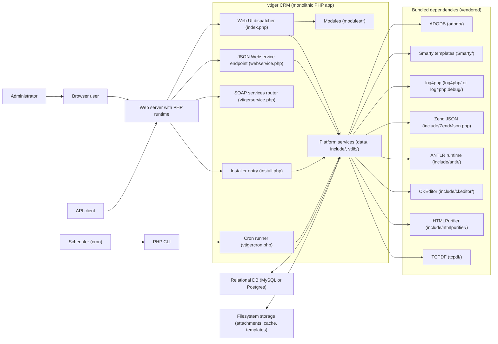
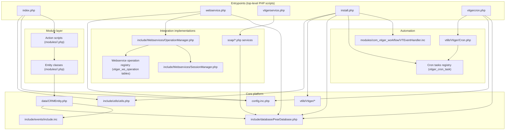
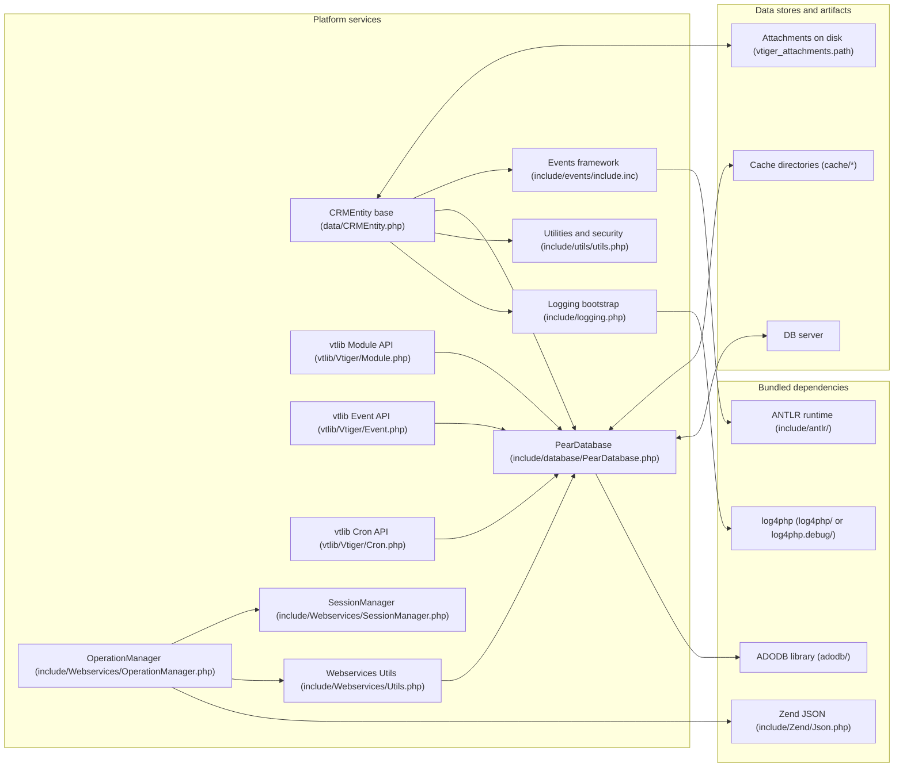
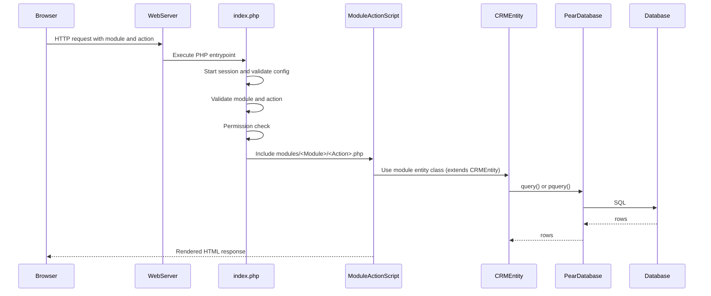
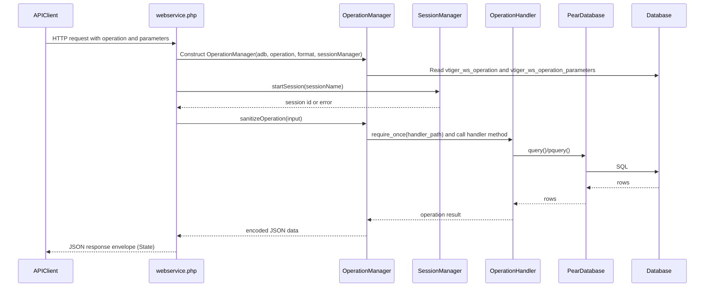
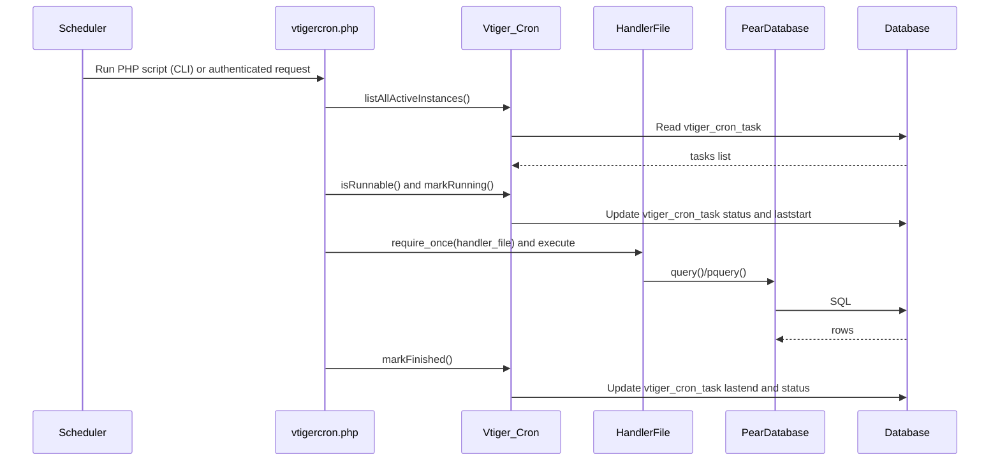
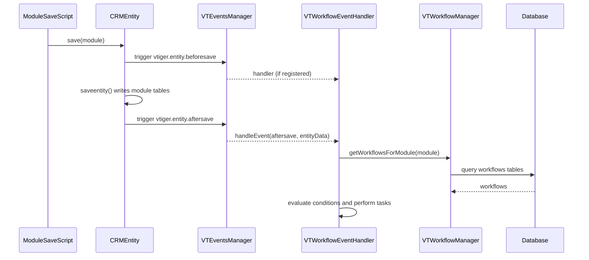

# Knowledge Graph

## 1. Purpose and scope

This document provides a repository-wide knowledge graph for the vtiger CRM v5.4.0 codebase in this repository. The intent is to map the major subsystems, the most important nodes (runtime entrypoints, shared services, module layer, and storage), and the key edges (includes/calls/reads-writes/registration) that connect them.

This is not a per-file call graph. The repository contains thousands of PHP files (especially under `modules/` and `include/`), so the graph is organized as a subsystem graph. Where the codebase uses dynamic dispatch (for example, `index.php` including `modules/<Module>/<Action>.php`), the graph models that dispatch as a structured edge rather than enumerating every possible included file.

## 2. Conventions (nodes and edges)

Nodes are grouped by major subsystems. Each node represents one of the following.

A node can be:
1. A runtime entrypoint script (for example, `index.php`).
2. A shared platform/library component (for example, `data/CRMEntity.php` or `include/database/PearDatabase.php`).
3. A module family (for example, “Business modules (modules/*)”).
4. A database concept (for example, “MySQL DB” or “vtiger_ws_operation tables”).
5. A filesystem storage concept (for example, `storage/`, `cache/upload/`).

Edges use consistent verbs:
1. “includes” indicates PHP `include`/`require_once` usage.
2. “dispatches to” indicates dynamic routing to a file path constructed at runtime.
3. “reads/writes” indicates database IO via `$adb` (PearDatabase) or direct SQL.
4. “registers” indicates runtime registration in DB (for example, cron tasks or event handlers).
5. “triggers” indicates the vtiger event framework invoking handlers (for example, workflow event handling).

## 3. Major subsystems (grouped overview)

The repository can be usefully partitioned into these subsystems.

### 3.1 Runtime entrypoints (HTTP / CLI / install)

The system has multiple “front doors” that start a request or job and then converge on shared framework services and the same database.
1. `index.php` is the primary web UI dispatcher.
2. `webservice.php` is the JSON webservice endpoint driven by DB-registered operations.
3. `vtigerservice.php` is the SOAP services endpoint router (includes `soap/*.php` based on `service` parameter).
4. `install.php` is the installer wizard dispatcher (includes `install/<step>.php` files).
5. `vtigercron.php` is the cron runner for DB-registered tasks.

### 3.2 Shared platform services (“vtiger platform layer”)

The shared platform layer is what modules and entrypoints reuse.
1. Core entity model base: `data/CRMEntity.php` (CRUD, attachments, relations, event triggers, access-control join helpers).
2. Database abstraction: `include/database/PearDatabase.php` (wraps ADODB from `adodb/` and provides `query`, `pquery`, caching toggles, charset setup).
3. Utilities and security: `include/utils/utils.php` (pulled in by `index.php` and `data/CRMEntity.php`; provides common helpers, sanitization, and file access checking functions referenced throughout).
4. Events framework: `include/events/include.inc` and related classes (antlr-based condition parsing and handler registration/execution).
5. vtlib extension APIs: `vtlib/Vtiger/*` (module management, webservice enablement, event registration helper, cron task registry).

### 3.3 Module layer (business and settings modules)

The module layer lives under `modules/` and is invoked by entrypoints (mostly by `index.php`).
1. Module “entity classes” typically extend `CRMEntity` (for example `modules/Leads/Leads.php`, `modules/Users/Users.php`).
2. Module “action scripts” implement controller-like behaviors (for example `DetailView.php`, `EditView.php`, `Save.php`, `*Ajax.php`).
3. Cross-module relationships are managed via generic relation tables (for example `vtiger_crmentityrel`) and module-specific relation tables (for example `vtiger_seproductsrel`, `vtiger_campaignleadrel` as seen in `modules/Leads/Leads.php`).

### 3.4 Automation (events, workflows, cron)

Automation is implemented through three main mechanisms.
1. The vtiger event bus triggers handlers during `CRMEntity::save()` (`vtiger.entity.beforesave.*`, `vtiger.entity.aftersave.*`).
2. The workflow engine (`modules/com_vtiger_workflow/VTEventHandler.inc`) evaluates workflow conditions and performs tasks when events occur.
3. Scheduled background jobs are executed via `vtigercron.php` and `vtlib/Vtiger/Cron.php` based on the DB table `vtiger_cron_task`. Install-time registration of cron tasks is performed in `install/CreateTables.inc.php`.

### 3.5 Integration endpoints (webservice JSON + SOAP)

Integration is surfaced through:
1. JSON webservices: `webservice.php` + `include/Webservices/*` using DB-described operations and session management.
2. SOAP services: `vtigerservice.php` includes specific SOAP server scripts under `soap/` based on the `service` request parameter.

### 3.6 Storage and assets

The application uses:
1. A relational DB for system state and CRM records.
2. Filesystem storage for attachments (via `vtiger_attachments.path` and disk writes in `CRMEntity::uploadAndSaveFile()`).
3. UI templates and assets: Smarty templates under `Smarty/` and themes under `themes/`.
4. Bundled third-party libs: `adodb/`, `Smarty/`, `include/ckeditor/`, `include/htmlpurifier/`, `include/tcpdf/`, `log4php/` and `log4php.debug/`.

## 4. System context knowledge graph (actors and external dependencies)

This diagram shows the system boundary (“vtiger CRM monolith”) and the most visible external actors and dependencies. It also calls out bundled third-party libraries as “external dependencies” from the point of view of the vtiger application code, even though they are vendored into the repository.

The dominant pattern is that all external interactions (UI, API, background jobs) converge on the same “platform layer” and the same database and filesystem.

## 5. Runtime entrypoints graph (how requests and jobs enter the system)

This diagram enumerates the repository’s primary entrypoints and shows which platform mechanisms they use.

This graph is driven directly by the entrypoint scripts:
1. `index.php` requires `include/utils/utils.php`, checks config, and then dynamically includes `modules/<module>/<action>.php`.
2. `webservice.php` uses `OperationManager` to look up operation metadata in DB tables and starts sessions using `SessionManager`.
3. `vtigercron.php` enumerates DB-configured tasks via `Vtiger_Cron` and includes task handler files at runtime.
4. `install.php` chooses install step files under `install/` and delegates install-time schema and metadata creation to `install/CreateTables.inc.php`.

## 6. Subsystem knowledge graph (platform services and their dependencies)

This diagram shows the “platform core” decomposition and highlights how the database and eventing mechanisms are central to most subsystems.

Key facts evidenced by code:
1. `CRMEntity` is the module model base and triggers events on save via `VTEventsManager` (`CRMEntity::save()` requires `include/events/include.inc`).
2. `PearDatabase` wraps ADODB and is the core DB API used throughout (`PearDatabase::getInstance()` returns global `$adb`).
3. Logging is log4php-based (`include/logging.php` selects `log4php` or `log4php.debug` and configures via `log4php.properties`).
4. Webservice operation execution is mediated by `OperationManager` and stored metadata in DB.

## 7. Key end-to-end flows as sequence graphs

### 7.1 Web UI request dispatch (index.php to module action)

This sequence models the “happy path” for a browser request that renders a module page.

Evidence anchors:
1. Dispatch: `index.php` builds `modules/$module/$action.php` and includes it after module/action checks.
2. Entity instantiation: `index.php` uses `CRMEntity::getInstance($currentModule)` for DetailView tracking and modules do similar patterns.
3. DB: modules and base classes use `$adb = PearDatabase::getInstance()` or the global `$adb`.

### 7.2 JSON Webservice request execution (webservice.php + OperationManager)

This sequence models how `webservice.php` resolves an operation from DB metadata and runs it.

Evidence anchors:
1. DB-driven operation lookup: `OperationManager::fillOperationDetails()` queries `vtiger_ws_operation` and `vtiger_ws_operation_parameters`.
2. Session management: `SessionManager` uses `HTTP_Session` and enforces expiry/idle rules.
3. Webservice helper library: `include/Webservices/Utils.php` is loaded and used to resolve entity IDs and other helpers.

### 7.3 Cron task execution (vtigercron.php + vtlib Cron registry)

This sequence models the scheduled job runner.

Evidence anchors:
1. `vtigercron.php` loads `vtlib/Vtiger/Cron.php`, iterates tasks, includes handler file, marks running/finished.
2. `vtlib/Vtiger/Cron.php` defines schema initialization and registry in `vtiger_cron_task`.

### 7.4 Event-driven workflow execution (CRMEntity save -> VTWorkflowEventHandler)

This sequence shows how CRM entity saves cause the workflow engine to evaluate workflows and run tasks.

Evidence anchors:
1. `CRMEntity::save()` triggers events in `data/CRMEntity.php`.
2. Install-time event registration in `install/CreateTables.inc.php` registers `VTWorkflowEventHandler` for `vtiger.entity.aftersave`.
3. `VTWorkflowEventHandler` loads webservice utilities and workflow manager classes and performs workflow evaluation and tasks.

## 8. Database-centric nodes (tables as graph anchors)

Even though vtiger has a large schema, some tables are architectural “routing tables” because they control dynamic behavior. These are the most important for understanding system-level flows.

### 8.1 “Meta” tables that drive dynamic behavior

1. `vtiger_version` is queried by `index.php` to ensure the DB version matches the code version.
2. `vtiger_ws_operation` and `vtiger_ws_operation_parameters` are used by `OperationManager` to resolve webservice operations.
3. `vtiger_ws_entity` and related metadata tables are used by webservice utilities (`include/Webservices/Utils.php`) to map module/entity types to handlers and IDs.
4. `vtiger_cron_task` is used by the cron subsystem (`vtlib/Vtiger/Cron.php` and `vtigercron.php`) to list and execute tasks.
5. `vtiger_eventhandlers` and `vtiger_eventhandler_module` are used by the event subsystem (see `vtlib/Vtiger/Event.php`) to register and enumerate event handlers.
6. `vtiger_relatedlists` is used by vtlib module relationship management (`vtlib/Vtiger/Module.php`) to define “related list” UI relationships between modules.

### 8.2 Core entity tables (cross-module linkage)

1. `vtiger_crmentity` is the central table that stores cross-module metadata such as ownership (`smownerid`), deleted flag, timestamps, and setype.
2. `vtiger_crmentityrel` is a generic relation table used by `CRMEntity::save_related_module()` and related-list implementations.
3. Attachment linkage is stored via `vtiger_attachments` and relation table `vtiger_seattachmentsrel`. File data itself is stored on disk; DB stores metadata including the path.

## 9. Subsystem adjacency lists (textual knowledge graph)

This section provides a compact “who depends on whom” list, grouped by subsystem. It is a useful complement to diagrams when you need a quick lookup.

### 9.1 Entrypoints

`index.php`
includes `include/utils/utils.php`, `config.inc.php`, `include/logging.php`, `modules/Users/Users.php`.
reads/writes `vtiger_version` (version check).
dispatches to `modules/<Module>/<Action>.php` (dynamic include).
invokes permission checks (`isPermitted`) before executing module action.

`install.php`
includes `include/install/resources/utils.php`, `vtigerversion.php`.
dispatches to `install/<step>.php` via `Common_Install_Wizard_Utils::checkFileAccessForInclusion`.

`vtigercron.php`
includes `vtlib/Vtiger/Cron.php`, `config.inc.php`.
reads/writes `vtiger_cron_task`.
includes handler files from `vtiger_cron_task.handler_file`.

`webservice.php`
includes `config.inc.php`, `include/Webservices/Utils.php`, `include/Webservices/OperationManager.php`, `include/Webservices/SessionManager.php`, `include/Zend/Json.php`.
reads/writes `vtiger_ws_operation`, `vtiger_ws_operation_parameters`.
loads operation handler path from DB and invokes it.

`vtigerservice.php`
includes `soap/*.php` based on `service` request parameter.

### 9.2 Platform layer

`data/CRMEntity.php`
includes `include/logging.php`, `include/utils/utils.php`, `include/utils/UserInfoUtil.php`, `include/events/include.inc`, `include/Zend/Json.php`.
reads/writes module tables listed in `$this->tab_name`.
reads/writes `vtiger_crmentity`, `vtiger_crmentityrel`, attachment tables.
triggers events via `VTEventsManager` during save and delete flows.

`include/database/PearDatabase.php`
includes `adodb/adodb.inc.php`.
provides `query`, `pquery`, `num_rows`, `query_result` and optional caching.
connects using values from `config.inc.php` (via global `$dbconfig` when constructed without explicit params).

`include/logging.php`
chooses between `log4php/` and `log4php.debug/` based on `config.performance.php`.
configures log4php via `log4php.properties`.

`vtlib/Vtiger/Module.php`
reads/writes module metadata tables such as `vtiger_tab` and relationship tables such as `vtiger_relatedlists`.
supports adding custom links and initializing webservice support (`Vtiger_Webservice::initialize`).

`vtlib/Vtiger/Cron.php`
reads/writes `vtiger_cron_task`, can create the table if missing.
registers/deregisters tasks.

`vtlib/Vtiger/Event.php`
registers handlers via `VTEventsManager`, queries `vtiger_eventhandlers` and module mapping tables.

### 9.3 Automation

`modules/com_vtiger_workflow/VTEventHandler.inc`
depends on events framework (`VTEventHandler`), workflow manager classes, and Webservices utilities.
evaluates workflows and performs tasks on save events.

Install-time automation registration (`install/CreateTables.inc.php`)
registers cron tasks (`Vtiger_Cron::register`).
registers event handlers via `VTEventsManager->registerHandler`, including workflow handler.

### 9.4 Modules (representative examples)

`modules/Users/Users.php`
extends `CRMEntity`.
uses `PearDatabase`, `include/Webservices/Utils.php` for generating access keys and ownership transfer.
reads/writes `vtiger_users` and related tables and writes “privileges flat files” (via `modules/Users/CreateUserPrivilegeFile.php`).

`modules/Leads/Leads.php`
extends `CRMEntity`.
implements module-specific related-list functions for Activities, Campaigns, Emails, Products.
uses module-specific relation tables such as `vtiger_seproductsrel` and `vtiger_campaignleadrel`.

## 10. Sources (evidence trail)

This knowledge graph is grounded in the following repository sources.

### 10.1 Runtime entrypoints

1. `index.php`
2. `install.php`
3. `vtigercron.php`
4. `webservice.php`
5. `vtigerservice.php`

### 10.2 Core platform components

1. `data/CRMEntity.php`
2. `include/database/PearDatabase.php`
3. `include/logging.php`
4. `include/utils/utils.php`
5. `vtlib/Vtiger/Module.php`
6. `vtlib/Vtiger/Cron.php`
7. `vtlib/Vtiger/Webservice.php`
8. `vtlib/Vtiger/Event.php`

### 10.3 Webservice stack

1. `include/Webservices/Utils.php`
2. `include/Webservices/OperationManager.php`
3. `include/Webservices/SessionManager.php`

### 10.4 Automation stack (events + workflows)

1. `include/events/include.inc`
2. `modules/com_vtiger_workflow/VTEventHandler.inc`

### 10.5 Install-time initialization

1. `install/CreateTables.inc.php`
2. `include/install/resources/utils.php`
3. `config.template.php`

### 10.6 Supporting repository docs used for alignment

1. `Docs/VTigerCRM-Architecture-Overview.md`
2. `Docs/VTigerCRM-Modules-MindMap.md`
