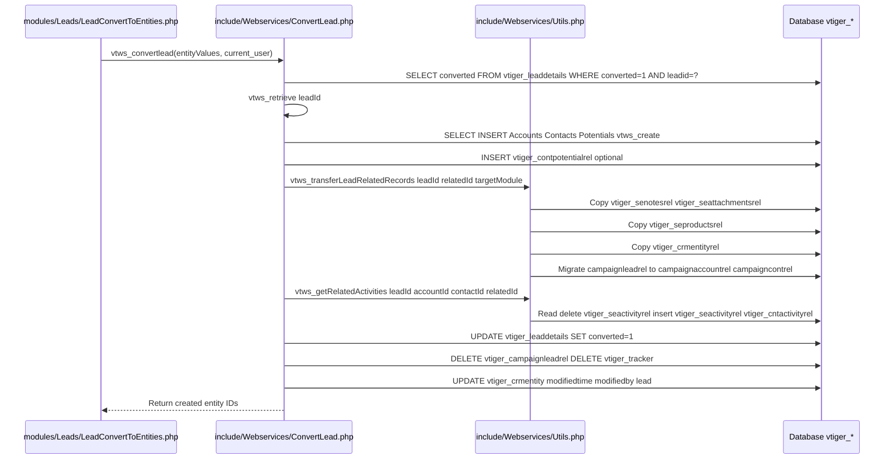
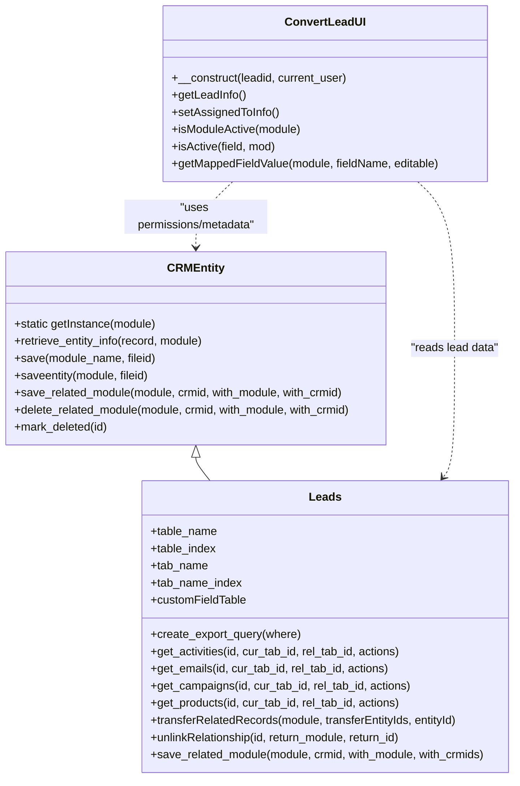

# Leads Module Low-Level Design (LLD) — vtiger CRM 5.4.x (code-grounded)

## 1. Purpose and scope

This document provides a low-level design for the **Leads** module as implemented in this repository. It describes the concrete PHP classes and request-entry scripts, their responsibilities, key methods, database interactions, and the internal workflows for CRUD operations, related lists, duplicate merge, mass edit, and lead conversion (including mapping and related-record transfer).

The design statements below are grounded in the referenced repository files. Where the runtime behavior depends on shared framework functions (for example `DeleteEntity`, `relateEntities`, vtiger Events, or vtiger Webservices), this document describes the integration points and the call chains used by the Leads module code.

## 2. Module structure in the repository

In this codebase, a “module” is typically implemented using:

1. A module entity class extending `CRMEntity` (data model + related list APIs).
2. A set of request entry scripts under `modules/<ModuleName>/` that are invoked via `index.php?module=<ModuleName>&action=<ActionName>`.
3. Shared vtiger framework code that provides generic list/edit/detail behaviors, permission checks, event/workflow triggering, and database abstraction.

For Leads, the key files are:

- Entity model:
  - `modules/Leads/Leads.php`
- CRUD / UI entry scripts:
  - `modules/Leads/EditView.php`
  - `modules/Leads/Save.php`
  - `modules/Leads/DetailView.php`
  - `modules/Leads/ListView.php` (delegates to generic Vtiger ListView)
  - `modules/Leads/Delete.php`
  - `modules/Leads/MassEditSave.php`
- Lead conversion UI + handler:
  - `modules/Leads/ConvertLead.php` (renders conversion UI)
  - `modules/Leads/ConvertLeadUI.php` (server-side UI helper class)
  - `modules/Leads/LeadConvertToEntities.php` (submits conversion via webservice API)
  - `modules/Leads/Leads.js` (client-side conversion validation and UI helpers)
- Related list linking:
  - `modules/Leads/updateRelations.php`
- Duplicate merge:
  - `modules/Leads/ProcessDuplicates.php`
- Dashboard “New Leads” widget:
  - `modules/Leads/ListViewTop.php`
- Lead conversion core (webservice):
  - `include/Webservices/ConvertLead.php`
  - `include/Webservices/Utils.php`
- Conversion mapping configuration (Settings):
  - `modules/Settings/LeadCustomFieldMapping.php`
  - `modules/Settings/SaveConvertLead.php`
- Framework base entity (save/retrieve/delete/event triggering):
  - `data/CRMEntity.php`

## 3. Core classes and responsibilities

### 3.1 `CRMEntity` (framework base class)

`data/CRMEntity.php` defines the base persistence and event pipeline for entity modules, including Leads.

The Leads module relies on these behaviors:

1. `CRMEntity::getInstance($module)` loads `modules/<Module>/<Class>.php` and instantiates the module class (for Leads, class `Leads`).
2. `CRMEntity::retrieve_entity_info($record, $module)` loads values from each table in the module’s `$tab_name_index`.
3. `CRMEntity::save($module_name, $fileid='')` triggers vtiger events and then delegates to `saveentity(...)`.
4. `CRMEntity::saveentity($module, $fileid='')` performs a transaction and persists rows into:
   - `vtiger_crmentity` via `insertIntoCrmEntity(...)`
   - Each module table in `$tab_name` via `insertIntoEntityTable(...)`
   - Then calls the module override `save_module($module)`.

The Leads class does not add module-specific persistence in `save_module`, but it still gets the standard vtiger save transaction and event triggers.

### 3.2 `Leads extends CRMEntity` (module entity class)

`modules/Leads/Leads.php` defines the Leads entity. The class primarily specifies metadata (tables, list/search fields) and provides related list and relationship-handling overrides.

#### 3.2.1 Data/table metadata

The following class members determine persistence and retrieval:

- `$table_name = "vtiger_leaddetails"`
- `$table_index = "leadid"`
- `$tab_name = ['vtiger_crmentity','vtiger_leaddetails','vtiger_leadsubdetails','vtiger_leadaddress','vtiger_leadscf']`
- `$tab_name_index = [ ... ]` mapping each table to its PK:
  - `vtiger_crmentity => crmid`
  - `vtiger_leaddetails => leadid`
  - `vtiger_leadsubdetails => leadsubscriptionid`
  - `vtiger_leadaddress => leadaddressid`
  - `vtiger_leadscf => leadid`
- `$customFieldTable = ['vtiger_leadscf', 'leadid']`

The constructor initializes:

- `$this->db = PearDatabase::getInstance()`
- `$this->column_fields = getColumnFields('Leads')`

This means Leads inherits the generic `CRMEntity::insertIntoEntityTable()` behavior; vtiger’s field metadata (`vtiger_field`) determines which request fields are persisted into which tables.

#### 3.2.2 List/search configuration

The class defines list fields and their tables:

- List fields include `lastname`, `firstname`, `company`, `phone`, `website`, `email`, and ownership via `vtiger_crmentity.smownerid`.
- Default sort: `$default_order_by = 'lastname'`, `$default_sort_order = 'ASC'`.
- Basic search column: `$def_basicsearch_col = 'lastname'`.

These definitions are used by shared ListView logic (`modules/Vtiger/ListView.php`).

#### 3.2.3 Key overridden behaviors and module-specific APIs

Although many operations are generic, Leads overrides certain relationship behaviors:

1. `create_export_query($where)` generates module-specific export SQL that:
   - Uses permitted field list (`getPermittedFieldsQuery`)
   - Joins the lead tables and ownership tables
   - Enforces `vtiger_crmentity.deleted=0 AND vtiger_leaddetails.converted=0`
   - Adds non-admin access control via `getNonAdminAccessControlQuery('Leads', $current_user)`

2. Related list providers (used by vtiger related lists UI):
   - `get_activities($id, ...)` queries `vtiger_seactivityrel`/`vtiger_activity` and returns open tasks/events (excludes Completed/Deferred/Held, excludes Emails for this list).
   - `get_history($id)` queries historical activities for completed/held/deferred.
   - `get_campaigns($id, ...)` uses `vtiger_campaignleadrel` to list campaigns associated with a lead.
   - `get_emails($id, ...)` queries activities of type `Emails` related via `vtiger_seactivityrel`.
   - `get_products($id, ...)` uses `vtiger_seproductsrel` with `setype='Leads'`.

3. Relationship persistence overrides:
   - `save_related_module($module, $crmid, $with_module, $with_crmids)`:
     - For `Products`, inserts into `vtiger_seproductsrel (crmid, productid, setype)`
     - For `Campaigns`, inserts into `vtiger_campaignleadrel (campaignid, leadid, campaignrelstatusid)` with default status `1`
     - Otherwise delegates to `CRMEntity::save_related_module` (typically `vtiger_crmentityrel` / `vtiger_senotesrel` for Documents)

4. Relationship unlinking override:
   - `unlinkRelationship($id, $return_module, $return_id)`:
     - For `Campaigns`, deletes from `vtiger_campaignleadrel`
     - For `Products`, deletes from `vtiger_seproductsrel`
     - Otherwise deletes from `vtiger_crmentityrel` in both directions

5. Lead-specific related-record transfer for duplicate merge:
   - `transferRelatedRecords($module, $transferEntityIds, $entityId)` updates the lead-related rows from multiple source leads to a “primary” lead.
   - It covers these relation tables:
     - `vtiger_seactivityrel`, `vtiger_senotesrel`, `vtiger_seattachmentsrel`, `vtiger_seproductsrel`, `vtiger_campaignleadrel`
   - The implementation avoids duplicates by selecting only IDs not already linked to the target lead.

This is used by the merge-duplicates flow (`modules/Leads/ProcessDuplicates.php`).

### 3.3 `ConvertLeadUI` (conversion UI helper)

`modules/Leads/ConvertLeadUI.php` defines a PHP class dedicated to populating and validating data for the Convert Lead UI.

Key responsibilities:

1. Loading lead data needed for conversion UI:
   - Constructor executes:

     - `SELECT * FROM vtiger_leaddetails, vtiger_leadscf, vtiger_crmentity
        WHERE vtiger_leaddetails.leadid=vtiger_leadscf.leadid
          AND vtiger_leaddetails.leadid=vtiger_crmentity.crmid
          AND vtiger_leaddetails.leadid=?`

   - The resulting `$row` is used for default field values in the conversion UI.
   - The class applies field visibility; for example if `company` is not visible, it clears `$row["company"]`.

2. Determining owner (user vs group) defaults:
   - `setAssignedToInfo()` checks the lead’s `vtiger_crmentity.smownerid`:
     - It queries `vtiger_users` to decide whether the owner is a user row; if not found, it treats it as a group owner.
     - It sets UI flags: `userselected/userdisplay` or `groupselected/groupdisplay`.

3. Module and field availability:
   - `isModuleActive($module)` checks `vtlib_isModuleActive($module)` and permission `isPermitted($module, 'EditView')`.
   - `isActive($field, $mod)` checks `vtiger_field` for `presence in (0,2)`.

4. Mapping-based default values:
   - `getMappedFieldValue($module, $fieldName, $editable)`:
     - Resolves target field id using `vtiger_convertleadmapping` and `vtiger_field`.
     - Uses `vtws_describe($module, $current_user)` to determine type and default values.
     - For picklists, it ensures the Lead’s mapped value is a valid picklist option; otherwise it returns the field default.

This class is used in both `modules/Leads/DetailView.php` (to decide convert eligibility) and `modules/Leads/ConvertLead.php` (to render ConvertLead UI).

## 4. Database design and interactions

### 4.1 Primary tables

From `Leads.php` and conversion code, Leads persistence is spread across:

- `vtiger_crmentity`
  - Common entity record: `crmid`, `smownerid`, `smcreatorid`, `deleted`, `createdtime`, `modifiedtime`, `modifiedby`, etc.
- `vtiger_leaddetails` (primary Leads module table)
  - `leadid`
  - business fields like `firstname`, `lastname`, `company`, `email`, `leadstatus`, and the conversion flag `converted`
- `vtiger_leadaddress`
  - `leadaddressid` plus address fields and phone
- `vtiger_leadsubdetails`
  - `leadsubscriptionid` plus secondary details like `website`
- `vtiger_leadscf`
  - custom fields table keyed by `leadid`

The module uses the `converted` flag in multiple places:
- `modules/Leads/ListViewTop.php` enforces `vtiger_leaddetails.converted = 0`
- `modules/Leads/Leads.php::create_export_query()` enforces `vtiger_leaddetails.converted = 0`
- `include/Webservices/ConvertLead.php` checks and then sets `converted = 1` during conversion

### 4.2 Relationship tables used by Leads

Leads interacts with both generic and module-specific relation tables:

- Activities:
  - `vtiger_seactivityrel (crmid, activityid)` links activities/emails to the Lead.
  - `vtiger_cntactivityrel (contactid, activityid)` links activities to a Contact after conversion.
- Documents/Notes:
  - `vtiger_senotesrel (crmid, notesid)`
- Attachments:
  - `vtiger_seattachmentsrel (crmid, attachmentsid)`
- Products:
  - `vtiger_seproductsrel (crmid, productid, setype)`
- Campaigns:
  - `vtiger_campaignleadrel (campaignid, leadid, campaignrelstatusid)`
  - During conversion, campaign relations are moved into:
    - `vtiger_campaignaccountrel (campaignid, accountid)` or
    - `vtiger_campaigncontrel (campaignid, contactid)`
- Generic relations:
  - `vtiger_crmentityrel (crmid, module, relcrmid, relmodule)`

### 4.3 Conversion mapping table

Lead conversion uses:

- `vtiger_convertleadmapping`
  - Columns: `leadfid, accountfid, contactfid, potentialfid, editable` (as used by UI and settings save)
  - The conversion engine reads all rows from this table to map Lead fields into the created Account/Contact/Potential entities.

Settings UI persists mappings by:
- Deleting: `DELETE FROM vtiger_convertleadmapping WHERE editable=1`
- Re-inserting user-provided mappings:
  - `INSERT INTO vtiger_convertleadmapping(leadfid,accountfid,contactfid,potentialfid) VALUES(?,?,?,?)`

(See `modules/Settings/SaveConvertLead.php`.)

## 5. Internal workflows (request-to-DB sequences)

### 5.1 Create/Edit Save workflow (`modules/Leads/Save.php`)

**Entry point**: `index.php?module=Leads&action=Save`

The script performs these steps:

1. Instantiate the entity: `new Leads()`.
2. Set record context:
   - If `$_REQUEST['record']` is set, it sets `$focus->id`.
   - If `$_REQUEST['mode']` is set, it sets `$focus->mode` (usually `'edit'`).
3. Populate `$focus->column_fields`:
   - Iterates over the module’s `column_fields` and assigns request values.
   - Owner assignment:
     - If `assigntype == 'U'`, uses `assigned_user_id`
     - If `assigntype == 'T'`, uses `assigned_group_id`
4. Save:
   - Calls `$focus->save("Leads")`
   - This triggers vtiger events and persists into `vtiger_crmentity` + all module tables listed in `$focus->tab_name`.
5. Special-case: when returning from Campaigns:
   - If `return_module == "Campaigns"` and `return_id` is set, it:
     - Reads existing `campaignrelstatusid` for `(campaignid, leadid)`
     - Deletes existing lead campaign relations for that lead
     - Inserts a new `vtiger_campaignleadrel` row with preserved status or default status `1`
6. Redirect:
   - Redirects back to `return_module/return_action` with list view context params.

#### Notes on custom fields in Save.php

`modules/Leads/Save.php` also contains a `save_customfields($entity_id)` function that writes to legacy tables `customfields` and `leadcf`. However, the main save flow relies on `CRMEntity` + `$customFieldTable = vtiger_leadscf`, and `save_customfields()` is not invoked from `Save.php` in this repository version.

### 5.2 Detail view workflow (`modules/Leads/DetailView.php`)

**Entry point**: `index.php?module=Leads&action=DetailView&record=<id>`

Key steps:

1. Instantiate via `CRMEntity::getInstance($currentModule)` and call:
   - `$focus->retrieve_entity_info(<record>, "Leads")`
2. Build Smarty view model:
   - Uses `getBlocks($currentModule, "detail_view", '', $focus->column_fields)` to compute UI blocks/fields.
   - Assigns `UPDATEINFO` via `updateInfo($focus->id)`.
3. Permission gating:
   - Uses `isPermitted("Leads", "EditView", record)` to show edit/duplicate controls.
   - Uses `isPermitted("Leads", "Delete", record)` to show delete control.
4. Convert Lead gating:
   - Instantiates `ConvertLeadUI($record, $current_user)`.
   - Enables “Convert Lead” button only if:
     - User can edit the Lead and can ConvertLead,
     - User can edit Accounts or Contacts,
     - Accounts/Contacts modules are active,
     - Lead is not converted,
     - And there is enough UI info to proceed (e.g., company present or Contacts active).
5. Email integration:
   - If the user can edit Emails, it:
     - Uses webservice meta (`VtigerWebserviceObject`, `VtigerCRMObjectMeta`) to discover email fields.
     - Builds JS that either opens the internal mailer (`sendmail`) or opens compose (`OpenCompose`) depending on whether email fields are populated.
6. Mark record as viewed:
   - Calls `$focus->markAsViewed($current_user->id)` which updates `vtiger_crmentity.viewedtime` for the owner.

### 5.3 List views

#### 5.3.1 Standard list view

`modules/Leads/ListView.php` delegates to `modules/Vtiger/ListView.php`. The generic list view uses:
- The Leads class list/search metadata
- vtiger field permissions
- sorting and paging helpers from `CRMEntity`

#### 5.3.2 “New Leads” dashboard widget (`modules/Leads/ListViewTop.php`)

The function `getNewLeads($maxval, $calCnt)` implements a dashboard widget that lists new leads for the current user.

Key DB interactions:

1. It determines the time window from:
   - `vtiger_users.lead_view` (if `$_REQUEST['lead_view']` is not provided), otherwise uses the request parameter.
2. It selects leads with constraints:
   - `vtiger_crmentity.deleted = 0`
   - `vtiger_leaddetails.converted = 0`
   - Excludes lead status values “Lost Lead” and “Junk Lead” (including translated variants)
   - `vtiger_crmentity.createdtime >= ?`
   - `vtiger_crmentity.smownerid = current_user.id`
   - Adds SQL LIMIT.

It returns both the data and an “advanced filter” query string (`advft_criteria` JSON) that the UI can use to open the full list view with equivalent filtering.

### 5.4 Lead conversion workflow (UI + webservice)

Lead conversion in this repository is implemented through a dedicated webservice routine invoked by a module script.

#### 5.4.1 Render conversion UI (`modules/Leads/ConvertLead.php`)

**Entry point**: `index.php?module=Leads&action=ConvertLead&record=<id>`

The script:

1. Reads `record` (lead id) and creates `ConvertLeadUI($id, $current_user)`.
2. Assigns `UIINFO` into Smarty and renders `ConvertLead.tpl`.

#### 5.4.2 Client-side conversion validation (`modules/Leads/Leads.js`)

`verifyConvertLeadData(form)` enforces UI-level constraints before submit:

1. Requires that at least one of Account or Contact is selected (depending on which options exist in the form).
2. Validates mandatory fields for selected modules by checking form elements with attributes:
   - `module="<ModuleName>"`
   - `record="true"`
3. For Potentials:
   - Validates closing date format (`dateValidate`)
   - Validates numeric amount
4. For Contacts:
   - Validates email format (`patternValidate`)
5. Ensures “transfer related records to” selection is consistent:
   - Prevents transferring to Account if Account is not selected.
   - Prevents transferring to Contact if Contact is not selected.

This ensures that most mapping/mandatory-field issues are caught early, but the server-side conversion still performs its own mandatory handling.

#### 5.4.3 Submit conversion (`modules/Leads/LeadConvertToEntities.php`)

This script constructs a payload and calls the webservice conversion routine:

1. Converts the numeric lead id to a webservice id:
   - `$leadId = vtws_getWebserviceEntityId('Leads', $recordId)`
2. Determines assigned owner (User or Group) and converts to webservice id:
   - `vtws_getWebserviceEntityId('Users', <id>)` or `vtws_getWebserviceEntityId('Groups', <id>)`
3. Determines where to transfer related records:
   - `transferRelatedRecordsTo` defaults to `'Contacts'` if not specified.
4. Builds `entityValues['entities']` with per-module create flags and user-provided field values.
5. Calls `vtws_convertlead($entityValues, $current_user)` (defined in `include/Webservices/ConvertLead.php`).
6. Redirects to the created Account or Contact (it prefers Account detail view if created).

#### 5.4.4 Conversion engine (`include/Webservices/ConvertLead.php` + `include/Webservices/Utils.php`)

The conversion is orchestrated by `vtws_convertlead($entityvalues, $user)`.

Key internal steps and DB interactions:

1. Defaulting:
   - If `assignedTo` is empty, it defaults to the current user’s webservice id.
   - If `transferRelatedRecordsTo` is empty, it defaults to `'Contacts'`.

2. Retrieve lead info:
   - Uses `vtws_retrieve($entityvalues['leadId'], $user)` to get a field-value array.

3. Guard against double conversion:
   - Executes `SELECT converted FROM vtiger_leaddetails WHERE converted = 1 AND leadid=?`
   - If found, it throws a webservice exception.

4. Create target entities (Accounts, Contacts, Potentials):
   - Uses `VtigerWebserviceObject::fromName(...)` to load handler/meta for each module.
   - Populates target entity fields using:
     - `vtws_populateConvertLeadEntities(...)` (reads `vtiger_convertleadmapping` to map fields)
     - `vtws_validateConvertLeadEntityMandatoryValues(...)` (ensures mandatory fields exist)
   - Handles module-specific links:
     - For Potentials, sets `related_to` to Account if Account exists, otherwise to Contact.
     - For Contacts, sets `account_id` if Account exists.

5. Account de-duplication:
   - Before creating an Account, it queries:
     - `SELECT vtiger_account.accountid FROM vtiger_account, vtiger_crmentity
        WHERE vtiger_crmentity.crmid=vtiger_account.accountid
          AND vtiger_account.accountname=?
          AND vtiger_crmentity.deleted=0`
   - If an Account exists, conversion reuses it (no create).

6. Contact–Potential relation table:
   - If Account, Contact, and Potential exist, it inserts:
     - `INSERT INTO vtiger_contpotentialrel VALUES(contactid, potentialid)`

7. Transfer related records:
   - `vtws_convertLeadTransferHandler(...)` delegates to:
     - `vtws_transferLeadRelatedRecords($leadId, $relatedId, $seType)` in `include/Webservices/Utils.php`
   - This transfers:
     - Notes/documents (`vtiger_senotesrel`)
     - Attachments (`vtiger_seattachmentsrel`)
     - Products (`vtiger_seproductsrel`)
     - Generic relations (`vtiger_crmentityrel`)
     - Campaign relations (`vtiger_campaignleadrel` → `vtiger_campaignaccountrel` / `vtiger_campaigncontrel`)
     - Optional comment transfer if `ModComments` is active

8. Transfer activities/emails:
   - Calls `vtws_getRelatedActivities($leadId, $accountId, $contactId, $relatedId)` (in `include/Webservices/Utils.php`).
   - Behavior:
     - Reads all `vtiger_seactivityrel` rows for the Lead.
     - For each activity:
       - Checks `vtiger_crmentity.setype` of the activity.
       - Deletes the Lead’s activity relation (`DELETE FROM vtiger_seactivityrel WHERE crmid=?`).
       - If not `Emails`, it links the activity to:
         - Account via `vtiger_seactivityrel`
         - Contact via `vtiger_cntactivityrel`
       - If `Emails`, it links to the selected `relatedId` via `vtiger_seactivityrel`.

9. Finalize conversion status:
   - `UPDATE vtiger_leaddetails SET converted = 1 WHERE leadid=?`
   - Deletes campaign-lead relations:
     - `DELETE FROM vtiger_campaignleadrel WHERE leadid=?`
   - Deletes tracker rows:
     - `DELETE FROM vtiger_tracker WHERE item_id=?`
   - Updates lead’s modified info in `vtiger_crmentity`:
     - `UPDATE vtiger_crmentity SET modifiedtime=?, modifiedby=? WHERE crmid=?`

10. Error handling / rollback strategy:
   - If a later step fails, the conversion routine attempts to delete created entities (`vtws_delete`) to avoid orphan records.

#### Conversion workflow diagram

### 5.5 Duplicate merge workflow (`modules/Leads/ProcessDuplicates.php`)

This entrypoint supports two modes:

1. `mergemode=mergefields`:
   - Loads multiple lead records (`passurl` contains IDs).
   - Builds the field comparison UI (`MergeFields.tpl`) using helpers like `getRecordValues(...)`.

2. `mergemode=mergesave`:
   - Persists the chosen primary record:
     - Sets `focus->mode = 'edit'`
     - Populates from request (`setObjectValuesFromRequest($focus)`)
     - Calls `$focus->save($module)`
   - Transfers related records from the duplicate records to the primary record:
     - If the module defines `transferRelatedRecords`, it calls `$focus->transferRelatedRecords($module, $del_value, $merge_id)`.
     - Leads implements `transferRelatedRecords` in `Leads.php` with lead-specific relation tables.
   - Deletes each duplicate record using `DeleteEntity(...)`.

The merge flow relies on Leads’ overridden `transferRelatedRecords` to preserve related activities, documents, attachments, products, and campaign relations.

### 5.6 Mass edit workflow (`modules/Leads/MassEditSave.php`)

**Entry point**: `index.php?module=Leads&action=MassEditSave`

The script:

1. Parses `massedit_recordids` (semicolon-separated).
2. For each record:
   - Checks `isPermitted($currentModule, 'EditView', $recordid)`.
   - Loads current values with `retrieve_entity_info`.
   - Updates only fields whose `<fieldname>_mass_edit_check` checkbox is set.
   - Handles assignment changes with `assigntype` similar to `Save.php`.
   - Calls `$focus->save($currentModule)`.

This leverages the same `CRMEntity::save` pipeline and therefore also triggers events/workflows.

### 5.7 Delete workflow (`modules/Leads/Delete.php`)

**Entry point**: `index.php?module=Leads&action=Delete&record=<id>`

The script:

1. Instantiates `$focus = CRMEntity::getInstance($currentModule)`.
2. Calls `DeleteEntity(module, return_module, focus, record, return_id)`.
3. Redirects back using `return_module`, `return_action`, `return_id`, and parent tab.

The deletion is implemented as a soft delete by `CRMEntity::mark_deleted`, which updates `vtiger_crmentity.deleted = 1` and modified time/by.

### 5.8 Linking records workflow (`modules/Leads/updateRelations.php`)

This script provides a generic relationship-creation entrypoint from popup selection UIs:

1. Parses `idlist` (IDs of selected related records) and `destination_module`.
2. Determines parent record (`parentid`) and current module (`Leads`).
3. Calls `relateEntities($focus, $currentModule, $parentid, $dest_mod, $storearray)`.

The exact DB table used depends on the module relationship:
- Default is `vtiger_crmentityrel`.
- Some modules override relation storage; Leads overrides `save_related_module` when linking Products and Campaigns.

## 6. Component interactions and extension points

### 6.1 Permission checks and field visibility

Leads UI scripts rely on these framework checks:

- `isPermitted($module, $action, $recordId)` for action-level permission gating.
- `getFieldVisibilityPermission($module, $userId, $fieldname)` for field-level visibility and for “Convert Lead” eligibility logic (e.g., company visibility and email fields).

### 6.2 Events and workflow triggers

Even though `Leads::save_module()` is empty, saving Leads uses `CRMEntity::save()`, which triggers:

- `vtiger.entity.beforesave.modifiable`
- `vtiger.entity.beforesave`
- `vtiger.entity.beforesave.final`
- `vtiger.entity.aftersave`
- `vtiger.entity.aftersave.final`

This matters for conversion and mass edit: converted entities created via `vtws_create` still ultimately persist via CRMEntity-based handlers and can trigger workflows configured for Accounts/Contacts/Potentials.

### 6.3 Webservices integration

Lead conversion uses the vtiger Webservices layer:

- UI submits conversion to `vtws_convertlead(...)`.
- The conversion routine uses `vtws_retrieve`, `vtws_create`, and `vtws_delete`.
- The mapping uses `vtws_describe(...)` to reason about field types, defaults, and mandatory fields.

This design means conversion behavior is consistent with Webservices CRUD semantics and permission checks.

## 7. Low-level design diagrams

### 7.1 Class relationships (selected)

## 8. Known implementation risks and noteworthy details (code-observed)

1. In `include/Webservices/Utils.php::vtws_saveLeadRelations`, the code inserts into `vtiger_crmentityrel` but then checks `$resultNew` for failure without assigning it in that function. This looks like a defect that could mask DB insert failures during relation transfer.

2. In `include/Webservices/Utils.php::vtws_getRelatedActivities`, the statement `DELETE FROM vtiger_seactivityrel WHERE crmid=?` is executed inside the per-activity loop. Functionally, it removes all Lead activity relations, but it is repeated each iteration, which is redundant and can add overhead.

3. `modules/Leads/Save.php` contains a legacy `save_customfields(...)` implementation targeting `customfields` / `leadcf`. In the current code path, custom fields are primarily handled by `CRMEntity` using the configured `$customFieldTable = vtiger_leadscf`. If `save_customfields` is intended to be used, it would need explicit invocation; otherwise it is dead code.

## 9. Appendix: Key SQL patterns by workflow

### 9.1 Save (generic CRMEntity)
During `CRMEntity::saveentity`:
- `INSERT/UPDATE vtiger_crmentity`
- `INSERT/UPDATE vtiger_leaddetails`, `vtiger_leadaddress`, `vtiger_leadsubdetails`, `vtiger_leadscf` (based on `vtiger_field` metadata)

### 9.2 New Leads widget
- Reads `vtiger_users.lead_view`
- Selects from `vtiger_leaddetails` + `vtiger_crmentity` with `converted=0` and `createdtime >= ?`

### 9.3 Conversion
- `SELECT converted FROM vtiger_leaddetails WHERE converted=1 AND leadid=?`
- `SELECT ... FROM vtiger_convertleadmapping`
- `UPDATE vtiger_leaddetails SET converted=1 WHERE leadid=?`
- `DELETE FROM vtiger_campaignleadrel WHERE leadid=?`
- `DELETE FROM vtiger_tracker WHERE item_id=?`
- Transfer of relations and activities through the relation tables described in Sections 4.2 and 5.4.

## 10. Source references

This document is based primarily on the following implementation files:

- `modules/Leads/Leads.php`
- `modules/Leads/Save.php`
- `modules/Leads/DetailView.php`
- `modules/Leads/EditView.php`
- `modules/Leads/ListView.php`
- `modules/Leads/ListViewTop.php`
- `modules/Leads/ConvertLead.php`
- `modules/Leads/ConvertLeadUI.php`
- `modules/Leads/LeadConvertToEntities.php`
- `modules/Leads/Leads.js`
- `modules/Leads/ProcessDuplicates.php`
- `modules/Leads/MassEditSave.php`
- `modules/Leads/updateRelations.php`
- `modules/Leads/Delete.php`
- `include/Webservices/ConvertLead.php`
- `include/Webservices/Utils.php`
- `modules/Settings/LeadCustomFieldMapping.php`
- `modules/Settings/SaveConvertLead.php`
- `data/CRMEntity.php`
- `Docs/Leads-Accounts-Contacts-Opportunities-Interactions.md`
