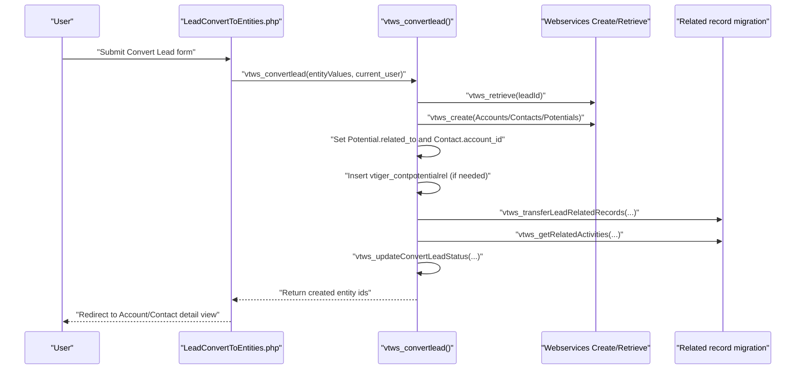

# Leads, Accounts, Contacts, and Opportunities (Potentials) Interactions in vtiger CRM 5.4.0

## 1. Purpose and Scope

This document explains, based on the repository’s PHP implementation, how the core sales modules in this vtiger CRM codebase interact: Leads, Accounts, Contacts, and Opportunities (implemented as the `Potentials` module). It focuses on the concrete relationships and tables used, the lead conversion process (including field mapping and related-record transfer), and the trigger/workflow mechanisms that run when records are created or updated.

This document intentionally focuses on what is evidenced in the source code. If a behavior is commonly known in vtiger but not directly visible in the inspected files, it is not asserted here.

## 2. Terminology and Module Mapping

In this repository:

Leads are implemented by the `Leads` module, whose primary data table is `vtiger_leaddetails`.

Accounts are implemented by the `Accounts` module, whose primary data table is `vtiger_account`.

Contacts are implemented by the `Contacts` module, whose primary data table is `vtiger_contactdetails`.

Opportunities are implemented by the `Potentials` module (class name `Potentials`), whose primary data table is `vtiger_potential`.

Throughout this document, “Opportunity” and “Potential” refer to the same module (`Potentials`).

## 3. Core Data Model and Relationships

### 3.1 The shared CRM entity layer

All these modules are entity modules built on the shared “CRM entity” pattern. Each module’s main table is tied to a row in `vtiger_crmentity`, which provides the generic identity (`crmid`), ownership, audit timestamps, and the `deleted` soft-delete flag.

The generic relationship system is largely expressed via:

`vtiger_crmentityrel` for generic cross-module relationships, used by `CRMEntity::save_related_module()` unless a module overrides it.

Module-specific relation tables for “typed” relations (for example, Contacts-to-Potentials) or for special modules (for example, documents/attachments/activity relations).

### 3.2 Accounts ↔ Contacts (one-to-many via `accountid`)

The “primary” relationship between Accounts and Contacts is implemented as a direct foreign key column:

A Contact points at an Account via `vtiger_contactdetails.accountid`.

This relationship is used throughout the `Accounts` and `Contacts` implementations, for example:

`Accounts::get_contacts()` returns contacts where `vtiger_contactdetails.accountid = <accountId>`.

`Contacts::setRelationTables('Accounts')` indicates that the Accounts–Contacts relationship can be traversed via `vtiger_contactdetails` and the `accountid` column.

When an Account address is changed, the codebase contains an explicit propagation path that can update related contacts’ addresses (see Section 7.1).

### 3.3 Potentials (Opportunities) ↔ Accounts/Contacts (polymorphic via `related_to`)

The `Potentials` module uses a polymorphic reference field:

`vtiger_potential.related_to` can refer to either an Account or a Contact.

This is evidenced in multiple places:

`Potentials::create_export_query()` joins `vtiger_potential.related_to` to both `vtiger_account.accountid` and `vtiger_contactdetails.contactid`.

During lead conversion, the code explicitly sets a Potential’s `related_to` to either the created Account or the created Contact (see Section 5.3).

In addition to `related_to`, the Potentials module also supports relating multiple Contacts to a Potential using the dedicated many-to-many table:

`vtiger_contpotentialrel(contactid, potentialid)`

This table is used by:

`Potentials::get_contacts()` and `Potentials::save_related_module()` for Contacts.

The lead conversion code inserts into `vtiger_contpotentialrel` when all of Account, Contact, and Potential exist (see Section 5.4).

### 3.4 Leads ↔ other modules (before conversion)

While a Lead is still unconverted, it can still have related records through a set of generic and module-specific relation tables that are later migrated during conversion:

Activities and Emails via `vtiger_seactivityrel(crmid, activityid)` and (for Contact activity linkage) `vtiger_cntactivityrel(contactid, activityid)`.

Documents/Notes via `vtiger_senotesrel(crmid, notesid)`.

Attachments via `vtiger_seattachmentsrel(crmid, attachmentsid)`.

Products via `vtiger_seproductsrel(crmid, productid, setype)`.

Campaign linkage via `vtiger_campaignleadrel(campaignid, leadid, ...)`.

Generic relations via `vtiger_crmentityrel(crmid, module, relcrmid, relmodule)`.

The Leads module also uses a `converted` flag in `vtiger_leaddetails` to exclude converted Leads from export and to prevent double conversion.

### 3.5 Relationship overview diagram

The following diagram summarizes the relationships that are directly evidenced in the code inspected for this task.

```mermaid
flowchart LR
  lead["Lead\n(Leads: vtiger_leaddetails)"]
  acc["Account\n(Accounts: vtiger_account)"]
  con["Contact\n(Contacts: vtiger_contactdetails)"]
  pot["Opportunity\n(Potentials: vtiger_potential)"]

  con -->|accountid| acc
  pot -->|related_to (Account)| acc
  pot -->|related_to (Contact)| con
  con <--> |vtiger_contpotentialrel| pot

  lead -.->|convert to| acc
  lead -.->|convert to| con
  lead -.->|convert to| pot
```

## 4. How Saves, Links, and Deletes Cause Cross-Module Effects

### 4.1 Save pipeline and event trigger points

All entity modules ultimately call `CRMEntity::save($module_name, ...)` to persist records. The base implementation triggers vtiger events around the persistence operation:

Before save:
`vtiger.entity.beforesave.modifiable`
`vtiger.entity.beforesave`
`vtiger.entity.beforesave.final`

After save:
`vtiger.entity.aftersave`
`vtiger.entity.aftersave.final`

This is implemented in `data/CRMEntity.php` and uses `VTEventsManager` and `VTEventTrigger`. Because the workflow engine registers an event handler on `vtiger.entity.aftersave`, workflows can run as a consequence of record saves in Leads/Accounts/Contacts/Potentials (see Section 6).

### 4.2 Linking records (related lists)

When users link records through the UI “Select” or “Add” controls in related lists, the underlying relation persistence depends on the modules involved:

The default generic behavior uses `CRMEntity::save_related_module()` which inserts into `vtiger_crmentityrel` (except for Documents, which uses `vtiger_senotesrel`).

Some modules override this behavior for certain related modules. For example:

`Potentials::save_related_module()` inserts into `vtiger_contpotentialrel` when linking Contacts to a Potential, and into `vtiger_seproductsrel` when linking Products.

`Contacts::save_related_module()` inserts into `vtiger_contpotentialrel` when linking Potentials to a Contact.

These overrides are part of how “Contact ↔ Opportunity” is implemented as a many-to-many association, instead of only relying on `vtiger_potential.related_to`.

### 4.3 Delete/unlink behavior can affect dependent modules

Modules implement cleanup or dependency unlinking when a record is deleted or unlinked.

For Accounts deletion, `Accounts::unlinkDependencies()` performs non-trivial cross-module behavior, including:

Marking Account-related Potentials as deleted in `vtiger_crmentity` where `vtiger_potential.related_to = <accountId>`.

Clearing the Account link on Contacts by setting `vtiger_contactdetails.accountid = 0` for contacts linked to that account.

Updating trouble tickets that referenced the Account as parent (`vtiger_troubletickets.parent_id = 0`).

For Contacts deletion, `Contacts::unlinkDependencies()` similarly marks Potentials that are directly linked to that Contact via `vtiger_potential.related_to = <contactId>` as deleted.

These behaviors are important when reasoning about data flow, because “unlink” or “delete” operations in one core module can remove or alter records in another.

## 5. Lead Conversion: End-to-End Data Flow

Lead conversion is the key “bridge” that turns pre-sales Leads into sales entities (Account/Contact/Opportunity) and migrates context (activities, documents, products, campaigns, and generic relations) from the Lead to the new entity.

### 5.1 UI entrypoint and payload construction

The UI conversion process is driven by PHP scripts under `modules/Leads/`. One concrete entrypoint is:

`modules/Leads/LeadConvertToEntities.php`

This script:

Reads the Lead record id from `$_REQUEST["record"]` and converts it to a webservice id using `vtws_getWebserviceEntityId('Leads', $recordId)`.

Requires `include/Webservices/ConvertLead.php`.

Builds an `$entityValues` payload containing:
`leadId`
`assignedTo` (Users or Groups webservice id)
`transferRelatedRecordsTo` (defaults to `Contacts`)
and an `entities` structure indicating whether to create Accounts, Contacts, and/or Potentials and providing some explicit user-entered field values (for example `accountname`, `lastname`, `potentialname`, `amount`, etc.).

Then it calls:
`vtws_convertlead($entityValues, $current_user)`

On success, it redirects the browser to the created Account or Contact detail view.

### 5.2 Lead conversion pre-check: “already converted”

Inside `include/Webservices/ConvertLead.php`, `vtws_convertlead()` checks:

`SELECT converted FROM vtiger_leaddetails WHERE converted = 1 AND leadid=?`

If the Lead is already converted, the conversion fails with a webservice exception. This protects against double conversion.

### 5.3 Field mapping: converting Lead fields to Account/Contact/Potential fields

The conversion process supports field mapping between Lead fields and the target modules’ fields through the database table:

`vtiger_convertleadmapping`

The mapping is editable through Settings actions:

`modules/Settings/LeadCustomFieldMapping.php` (rendering the mapping UI)

`modules/Settings/SaveConvertLead.php` (persisting the mapping by replacing `vtiger_convertleadmapping` rows where `editable=1`)

During conversion, `vtws_populateConvertLeadEntities()`:

Reads all rows from `vtiger_convertleadmapping`.

For the target entity type (Accounts/Contacts/Potentials), selects the corresponding “target field id” column (`accountfid`, `contactfid`, or `potentialfid`).

Uses the field metadata of the Lead module and target module to copy values from the Lead to the target record fields.

Applies user-entered values from the conversion form payload, allowing overrides.

Ensures mandatory fields are populated. If a mandatory field is empty:
If it is an editable picklist/date/datetime field, it uses the field default.
Otherwise it fills the value with the literal string `????`.

This behavior is important operationally: it means conversion may succeed even when the operator did not provide all mandatory values, but the resulting record may contain placeholder values if the field is not eligible for a default.

### 5.4 Entity creation and relationship initialization

The conversion loop iterates across `Accounts`, `Contacts`, and `Potentials` and creates the chosen entities.

Key relationship behaviors during creation:

Potential `related_to` is set to the created Account if an Account exists, otherwise to the created Contact. This is explicitly implemented in `vtws_convertlead()`.

Contact `account_id` is set to the created Account when Accounts are created.

Account de-duplication is applied by account name. If an Account with the same `accountname` exists and is not deleted, conversion reuses it instead of creating a new one.

After creation, if Account, Contact, and Potential exist, conversion inserts a row into `vtiger_contpotentialrel(contactid, potentialid)` to relate the contact to the opportunity. This explicitly creates the many-to-many association in addition to the Potential’s `related_to` reference.

### 5.5 Transferring related records from Lead to Account/Contact (and sometimes Potential)

After creating the new entities, conversion migrates the Lead’s context.

The target entity that receives most of the migrated related records is controlled by:

`transferRelatedRecordsTo` in `$entityValues`, defaulting to `Contacts`.

The function `vtws_convertLeadTransferHandler()` calls:

`vtws_transferLeadRelatedRecords($leadId, $relatedId, $targetModuleName)`

The implementation is in `include/Webservices/Utils.php` and performs several migrations.

#### 5.5.1 Documents/Notes and Attachments

`vtws_getRelatedNotesAttachments($leadId, $relatedId)`:

Copies Lead’s `vtiger_senotesrel` rows to the destination entity.

Copies Lead’s `vtiger_seattachmentsrel` rows to the destination entity.

This effectively “relinks” the same document and attachment records; it does not duplicate them.

#### 5.5.2 Products

`vtws_saveLeadRelatedProducts($leadId, $relatedId, $setype)`:

Copies products linked to the Lead in `vtiger_seproductsrel` to new rows linked to the destination entity id, using `setype` as the destination module name (Accounts, Contacts, or Potentials).

#### 5.5.3 Generic relationships (`vtiger_crmentityrel`)

`vtws_saveLeadRelations($leadId, $relatedId, $setype)`:

Reads all `vtiger_crmentityrel` rows where the Lead is the parent (`crmid = leadId`) and inserts new rows where the destination entity becomes the parent.

Reads all `vtiger_crmentityrel` rows where the Lead is the related record (`relcrmid = leadId`) and inserts new rows where the destination entity becomes the related record.

This is a broad “relationship migration” that attempts to preserve generic cross-module linking.

#### 5.5.4 Campaign relations

`vtws_saveLeadRelatedCampaigns($leadId, $relatedId, $seType)`:

Migrates campaign associations from `vtiger_campaignleadrel` into:
`vtiger_campaignaccountrel` if destination is Accounts, or
`vtiger_campaigncontrel` if destination is Contacts.

#### 5.5.5 Comments (optional module)

`vtws_transferComments($sourceRecordId, $destinationRecordId)`:

If the `ModComments` module is active, it calls `ModComments::transferRecords(...)` to migrate comment history. This is conditional; if `ModComments` is not active, no comment transfer occurs.

### 5.6 Transferring activities and emails

Conversion also moves activities/emails via:

`vtws_getRelatedActivities($leadId, $accountId, $contactId, $relatedId)`

Key behaviors in this function (from `include/Webservices/Utils.php`):

It reads all rows in `vtiger_seactivityrel` for the Lead (`crmid = leadId`).

For each related activity id:
It checks the activity’s entity type via `vtiger_crmentity.setype`.

It removes the Lead’s activity relation (`DELETE FROM vtiger_seactivityrel WHERE crmid=?`).

If the activity is not an Email:
If an Account exists, it inserts `vtiger_seactivityrel(crmid=accountId, activityid=...)`.
If a Contact exists, it inserts `vtiger_cntactivityrel(contactid=contactId, activityid=...)`.

If the activity is an Email:
It inserts `vtiger_seactivityrel(crmid=relatedId, activityid=...)` where `relatedId` is whichever entity the conversion chose as `transferRelatedRecordsTo` (default: Contact).

This design means that post-conversion, tasks/events are related to the Account and/or Contact, while emails are related to exactly one chosen target entity.

### 5.7 Finalizing conversion status on the Lead

Once entities are created and transfers succeed, conversion marks the Lead as converted:

`UPDATE vtiger_leaddetails SET converted = 1 WHERE leadid=?`

It also cleans up some Lead-specific tracking entries:

Deletes the Lead from `vtiger_campaignleadrel`.

Deletes tracker rows in `vtiger_tracker` for that Lead.

Updates the `vtiger_crmentity` modified fields for the Lead (modified time and modified by).

### 5.8 Lead conversion sequence diagram

The following sequence diagram illustrates the implementation-level flow from the conversion UI to persistence and migration.



## 6. Triggers and Workflows Affecting These Modules

vtiger CRM has two related automation mechanisms evidenced in this repository:

The generic event system (`VTEventsManager`, `VTEventTrigger`).

The workflow engine (`modules/com_vtiger_workflow/*`) which is implemented as an event handler that runs after saves.

### 6.1 Event system: how events are triggered

`CRMEntity::save()` triggers multiple vtiger events around persistence (see Section 4.1).

Event handlers are registered in the database table `vtiger_eventhandlers`. The code for managing and firing them is in:

`include/events/VTEventsManager.inc` (registration and triggering)

`include/events/VTEventTrigger.inc` (loading active handlers, evaluating conditions, executing handlers, and enforcing dependency ordering)

Event handlers may include:

A `cond` expression evaluated by `VTEventCondition`.

A `dependent_on` JSON list of handler classes that must run before a handler executes.

There is explicit deadlock detection if dependencies prevent progress.

### 6.2 Workflow engine: how workflows run on save/modify

The workflow engine is attached via the event handler class:

`VTWorkflowEventHandler` in `modules/com_vtiger_workflow/VTEventHandler.inc`

This handler runs on events such as `vtiger.entity.aftersave` and `vtiger.entity.afterrestore`. When invoked:

It computes whether the entity is new or modified.

It loads workflows for the entity’s module via `VTWorkflowManager::getWorkflowsForModule($moduleName)`.

It evaluates whether each workflow should run based on `executionCondition`, including:
ON_FIRST_SAVE, ONCE, ON_EVERY_SAVE, ON_MODIFY, MANUAL.

If the workflow is eligible and the condition expression matches (`$workflow->evaluate(...)`), it runs workflow tasks via `performTasks()`.

Tasks can run immediately or be queued with a delay via the task queue (`VTTaskQueue`) depending on the task configuration.

### 6.3 Default workflow registrations evidenced in install

During installation, the repository registers workflow handlers and creates several default workflows. This is visible in:

`install/CreateTables.inc.php`

Specifically:

It registers `VTWorkflowEventHandler` for `vtiger.entity.aftersave` (and afterrestore), and makes it depend on `VTEntityDelta`.

It creates default workflows for:
Accounts (notify owner on “once” when `notify_owner` is true)
Contacts (notify owner on “once” when `notify_owner` is true)
Potentials (send email on first save)

Although these default workflows are not specific to lead conversion, they influence the overall automation behavior of these core modules once records are created.

### 6.4 Entity methods (workflow tasks calling code)

The workflow engine can also call “entity methods,” which are a way to register a named method that points to a PHP function file and function name. This capability is implemented by:

`modules/com_vtiger_workflow/VTEntityMethodManager.inc`

The installation script registers some example entity methods (for example, Contacts portal login email), and workflows can invoke them via entity method tasks. For Leads/Accounts/Contacts/Potentials, the important point is that workflows can invoke custom code on save, which may create or update cross-module records depending on the configured tasks.

## 7. Additional Cross-Module Behaviors (Beyond Conversion)

### 7.1 Account address change propagation to contacts

There is a concrete cross-module data propagation path implemented in the Accounts save logic:

`modules/Accounts/AddressChange.php` compares the submitted account billing/shipping address fields with the stored values and returns an `address_change` indicator if there are contact records linked to the account.

`modules/Accounts/Save.php` checks:
If the account is being edited and `$_REQUEST['address_change'] == 'yes'`, it updates `vtiger_contactaddress` rows for contacts where `vtiger_contactdetails.accountid = <accountId>` so that mailing/other address fields match the account billing/shipping values.

This is a direct example of “save in one module updates records in another module” and is relevant when describing data flow between Accounts and Contacts.

### 7.2 Opportunity contact linkage patterns

The codebase supports multiple ways a Contact may be associated with a Potential:

Directly via `vtiger_potential.related_to = <contactId>` (polymorphic reference).

Indirectly (many-to-many) via `vtiger_contpotentialrel`.

`Contacts::get_opportunities()` explicitly queries opportunities using both:
Potential linked via `vtiger_contpotentialrel` and Potential linked directly via `related_to = contactId`.

This dual model is significant: a contact can be “the related_to” of an opportunity, and it can also be one of multiple contacts related to it.

## 8. Practical Examples and “What to Expect” Scenarios

### 8.1 Converting a lead into Account + Contact + Opportunity

When a user converts a Lead and chooses to create all three entities:

The system will create or reuse an Account (dedupe by account name).

It will create a Contact and set its `account_id` to the Account.

It will create a Potential and set `related_to` to the Account (because an Account exists).

It will also insert `vtiger_contpotentialrel(contactid, potentialid)` so the Contact is related to the Opportunity.

It will migrate related records (documents, attachments, products, generic relationships, campaigns) to whichever entity is selected as `transferRelatedRecordsTo` (default: the Contact), and migrate activities to the Account and/or Contact as described earlier.

It will set `vtiger_leaddetails.converted = 1` and remove some lead-specific tracking entries.

### 8.2 Converting a lead into Contact-only (no Account)

If only a Contact is created:

No `account_id` is set on the Contact (because no Account exists).

If a Potential is created as well, its `related_to` will be set to the Contact.

Activities migration will insert `vtiger_cntactivityrel` for non-email activities if a Contact exists, and emails will be attached to the chosen destination entity.

### 8.3 Why workflows may fire during these operations

Because entity persistence uses `CRMEntity::save()` and triggers `vtiger.entity.aftersave`, any workflow configured for Accounts, Contacts, or Potentials can fire after conversion creates them. This includes default workflows created at install time (for example, the default Potentials “send email on first save” workflow).

In practice, “convert lead” can therefore have side effects beyond the conversion code itself, depending on the workflow configuration in the database.

## 9. Key Source References (Implementation Evidence)

The behaviors described in this document are primarily evidenced in the following files:

Lead conversion UI payload construction:
`modules/Leads/LeadConvertToEntities.php`

Lead conversion UI field mapping helper:
`modules/Leads/ConvertLeadUI.php`

Canonical lead conversion logic:
`include/Webservices/ConvertLead.php`

Related record transfer and activity migration during conversion:
`include/Webservices/Utils.php`

Entity save pipeline and event triggers:
`data/CRMEntity.php`
`include/events/VTEventsManager.inc`
`include/events/VTEventTrigger.inc`

Workflow evaluation and task execution:
`modules/com_vtiger_workflow/VTEventHandler.inc`
`modules/com_vtiger_workflow/VTWorkflowManager.inc`
`modules/com_vtiger_workflow/VTEntityMethodManager.inc`

Module relationships and unlink/delete behaviors:
`modules/Accounts/Accounts.php`
`modules/Contacts/Contacts.php`
`modules/Potentials/Potentials.php`
`modules/Leads/Leads.php`

Account-to-contact address propagation:
`modules/Accounts/AddressChange.php`
`modules/Accounts/Save.php`

Lead conversion mapping persistence UI:
`modules/Settings/LeadCustomFieldMapping.php`
`modules/Settings/SaveConvertLead.php`

Default event/workflow registrations at install:
`install/CreateTables.inc.php`

## 10. Conclusion

In this vtiger CRM codebase, Leads are a pre-sales staging entity that, once qualified, can be converted into Accounts, Contacts, and Opportunities (Potentials). The conversion process is implemented as a webservice function (`vtws_convertlead`) invoked by a UI script, and it relies on a configurable field mapping table (`vtiger_convertleadmapping`) to populate target records.

The conversion flow is not limited to record creation. It also migrates a Lead’s context across multiple relationship systems: documents, attachments, products, campaigns, generic relations, and activities/emails. Post-conversion, automation can continue via the vtiger event system and workflow engine, which are hooked into the generic CRM entity save pipeline and may execute tasks whenever Accounts, Contacts, or Potentials are created or modified.
