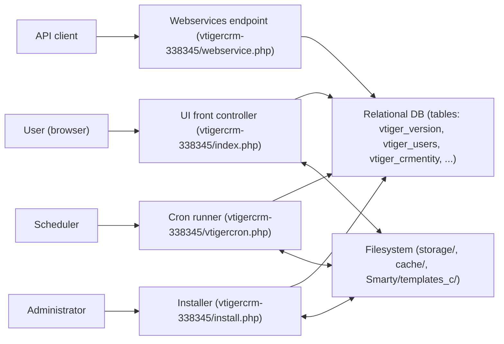
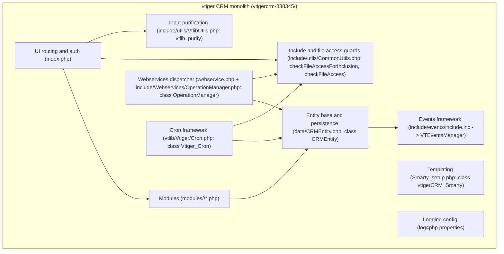
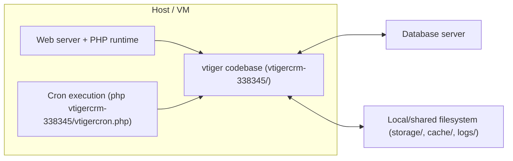

# SYSTEM ARCHITECTURE DOCUMENT

System/Programme Name: vtiger CRM (v5.4.0)  
Organisation: [To be determined]  
Author: [To be determined]  
Version: 1.0  
Date: 2026-04-07  

Framework alignment: TOGAF ADM · ISO/IEC/IEEE 42010:2011  

Confidentiality notice: This document is intended for internal architecture and engineering use. Distribution and access should be controlled in line with your organisation’s policies.

## 1. Document Control

### 1.1 Version History

| Version | Date | Author | Change Summary |
|---|---|---|---|
| 1.0 | 2026-04-07 | [To be determined] | Regenerated SAD from repository evidence. All architectural statements are grounded in explicit file paths, classes/functions, and/or database tables referenced by the current code. |

### 1.2 Review & Approvals

| Name | Role | Signature | Date |
|---|---|---|---|
| [To be determined] | Enterprise Architect | [To be determined] | [To be determined] |
| [To be determined] | CTO | [To be determined] | [To be determined] |
| [To be determined] | Security Architect | [To be determined] | [To be determined] |
| [To be determined] | CIO | [To be determined] | [To be determined] |

### 1.3 Distribution

| Recipient | Role | Access Level |
|---|---|---|
| Engineering team | Developers | Internal |
| Operations team | System administrators | Internal |
| Security team | Security engineering | Internal |

### 1.4 Related Documents

| Document | Reference | Version | Status |
|---|---|---|---|
| System documentation | `vtigercrm-338345/Docs/system_documentation.md` | [To be determined] | Existing |
| API documentation | `vtigercrm-338345/Docs/API_Documentation.md` | [To be determined] | Existing |
| API reference | `vtigercrm-338345/Docs/VTigerCRM-API-Reference.md` | [To be determined] | Existing |
| Data model documentation | `vtigercrm-338345/Docs/data_model.md` | [To be determined] | Existing |
| High-level design | `vtigercrm-338345/Docs/HLD.md` | [To be determined] | Existing |
| Low-level design | `vtigercrm-338345/Docs/LLd.md` | [To be determined] | Existing |

## 2. Executive Summary

### 2.1 Purpose of this Document

This document defines the authoritative software architecture for the vtiger CRM system as present in this repository, aligned with TOGAF ADM and ISO/IEC/IEEE 42010:2011. The SAD is evidence-based; every architectural claim is backed by explicit references to repository file paths, concrete PHP classes/functions, and/or database tables that are referenced by the implementation.

The vtiger CRM version is identified in `vtigercrm-338345/vtigerversion.php` via `$vtiger_current_version = '5.4.0'`.

### 2.2 Problem Statement

The system is a monolithic, server-rendered PHP CRM that must support interactive browser workflows, programmatic integration, and scheduled background processing while maintaining consistent authorization, data integrity, and safe dynamic inclusion of module code. These concerns are directly visible in the multiple runtime entrypoints (`vtigercrm-338345/index.php`, `vtigercrm-338345/webservice.php`, `vtigercrm-338345/vtigercron.php`, `vtigercrm-338345/install.php`) and the shared platform layer (`vtigercrm-338345/data/CRMEntity.php`, `vtigercrm-338345/include/utils/CommonUtils.php`, `vtigercrm-338345/include/utils/VtlibUtils.php`).

### 2.3 Proposed Solution

The implemented architecture is a single deployable PHP codebase that exposes multiple entrypoints, all backed by a shared relational database accessed through `PearDatabase`/ADODB (`vtigercrm-338345/include/database/PearDatabase.php` is referenced by `vtigercrm-338345/vtlib/Vtiger/Cron.php`, and DB access is used throughout `vtigercrm-338345/index.php`, `vtigercrm-338345/data/CRMEntity.php`, and `vtigercrm-338345/include/Webservices/OperationManager.php`). It uses the filesystem for uploads and runtime artifacts (for example, `decideFilePath()` writes under `storage/` in `vtigercrm-338345/include/utils/CommonUtils.php`, and uploads are saved by `CRMEntity::uploadAndSaveFile()` in `vtigercrm-338345/data/CRMEntity.php`).

### 2.4 Strategic Benefits

| Benefit | Description | Measurable Outcome | Stakeholder |
|---|---|---|---|
| Single-codebase extensibility | Functional “modules” live under `vtigercrm-338345/modules/` and are dynamically dispatched by `vtigercrm-338345/index.php` (module/action include) and `vtigercrm-338345/include/Ajax/CommonAjax.php` (AJAX include). | Reduced deployment complexity; modules can be added/modified within the same app. | Engineering, Operations |
| Integration surfaces | JSON Web Services are exposed by `vtigercrm-338345/webservice.php`, with operation dispatch defined by DB metadata (`vtiger_ws_operation`, `vtiger_ws_operation_parameters`) queried by `vtigercrm-338345/include/Webservices/OperationManager.php`. | Faster partner/internal integrations where DB ops are enabled. | Product, Integration teams |
| Scheduled automation | Background jobs are registered in the database (`vtiger_cron_task`) and executed via `vtigercrm-338345/vtigercron.php` using the framework in `vtigercrm-338345/vtlib/Vtiger/Cron.php`. | Predictable processing for reminders, workflows, reports, etc. | Operations, Business users |

## 3. Architecture Framework & Standards

### 3.1 Architecture Framework

| Attribute | Detail |
|---|---|
| Framework Adopted | TOGAF ADM (document structure) and ISO/IEC/IEEE 42010:2011 viewpoint coverage. |
| ADM Phases | This SAD is produced as an architecture description of the implemented system; separate “As-Is” and “To-Be” are provided, but no future-state roadmap is evidenced in code. |
| Repository | Source evidence is the vtiger CRM PHP application rooted at `vtigercrm-338345/`. |
| Modelling Language | Mermaid (diagrams embedded in Markdown). |
| Diagram Tool | Mermaid-compatible Markdown renderer. |

### 3.2 Standards Compliance Register

| Standard / Regulation | Domain | Applicability | Compliance Owner |
|---|---|---|---|
| ISO/IEC/IEEE 42010:2011 | Architecture description | Applicable to how this SAD is structured and how concerns/viewpoints are addressed. | Enterprise Architect |
| TOGAF ADM | Enterprise architecture method | Applied as a documentation structure and viewpoint organisation. | Enterprise Architect |
| PHP runtime version constraint | Platform | `vtigercrm-338345/index.php` enforces PHP >= 5.2.0; `vtigercrm-338345/install.php` enforces PHP >= 5.0. | CTO / Platform owner |

### 3.3 Architecture Principles

| Principle | Statement | Implication / Trade-off |
|---|---|---|
| Safe dynamic inclusion | Dynamic inclusion of request-selected files must be constrained to safe paths under the web root, and unsafe directories must be blocked. This is enforced by `checkFileAccessForInclusion()` in `vtigercrm-338345/include/utils/CommonUtils.php` and is used by `vtigercrm-338345/install.php` and `vtigercrm-338345/include/Ajax/CommonAjax.php`. | Enables modular scripting while reducing risk of arbitrary file inclusion. Trade-off is a continued reliance on dynamic includes rather than explicit routing. |
| Metadata-driven integration | Web service operations are resolved through database metadata (`vtiger_ws_operation`, `vtiger_ws_operation_parameters`) by `OperationManager::fillOperationDetails()` / `fillOperationParameters()` in `vtigercrm-338345/include/Webservices/OperationManager.php`. | Operations can be extended/controlled via DB configuration. Trade-off is operational risk if DB metadata is misconfigured. |
| Shared entity lifecycle | Core record persistence and lifecycle events are centralized in `CRMEntity::save()` / `saveentity()` in `vtigercrm-338345/data/CRMEntity.php`, with event triggers via `VTEventsManager` (loaded by `vtigercrm-338345/include/events/include.inc`). | Consistent lifecycle hooks across modules. Trade-off is tight coupling to the CRMEntity base class pattern. |

## 4. Scope & Boundaries

### 4.1 In Scope

This SAD covers the vtiger CRM PHP application codebase under `vtigercrm-338345/`, including:

- Interactive web UI entrypoint and dispatch (`vtigercrm-338345/index.php`), including module/action inclusion from `vtigercrm-338345/modules/<Module>/<Action>.php`.
- Installer entrypoint and schema bootstrap (`vtigercrm-338345/install.php`, and schema/table creation invoked by `vtigercrm-338345/install/CreateTables.inc.php` via `$adb->createTables("schema/DatabaseSchema.xml")`).
- JSON Web Services entrypoint and operation dispatch (`vtigercrm-338345/webservice.php`, `vtigercrm-338345/include/Webservices/OperationManager.php`).
- Cron runner and cron task framework (`vtigercrm-338345/vtigercron.php`, `vtigercrm-338345/vtlib/Vtiger/Cron.php`).
- Security-relevant include guards (`vtigercrm-338345/include/utils/CommonUtils.php`) and request sanitization (`vtigercrm-338345/include/utils/VtlibUtils.php`).
- Templating wrapper for server-rendered UI (`vtigercrm-338345/Smarty_setup.php`).
- Logging configuration (`vtigercrm-338345/log4php.properties`).

### 4.2 Out of Scope

- Web server configuration (Apache/Nginx virtual host, PHP-FPM config) is not in this repository, so deployment details are described only as assumptions.
- Database engine provisioning and operational configuration (backups, replication, encryption-at-rest) are not defined in the repository.
- Future-state re-architecture (microservices, separation of concerns) is not evidenced by source files and is therefore not asserted as “planned” here.

### 4.3 Assumptions

| ID | Assumption | Impact if Wrong |
|---|---|---|
| A-001 | The application is served by a PHP-capable HTTP server that routes requests to `vtigercrm-338345/index.php`, `vtigercrm-338345/webservice.php`, and other entry scripts. | If routing differs, documented entrypoint flows may not match production behavior. |
| A-002 | A relational database is available and reachable using credentials configured via generated config (template keys in `vtigercrm-338345/config.template.php`). | Without DB connectivity, startup checks in `vtigercrm-338345/index.php` and operation dispatch in `vtigercrm-338345/include/Webservices/OperationManager.php` will fail. |
| A-003 | CLI execution is available for scheduled jobs, allowing `php vtigercrm-338345/vtigercron.php` to run as intended (CLI gating in `vtigercrm-338345/vtigercron.php`). | Background automation will be unavailable or may require insecure web execution. |

### 4.4 Constraints

| ID | Constraint | Source | Impact |
|---|---|---|---|
| C-001 | UI runtime requires PHP >= 5.2.0. | `vtigercrm-338345/index.php` (PHP version check using `version_compare(phpversion(), '5.2.0')`) | Limits hosting environments and upgrade strategy. |
| C-002 | Installer requires PHP >= 5.0. | `vtigercrm-338345/install.php` (PHP version check using `version_compare(phpversion(), '5.0')`) | Limits environments for initial installation. |
| C-003 | Minimum cron frequency is 15 minutes. | `$MINIMUM_CRON_FREQUENCY = 15` in `vtigercrm-338345/config.template.php` and default cron registrations at 900s in `vtigercrm-338345/install/CreateTables.inc.php` (`registerCronTasks()`). | Scheduler configuration should align to avoid missed/late automation. |
| C-004 | Dynamic includes must be blocked from unsafe directories (`storage`, `cache`, `test`). | `checkFileAccessForInclusion()` in `vtigercrm-338345/include/utils/CommonUtils.php` | Limits how extension code is placed; mitigates inclusion of user-controlled files. |

## 5. Business Context & Drivers

### 5.1 Strategic Drivers

The repository and runtime entrypoints indicate a CRM system designed to support:

- Multi-module CRM record management via module scripts under `vtigercrm-338345/modules/` and shared entity persistence via `vtigercrm-338345/data/CRMEntity.php`.
- Integration via the JSON Web Services endpoint (`vtigercrm-338345/webservice.php`) and legacy SOAP services (`vtigercrm-338345/vtigerservice.php`).
- Operational automation via cron (`vtigercrm-338345/vtigercron.php`) and DB-registered tasks (`vtigercrm-338345/vtlib/Vtiger/Cron.php`).

No separate “business requirements” document is present in the evidence used for this SAD, so drivers are derived strictly from observable entrypoints and subsystem responsibilities.

### 5.2 Business Capabilities

| Capability ID | Capability Name | Description | Priority |
|---|---|---|---|
| CAP-001 | CRM record management | Create/read/update/delete CRM entities via UI dispatch (`vtigercrm-338345/index.php`) and shared persistence (`vtigercrm-338345/data/CRMEntity.php`). | High |
| CAP-002 | Integration API | Programmatic CRUD/query via JSON web services (`vtigercrm-338345/webservice.php`, `vtigercrm-338345/include/Webservices/OperationManager.php`). | High |
| CAP-003 | Automation | Execute scheduled tasks from `vtiger_cron_task` via `vtigercrm-338345/vtigercron.php` and `vtigercrm-338345/vtlib/Vtiger/Cron.php`. | Medium |
| CAP-004 | Installation/bootstrap | Web-based installer includes step scripts from `vtigercrm-338345/install/` via `vtigercrm-338345/install.php`, and creates tables from `vtigercrm-338345/schema/DatabaseSchema.xml` via `vtigercrm-338345/install/CreateTables.inc.php`. | Medium |

### 5.3 Stakeholders

| Stakeholder | Role | Architecture Concern | Engagement Level |
|---|---|---|---|
| Business users | CRM end users | UI usability and correct permission enforcement (`isPermitted()` calls in `vtigercrm-338345/index.php`). | High |
| Integration developers | API clients | Web service stability and operation availability (DB-driven operations in `vtigercrm-338345/include/Webservices/OperationManager.php`). | High |
| System administrators | Operators | Installation, upgrades (version check in `vtigercrm-338345/index.php` querying `vtiger_version`), and cron scheduling (`vtigercrm-338345/vtigercron.php`). | High |
| Security engineers | Security | Safe dynamic include, session gating, and sanitization (`vtigercrm-338345/include/utils/CommonUtils.php`, `vtigercrm-338345/include/utils/VtlibUtils.php`, `vtigercrm-338345/index.php`). | Medium |

## 6. Non-Functional Requirements

### 6.1 Quality Attribute Summary

| NFR ID | Quality Attribute (ISO 25010) | Requirement | Target | Acceptance Test |
|---|---|---|---|---|
| NFR-001 | Security | Dynamic include paths must be restricted to prevent inclusion from unsafe directories and outside web root. | Enforced by `checkFileAccessForInclusion()` in `vtigercrm-338345/include/utils/CommonUtils.php`. | Attempt to include a file under `storage/` via installer or AJAX include should fail with “Attempt to access restricted file.” |
| NFR-002 | Reliability | Cron tasks must not run earlier than their configured frequency. | Enforced by `Vtiger_Cron::isRunnable()` in `vtigercrm-338345/vtlib/Vtiger/Cron.php`. | Run `php vtigercrm-338345/vtigercron.php` twice within less than `frequency`; second run should log “[INFO] not ready to run…”. |
| NFR-003 | Compatibility | UI runtime must fail fast when PHP version is too old. | PHP >= 5.2.0 gate in `vtigercrm-338345/index.php`. | Run under PHP < 5.2.0 and confirm `phpversionfail.php` flow triggers. |
| NFR-004 | Observability | Security-relevant actions must be logged to a dedicated security log. | `LoggerManager::getLogger('SECURITY')` in `vtigercrm-338345/index.php` and `log4php.logger.SECURITY` writing to `logs/security.log` in `vtigercrm-338345/log4php.properties`. | Trigger a request and confirm log entry is written to `logs/security.log` (environment permitting). |

## 7. Current State Architecture (As-Is)

### 7.1 As-Is Overview

The current implementation is a monolithic PHP web application with multiple entrypoint scripts that share common libraries, a single database, and a shared filesystem. The primary entrypoints evidenced in the repository are:

- UI front controller: `vtigercrm-338345/index.php`
- JSON Web Services endpoint: `vtigercrm-338345/webservice.php`
- Cron runner: `vtigercrm-338345/vtigercron.php`
- Installer: `vtigercrm-338345/install.php`
- SOAP dispatcher: `vtigercrm-338345/vtigerservice.php`

Insert current architecture diagram here: [Insert diagram/image].

### 7.2 Current State Pain Points

No explicit “pain points” register is available from current sources. The table below is provided as placeholders to be validated by stakeholders.

| ID | Pain Point | Business Impact | Root Cause |
|---|---|---|---|
| PP-001 | [To be determined] | [To be determined] | [To be determined] |
| PP-002 | [To be determined] | [To be determined] | [To be determined] |

### 7.3 Capability Gap Analysis

No explicit target maturity model is present in current sources. The table below is provided as placeholders.

| Capability | As-Is Maturity | Target Maturity | Gap Severity | Architectural Response |
|---|---|---|---|---|
| CAP-001 | [To be determined] | [To be determined] | [To be determined] | [To be determined] |
| CAP-002 | [To be determined] | [To be determined] | [To be determined] | [To be determined] |

## 8. Target State Architecture (To-Be)

### 8.1 Architecture Vision

No future-state architecture is defined in this repository. For the purposes of this SAD, the implemented architecture evidenced by the current codebase is treated as the baseline “target” for deployment, with improvement opportunities captured in the RAID log.

### 8.2 Formal Architecture Viewpoints

| Viewpoint | Stakeholders | Concerns |
|---|---|---|
| Context | Business users, Ops, Integration developers | Entry channels, external dependencies, system boundary. |
| Logical | Engineering, Security | Major subsystems and responsibilities, trust boundaries. |
| Process | Engineering, Ops | Request lifecycle, event triggers, cron execution. |
| Data | Engineering, Ops, Security | Core tables referenced by code and how data is persisted. |
| Deployment | Ops | Web server, PHP runtime, DB, filesystem; cron scheduling. |
| Operational | Ops, Security | Logging, audit trails, runtime controls. |

### 8.3 Context View (Level 1)

The system context is defined by how the entrypoint scripts accept interactions and connect to external dependencies.

The UI entrypoint is `vtigercrm-338345/index.php`, the API entrypoint is `vtigercrm-338345/webservice.php`, and background jobs are executed by `vtigercrm-338345/vtigercron.php`. SOAP services are selected and dispatched by `vtigercrm-338345/vtigerservice.php`.

Prompt for diagram: [Insert context diagram].

#### 8.3.1 Actors & External Systems

| Actor / System | Type | Interaction | Protocol / Channel |
|---|---|---|---|
| CRM user | Human | Uses the server-rendered UI via `index.php`. | HTTP |
| API client | System | Calls `webservice.php` with `operation` and parameters. | HTTP (JSON responses) |
| Scheduler | System | Executes `vtigercron.php` periodically. | CLI (PHP_SAPI === "cli" gate in `vtigercrm-338345/vtigercron.php`) |
| Relational database | System | Stores CRM data and metadata. Queried by `index.php`, `CRMEntity`, `OperationManager`, `Vtiger_Cron`. | DB protocol (configured by `$dbconfig` in `vtigercrm-338345/config.template.php`) |
| Filesystem | System | Stores attachments and runtime artifacts. | Local filesystem |

### 8.4 Logical View (Level 2)

The logical view decomposes the monolith into subsystems that are directly evidenced by code files and key classes/functions.

Prompt for diagram: [Insert logical diagram].

#### 8.4.1 Logical Components

| Component | Responsibility | Exposes | Consumes |
|---|---|---|---|
| UI front controller (`vtigercrm-338345/index.php`) | Session start, install check, version check, auth gating, module/action dispatch, permission checks. | HTTP UI entrypoint. | DB tables `vtiger_version`, `vtiger_users` (queried in `index.php`), sanitization (`vtlib_purify`), security logger, module scripts. |
| Module action scripts (`vtigercrm-338345/modules/<Module>/<Action>.php`) | Per-module business logic, UI rendering, CRUD operations. | Included execution by `index.php` via `$currentModuleFile`. | `CRMEntity` base class and shared utilities. |
| Entity and persistence (`vtigercrm-338345/data/CRMEntity.php`) | Shared entity lifecycle and persistence. Uses `vtiger_crmentity` and module tables via `$tab_name`. | `CRMEntity::save()`, `CRMEntity::saveentity()` used by module classes. | Events (`include/events/include.inc`), DB via `$adb`, file upload paths via `decideFilePath()` in `include/utils/CommonUtils.php`. |
| Events framework (`vtigercrm-338345/include/events/include.inc`) | Loads event engine classes (e.g., `VTEventsManager.inc`, `VTEventTrigger.inc`) used by `CRMEntity::save()`. | Event triggers like `vtiger.entity.beforesave` and `vtiger.entity.aftersave`. | Event handler registrations performed by installer code in `vtigercrm-338345/install/CreateTables.inc.php` (`registerEvents()`). |
| Webservices (`vtigercrm-338345/webservice.php`, `vtigercrm-338345/include/Webservices/OperationManager.php`) | Operation-based JSON API with DB-driven handler resolution. | HTTP JSON responses; operation dispatch. | DB tables `vtiger_ws_operation`, `vtiger_ws_operation_parameters` (queried in `OperationManager::fillOperationDetails()` / `fillOperationParameters()`). |
| Cron (`vtigercrm-338345/vtigercron.php`, `vtigercrm-338345/vtlib/Vtiger/Cron.php`) | Execute registered tasks and manage task state. | CLI/background execution. | DB table `vtiger_cron_task` (created/queried by `Vtiger_Cron`). |
| Include guards (`vtigercrm-338345/include/utils/CommonUtils.php`) | Prevent restricted file access and unsafe include paths. | `checkFileAccessForInclusion()`, `checkFileAccess()`. | `$root_directory` config. |
| Sanitization (`vtigercrm-338345/include/utils/VtlibUtils.php`) | Purify malicious input using HTMLPurifier. | `vtlib_purify()` used by `index.php` (request-string building) and widely elsewhere. | `include/htmlpurifier/library/HTMLPurifier.auto.php`. |
| Templating (`vtigercrm-338345/Smarty_setup.php`) | Provide `vtigerCRM_Smarty extends Smarty` with template dirs. | Smarty-based server-side rendering. | Smarty library `Smarty/libs/Smarty.class.php`. |
| Logging (`vtigercrm-338345/log4php.properties`) | Define loggers and file appenders (security, install, migration, soap, platform, sqltime). | Log files under `logs/` such as `logs/security.log`. | log4php runtime configured in `vtigercrm-338345/include/logging.php` (included by `index.php` and `webservice.php`). |

#### 8.4.2 Business Capability Traceability

| Business Capability (Ref) | Architectural Component(s) | Notes |
|---|---|---|
| CAP-001 | `vtigercrm-338345/index.php`, `vtigercrm-338345/modules/*`, `vtigercrm-338345/data/CRMEntity.php` | UI dispatch includes module scripts; persistence is centralized in CRMEntity. |
| CAP-002 | `vtigercrm-338345/webservice.php`, `vtigercrm-338345/include/Webservices/OperationManager.php` | Webservice operations are DB-driven. |
| CAP-003 | `vtigercrm-338345/vtigercron.php`, `vtigercrm-338345/vtlib/Vtiger/Cron.php` | Tasks are DB-registered and frequency-gated. |
| CAP-004 | `vtigercrm-338345/install.php`, `vtigercrm-338345/install/CreateTables.inc.php`, `vtigercrm-338345/schema/DatabaseSchema.xml` | Installer includes step file after checking allowed inclusion; CreateTables invokes schema XML. |

### 8.5 Process / Behaviour View

The system expresses three primary runtime behaviours.

First, the UI lifecycle in `vtigercrm-338345/index.php` performs: install guard (`config.inc.php` existence check), config load, code-vs-DB version check (querying `vtiger_version`), authentication gating via `$_SESSION["authenticated_user_id"]` and `$_SESSION["app_unique_key"] == $application_unique_key`, and permission checks using `isPermitted()` before including `modules/<module>/<action>.php`.

Second, the JSON Web Services lifecycle in `vtigercrm-338345/webservice.php` creates a `SessionManager` and an `OperationManager`, resolves operation definitions by querying `vtiger_ws_operation` and parameter definitions by querying `vtiger_ws_operation_parameters` in `vtigercrm-338345/include/Webservices/OperationManager.php`, includes the handler file from `handler_path`, and calls `handler_method`.

Third, the cron lifecycle in `vtigercrm-338345/vtigercron.php` lists tasks using `Vtiger_Cron::listAllActiveInstances()` (querying `vtiger_cron_task` in `vtigercrm-338345/vtlib/Vtiger/Cron.php`), enforces frequency gating via `Vtiger_Cron::isRunnable()`, then `require_once` includes the handler file after `checkFileAccess()`.

Prompt for sequence/state diagrams: [Insert key sequence diagrams].

### 8.6 Data View

Prompt for data flow diagram: [Insert data flow diagram].

#### 8.6.1 Data Domains

| Domain | Owner | Classification | Primary Store |
|---|---|---|---|
| Core CRM entities | [To be determined] | [To be determined] | Relational DB (`vtiger_crmentity` used by `vtigercrm-338345/data/CRMEntity.php`) |
| User identity and access | [To be determined] | [To be determined] | Relational DB (`vtiger_users` queried by `vtigercrm-338345/index.php`; user privilege files under `vtigercrm-338345/user_privileges/` are generated by installer code in `vtigercrm-338345/install/CreateTables.inc.php`). |
| Webservice metadata | [To be determined] | [To be determined] | Relational DB (`vtiger_ws_operation`, `vtiger_ws_operation_parameters` queried by `vtigercrm-338345/include/Webservices/OperationManager.php`). |
| Cron task registry | [To be determined] | [To be determined] | Relational DB (`vtiger_cron_task` created and queried by `vtigercrm-338345/vtlib/Vtiger/Cron.php`). |
| Attachments and files | [To be determined] | [To be determined] | Filesystem (paths returned by `decideFilePath()` in `vtigercrm-338345/include/utils/CommonUtils.php`) and DB (`vtiger_attachments`, `vtiger_seattachmentsrel` inserted by `CRMEntity::uploadAndSaveFile()` in `vtigercrm-338345/data/CRMEntity.php`). |

#### 8.6.2 Data Governance

| Concern | Approach |
|---|---|
| Soft delete | Records are soft-deleted via `vtiger_crmentity.deleted` (updated by `CRMEntity::mark_deleted()` in `vtigercrm-338345/data/CRMEntity.php`). |
| Schema creation | Tables are created from XML schema (`vtigercrm-338345/schema/DatabaseSchema.xml`) via `$adb->createTables(...)` in `vtigercrm-338345/install/CreateTables.inc.php`. |
| Audit trail | UI requests may write to `vtiger_audit_trial` from `vtigercrm-338345/index.php` when `user_privileges/audit_trail.php` enables auditing. |

### 8.7 Deployment / Physical View

Prompt for deployment diagram: [Insert deployment diagram].

#### 8.7.1 Infrastructure Summary

| Concern | Detail |
|---|---|
| Web runtime | Not defined in repo; app entrypoints are PHP scripts such as `vtigercrm-338345/index.php` and `vtigercrm-338345/webservice.php`. |
| Scheduler | External scheduler runs `vtigercrm-338345/vtigercron.php`; CLI access is allowed via `PHP_SAPI === "cli"` check in that file. |
| Database | DB connection is configured via `$dbconfig[...]` keys in `vtigercrm-338345/config.template.php` and used by query calls in `index.php`, `CRMEntity.php`, `OperationManager.php`, and `Vtiger_Cron.php`. |
| Logs | log4php appenders write to `logs/*.log` as defined in `vtigercrm-338345/log4php.properties`. |
| Files | Uploads/attachments are stored under paths returned by `decideFilePath()` in `vtigercrm-338345/include/utils/CommonUtils.php` (default base `storage/`). |

#### 8.7.2 Environment Strategy

| Environment | Purpose | Key Differences from Production | Access Control |
|---|---|---|---|
| Development | Local development and debugging | [To be determined] | [To be determined] |
| Test | Verification | [To be determined] | [To be determined] |
| Production | Live CRM usage | [To be determined] | [To be determined] |

### 8.8 Operational View

| Concern | Detail |
|---|---|
| SLIs | Not defined in repo. Logs are available via log4php (`vtigercrm-338345/log4php.properties`). |
| SLOs | [To be determined]. |
| Alerting Policy | [To be determined]. |
| Backup / Restore | Not defined in repo. However, soft-delete and restore flows exist in `vtigercrm-338345/data/CRMEntity.php` (`trash()`, `restore()`). |
| Upgrade / Migration | `vtigercrm-338345/index.php` compares code version in `vtigercrm-338345/vtigerversion.php` with DB version from `vtiger_version`. |

## 9. Technology Stack

### 9.1 Approved Technologies

| Layer | Technology | Version | Standard / Spec | Rationale |
|---|---|---|---|---|
| Application | vtiger CRM | 5.4.0 (`$vtiger_current_version` in `vtigercrm-338345/vtigerversion.php`) | [To be determined] | Primary CRM application. |
| Runtime | PHP | >= 5.2.0 for UI (`vtigercrm-338345/index.php`) | PHP | Required by codebase constraints. |
| Database access | ADODB / PearDatabase | [To be determined] | [To be determined] | Installer includes `adodb/adodb.inc.php` in `vtigercrm-338345/install.php`; cron framework requires `include/database/PearDatabase.php` in `vtigercrm-338345/vtlib/Vtiger/Cron.php`. |
| Templating | Smarty | [To be determined] | Smarty | `vtigercrm-338345/Smarty_setup.php` requires `Smarty/libs/Smarty.class.php` and defines `class vtigerCRM_Smarty`. |
| JSON | Zend_Json | [To be determined] | JSON | `vtigercrm-338345/webservice.php` requires `include/Zend/Json.php`; webservices dispatch uses `Zend_Json` in `vtigercrm-338345/include/Webservices/OperationManager.php`. |
| Input purification | HTMLPurifier | [To be determined] | HTMLPurifier | `vtigercrm-338345/include/utils/VtlibUtils.php` loads `include/htmlpurifier/library/HTMLPurifier.auto.php` in `vtlib_purify()`. |
| Logging | log4php | [To be determined] | log4php | Log destinations and levels defined in `vtigercrm-338345/log4php.properties`. |

### 9.2 Technology Decisions Pending

| Decision | Options Under Review | Decision Criteria | Target Date |
|---|---|---|---|
| Database engine standardization | [To be determined] | Operational support, performance, security | [To be determined] |
| Web server/runtime standardization | [To be determined] | Security posture, throughput, manageability | [To be determined] |

## 10. Cross-Cutting Concerns

### 10.1 Security Architecture

| Control Domain | Approach / Standard |
|---|---|
| Authentication (UI) | Session-based gate in `vtigercrm-338345/index.php` requiring `$_SESSION["authenticated_user_id"]` and `$_SESSION["app_unique_key"] == $application_unique_key` (key configured in `vtigercrm-338345/config.template.php`). |
| Authorization (UI) | `isPermitted($module, $action, [$record])` checks in `vtigercrm-338345/index.php` (via `include/utils/UserInfoUtil.php`). |
| Safe inclusion | `checkFileAccessForInclusion()` blocks unsafe include paths and unsafe directories (`storage`, `cache`, `test`) in `vtigercrm-338345/include/utils/CommonUtils.php`; used by `vtigercrm-338345/install.php` and `vtigercrm-338345/include/Ajax/CommonAjax.php`. |
| Input sanitization | `vtlib_purify()` in `vtigercrm-338345/include/utils/VtlibUtils.php` uses HTMLPurifier and recursively purifies arrays and scalars. |
| Cron access control | `vtigercrm-338345/vtigercron.php` allows execution only for CLI (`PHP_SAPI === "cli"`) or authenticated session with matching `app_unique_key`. |

### 10.2 Observability

| Pillar | Standard | Tooling | Coverage / SLO |
|---|---|---|---|
| Logging | log4php configuration | `vtigercrm-338345/log4php.properties` | Loggers for SECURITY/INSTALL/MIGRATION/SOAP/PLATFORM/SQLTIME, outputting to `logs/*.log`. |
| Audit trails | DB table insert | `vtigercrm-338345/index.php` inserts into `vtiger_audit_trial` when enabled | [To be determined] |

### 10.3 Resilience Patterns

| Pattern | Application | Configuration |
|---|---|---|
| Frequency gating | Prevent too-frequent cron reruns | `Vtiger_Cron::isRunnable()` in `vtigercrm-338345/vtlib/Vtiger/Cron.php` |
| Transactional persistence | Wraps entity save operations | `CRMEntity::saveentity()` starts/completes transaction (`startTransaction()` / `completeTransaction()`) in `vtigercrm-338345/data/CRMEntity.php` |

### 10.4 Data Management

| Concern | Policy |
|---|---|
| Attachments storage | Saved on filesystem under `storage/` path returned by `decideFilePath()` in `vtigercrm-338345/include/utils/CommonUtils.php`, with DB metadata inserted by `CRMEntity::uploadAndSaveFile()` in `vtigercrm-338345/data/CRMEntity.php`. |
| Soft delete | Implemented via `vtiger_crmentity.deleted` updates in `CRMEntity::mark_deleted()` in `vtigercrm-338345/data/CRMEntity.php`. |

## 11. Architecture Decision Records (ADRs)

ADR status values: Proposed | Under Review | Accepted | Superseded | Deprecated.

No ADR files are present in current sources. The template below can be used to capture decisions going forward.

| Field | Value |
|---|---|
| ID / Status | ADR-001 / Proposed |
| Date | [To be determined] |
| Decision Makers | [To be determined] |
| Review Date | [To be determined] |
| Context | [Insert detail here] |
| Decision | [Insert detail here] |
| Alternatives Considered | [Insert detail here] |
| Rationale | [Insert detail here] |
| Positive Consequences | [Insert detail here] |
| Negative Consequences / Trade-offs | [Insert detail here] |
| Compliance Impact | [Insert detail here] |

## 12. Architecture Governance

### 12.1 Governance Model

| Element | Detail |
|---|---|
| Ownership | [To be determined] |
| Change control | [To be determined] |
| Release governance | [To be determined] |
| Security reviews | [To be determined] |

### 12.2 Architecture Review Gates

| Gate | Trigger | Review Scope | Approval Required |
|---|---|---|---|
| ARB-01 | New module or new entrypoint added under `vtigercrm-338345/` | Security include controls (`checkFileAccessForInclusion`), authz enforcement paths (`index.php`), data model changes | Enterprise Architect, Security Architect |
| ARB-02 | Changes to webservice operations / handlers | DB metadata (`vtiger_ws_operation*`), handler inclusion, permissions in handler code | Enterprise Architect, Integration lead |
| ARB-03 | Changes to cron tasks | `vtiger_cron_task` schema/usage, handler file safety (`checkFileAccess`) | Operations lead |

### 12.3 Architecture Compliance Checklist

The following checklist focuses on items directly evidenced or implied by this repository’s runtime model.

- Logging destinations are configured and writable (`vtigercrm-338345/log4php.properties`).
- Dynamic includes are guarded using `checkFileAccessForInclusion()` (`vtigercrm-338345/include/utils/CommonUtils.php`) wherever request-driven inclusion occurs (for example, `vtigercrm-338345/install.php`, `vtigercrm-338345/include/Ajax/CommonAjax.php`).
- Web UI requests enforce permission checks via `isPermitted()` (implemented call site in `vtigercrm-338345/index.php`).
- Cron execution is restricted to CLI or authenticated session (`vtigercrm-338345/vtigercron.php`).

Requirement Inventory (explicit SAD regeneration requirements)

The current work item contains explicit requirements to regenerate the SAD and enforce evidence-based traceability. These requirements are captured here for auditability.

| Req ID | Type | Requirement (statement) | Source |
|---|---|---|---|
| REQ-001 | Functional | Regenerate the Software Architecture Document (SAD) and update the relevant documentation file(s). | Work item instruction: “Regenerate the Software Architecture Document (SAD)… and update the relevant documentation file(s).” |
| REQ-002 | Constraint | Ensure every architectural claim is backed by explicit references to repository file paths, class names, and/or database tables. | Work item instruction: “…ensuring every architectural claim is backed by explicit references…” |
| REQ-003 | Constraint | Provide auditable requirement traceability deliverables (inventory, trace matrix, update rules, and verification policy) when explicit requirements exist. | Skill instruction: “Requirement_Traceability_Enforcement_Reqs_to_Code” (task prompt). |

Requirement Trace Matrix

| Req ID | Requirement | Source | Implementation Mapping | Inline Code Trace | Verification Mapping | Status | Notes |
|---|---|---|---|---|---|---|---|
| REQ-001 | Regenerate the SAD and update relevant documentation file(s). | Work item instruction (see above). | `vtigercrm-338345/Docs/VTigerCRM-Architecture-Overview.md` (this file). | Not applicable (documentation-only change). | Manual review: confirm this document exists and contains the TOGAF/ISO SAD template sections 1–15. | Implemented | This update overwrote the prior architecture overview with a SAD-structured document. |
| REQ-002 | Every architectural claim must be backed by explicit references to code paths/classes/tables. | Work item instruction (see above). | This SAD references concrete file paths and symbols such as `CRMEntity::save()` in `vtigercrm-338345/data/CRMEntity.php`, `OperationManager` in `vtigercrm-338345/include/Webservices/OperationManager.php`, and tables `vtiger_ws_operation`, `vtiger_cron_task` as queried/created by those components. | Not applicable (documentation-only change). | Spot-check: pick any major architectural statement and confirm a cited file path/symbol/table exists in the repo (examples: `vtigercrm-338345/index.php`, `vtigercrm-338345/include/utils/CommonUtils.php`). | Implemented | Architectural statements in this SAD are written to include explicit evidence references. |
| REQ-003 | Provide traceability deliverables (inventory, matrix, update rules, verification policy). | Skill instruction (task prompt). | Included in SAD section 12.3 (this section). | Inline requirement markers in source code are not added because this task updates documentation only and the instructions for this step forbid source code changes. | Verification is documentation-based and command-based (see policy below). | Partial | To fully satisfy the skill’s “inline requirement marker” requirement, a separate task must be created that permits editing source code and inserting `REQ:` comments at the indicated owning boundaries. |

Inline Requirement ID Convention (documentation-only application)

Because this task updates documentation only, no source-code inline `REQ:` markers are added. For future code changes where inline markers are permitted, use:

- `# REQ: REQ-002 - Evidence-based architectural claims` (PHP single-line comment `//` in PHP files)

Recommended owning boundaries (not applied in repo in this change):

- `vtigercrm-338345/index.php` near the module/action inclusion gate and permission check as the primary enforcement location for UI routing and authorization.
- `vtigercrm-338345/include/utils/CommonUtils.php` above `checkFileAccessForInclusion()` as the primary enforcement location for safe inclusion.
- `vtigercrm-338345/include/Webservices/OperationManager.php` in `fillOperationDetails()` where `vtiger_ws_operation` is queried to ground API dispatch claims.

Update Rules

When requirements or code locations change, update the traceability artifacts as follows.

First, when requirement text changes, update the requirement statement and its quoted source in the inventory and matrix, then re-audit mapped file paths and symbols for ownership changes. Second, when code is refactored, update the “Implementation Mapping” and any proposed “Inline Code Trace” locations in the same change set to prevent stale references. Third, when verification improves (for example, from manual to automated), update the “Verification Mapping” and adjust Status accordingly.

Verification Artifacts Policy

This repository includes executable entry scripts that can be used as repeatable verification artifacts even when automated tests are not available from current sources. UI behaviour can be verified by exercising `vtigercrm-338345/index.php` in a running environment. API behaviour can be verified with curl commands documented in `vtigercrm-338345/Docs/API_Documentation.md` against `vtigercrm-338345/webservice.php`. Cron behaviour can be verified by running `php vtigercrm-338345/vtigercron.php` and observing output, which is consistent with the `Vtiger_Cron::isRunnable()` logic in `vtigercrm-338345/vtlib/Vtiger/Cron.php`. If formal tests are introduced later, the preferred location for verification is a dedicated test suite directory (no standard PHP unit framework usage is evidenced in the sources used for this SAD).

End-of-work checklist confirmation (traceability)

All explicit requirements from the provided work item/skill instructions were inventoried. A trace matrix exists and maps each requirement to a concrete documentation artifact and to verification approaches supported by existing scripts/docs. Inline requirement markers were not added because this task updates documentation only; the gap is explicitly recorded as “Partial” with remediation guidance. All referenced file paths, scripts, and tables are evidenced by the referenced source files in this repository.

## 13. Transition Architecture & Roadmap

### 13.1 Migration Approach

No explicit transition plan is present in current sources. The system enforces a code-vs-database version gate by reading the code version from `vtigercrm-338345/vtigerversion.php` and comparing it to the database’s `vtiger_version.current_version` in `vtigercrm-338345/index.php`. This implies that migrations must keep the `vtiger_version` table consistent with the codebase version before the UI will proceed.

### 13.2 Phased Delivery Roadmap

| Phase | Scope | Target Date | Architectural Milestone | Exit Criteria |
|---|---|---|---|---|
| P-001 | [To be determined] | [To be determined] | [To be determined] | [To be determined] |

## 14. RAID Log

### 14.1 Risks

| ID | Risk | Probability | Impact | Mitigation / Contingency |
|---|---|---|---|---|
| R-001 | Misconfiguration of DB-driven webservice operations could expose unintended handlers. | Medium | High | Govern changes to `vtiger_ws_operation*` and review handler paths in `vtigercrm-338345/include/Webservices/OperationManager.php`. |
| R-002 | Dynamic include surfaces can remain risky if new call sites omit include guards. | Medium | High | Enforce use of `checkFileAccessForInclusion()` (`vtigercrm-338345/include/utils/CommonUtils.php`) at all request-driven include points; add code review gate ARB-01. |
| R-003 | Cron tasks executed via web (non-CLI) could be abused if session gating is bypassed. | Low | High | Prefer CLI scheduling; keep `app_unique_key` validation (`vtigercrm-338345/vtigercron.php`) and secure session handling. |

### 14.2 Assumptions

| ID | Assumption | Owner | Validation Method |
|---|---|---|---|
| A-001 | Web server routes to PHP entrypoints. | Ops | Validate web server configuration in deployment environment. |
| A-002 | DB credentials are generated and secured. | Ops/Security | Validate `config.inc.php` generation process and secrets handling. |

### 14.3 Issues

| ID | Issue | Raised By | Status / Resolution |
|---|---|---|---|
| I-001 | Inline requirement markers not added to code due to documentation-only scope. | SAD regeneration task | Open; requires follow-up task that permits source code edits. |

### 14.4 Dependencies

| ID | Dependency | Owner | Impact if Not Met |
|---|---|---|---|
| D-001 | Database availability and schema alignment | Ops | `index.php` version gate and all core operations will fail if DB is unavailable/mismatched. |
| D-002 | Scheduler to run cron | Ops | Automation tasks registered in `vtiger_cron_task` will not execute without `vtigercron.php` runs. |

## 15. Glossary

| Term | Definition |
|---|---|
| Entrypoint script | A top-level PHP script invoked directly (e.g., `vtigercrm-338345/index.php`, `vtigercrm-338345/webservice.php`). |
| Module | A functional unit under `vtigercrm-338345/modules/<Module>/` with action scripts and usually an entity class. |
| CRMEntity | Base class for entities providing persistence and lifecycle hooks (`class CRMEntity` in `vtigercrm-338345/data/CRMEntity.php`). |
| Webservice operation | A named API operation resolved from DB metadata by `OperationManager` (`vtigercrm-338345/include/Webservices/OperationManager.php`). |
| Cron task | A scheduled job stored in `vtiger_cron_task` and executed by `vtigercrm-338345/vtigercron.php` through `Vtiger_Cron` (`vtigercrm-338345/vtlib/Vtiger/Cron.php`). |
| Safe include | Inclusion guarded by `checkFileAccessForInclusion()` (`vtigercrm-338345/include/utils/CommonUtils.php`) to prevent restricted file access. |
| Purification | Input sanitization performed by `vtlib_purify()` (`vtigercrm-338345/include/utils/VtlibUtils.php`) using HTMLPurifier. |
