# VTiger CRM Modules Mind Map (v5.4.0)

## Overview

This document provides a structured, hierarchical mind map of the vtiger CRM (v5.4.0) module landscape as represented in the repository. The hierarchy is primarily organized by vtiger’s “parent tab” groupings (top-level UI categories) and then by functional modules. Relationships called out in the mind map are grounded in the module classes’ related-list methods and cross-module includes.

## Hierarchical Mind Map

```mermaid
mindmap
  root((vtiger CRM 5.4.0))
    UI Grouping (Parent Tabs)
      My Home Page
        Home
        Dashboard
      Marketing
        Campaigns
        Leads
        Accounts
        Contacts
        Potentials
        Calendar and Activities
        Documents
        Emails
        Reports
      Sales
        Leads
        Accounts
        Contacts
        Potentials
        Campaigns
        Products
        PriceBooks
        Vendors
        Quotes
        SalesOrder
        Invoice
        PurchaseOrder
        Calendar and Activities
        Documents
        Emails
      Support
        HelpDesk
        Faq
        Accounts
        Contacts
        Calendar and Activities
        Documents
        Emails
      Analytics
        Reports
      Inventory
        Products
        PriceBooks
        Vendors
        Quotes
        PurchaseOrder
        SalesOrder
        Invoice
        Documents
      Tools
        Emails
        Webmails
        Rss
        Portal
        Utilities
        Migration
        CustomView
        PickList
        com_vtiger_workflow
      Settings
        Settings (Administration)
        Users
        ModuleManager
        MailScanner
    Core Business Modules
      Leads
        Views
          ListView
          DetailView
          EditView
          ConvertLead
        Related Information
          Activities and History
          Campaigns
          Emails
          Products
        Key Flows
          Convert lead to Accounts and Contacts and Potentials
      Accounts
        Views
          ListView
          DetailView
          EditView
        Related Information
          Contacts
          Potentials
          Calendar and Activities
          HelpDesk Tickets
          Emails
          Quotes
          SalesOrder
          Invoice
          Products
          Documents
      Contacts
        Views
          ListView
          DetailView
          EditView
        Related Information
          Potentials
          Calendar and Activities
          HelpDesk Tickets
          Quotes
          SalesOrder
          PurchaseOrder
          Invoice
          Products
          Emails
          Campaigns
      Potentials (Opportunities)
        Views
          ListView
          DetailView
          EditView
          Pipeline Charts
        Related Information
          Contacts
          Calendar and Activities
          Products
          Quotes
          SalesOrder
          History and Stage History
      Campaigns
        Views
          ListView
          DetailView
          EditView
        Related Information
          Leads
          Contacts
          Accounts
          Potentials
          Calendar and Activities
      Calendar and Activities
        Activities Entity
          Events
          Tasks
          Reminders
          Recurrence
          Invitees
        Calendar UI
          Day and Week and Month and Year views
          iCal Import and Export
      HelpDesk (Tickets)
        Ticket Lifecycle
          Ticket Comments
          Attachments
          Notifications (Email content helpers)
        Related Information
          Calendar and Activities
          Contacts and Accounts (as related-to entities)
          Documents and Attachments
      Documents
        Document Records
          File Upload and Attachments
          Folders
        Relationships
          Can be linked to other modules via relationships
      Emails
        Email Activity Records
          Compose and Send
          Attachments
          Relationship linking (contacts users and entities)
        Integrations
          Webmails (mailbox integration)
      Products
        Catalog
          Taxes
          Prices and Currencies
          Attachments
        Related Information
          Leads
          Accounts
          Contacts
          Potentials
          HelpDesk Tickets
          Quotes
          PurchaseOrder
          SalesOrder
          Invoice
          PriceBooks
          Vendors
      Vendors
        Supplier Records
        Related Information
          Products
          PurchaseOrder
          Contacts
          Emails
      Inventory Suite
        Quotes
          Related Information
            SalesOrder
            Accounts and Contacts and Potentials
        SalesOrder
          Related Information
            Invoice
            Accounts and Contacts and Products
        PurchaseOrder
          Related Information
            Vendors
            Contacts
            Products and Stock adjustments
        Invoice
          Related Information
            SalesOrder
            Accounts and Contacts and Products
      Reports
        Report Builder
          Primary and Secondary modules selection
          Standard filters and advanced filters
          Sorting and grouping
        Outputs
          PDF
          Excel
          Scheduled emails
    Automation and Platform Services
      Workflow (com_vtiger_workflow)
        Workflow Manager
          Workflow CRUD
          Condition evaluation
          Task execution
        Workflow Tasks
          Entity method tasks
          Email and other task types (module tasks directory)
      Scheduled Jobs (Cron)
        vtigercron.php entry point
          Run all active cron tasks
          Run specific service by name
        Cron Handlers
          Loaded from handler file configured in vtlib cron registry
      Webservices API
        webservice.php entry point
          Operations (login query create retrieve update delete revise)
          Session management
          JSON encoding and decoding
      Settings and Administration
        Users
          Authentication and preferences (module-level responsibility)
        Module Manager
          Enable and disable modules
          Import and update module packages
        MailScanner
          Mailbox connection
          Folder scanning
          Rules and actions
```

## Relationship Notes (How Modules Connect)

The module relationships captured above reflect patterns in the module classes where a module exposes “get_related_*” or “get_*” related-list methods. For example, the Accounts module explicitly supports related lists for contacts, opportunities (potentials), activities, history, emails, quotes, invoices, sales orders, tickets, and products. Similarly, Contacts provides related lists for opportunities, activities, tickets, quotes, sales orders, purchase orders, invoices, products, emails, and campaigns. These relationships are not theoretical; they are implemented in the module PHP classes as related-list query builders and helper methods.

The “Convert Lead” flow is represented as a first-class subnode under Leads because the repository contains a dedicated ConvertLead controller which uses a UI helper and Webservices describe metadata to drive the conversion user experience. This makes lead conversion a key cross-module interaction path that bridges Leads into Sales modules such as Accounts, Contacts, and Potentials.

In addition to user-facing modules, the mind map includes system-level services that materially affect module behavior. The workflow engine (com_vtiger_workflow) provides automation that can act on CRM entities, vtigercron.php runs scheduled background work registered in vtlib’s cron registry, and webservice.php exposes the platform’s HTTP API operations that operate across modules.

## Source Files Used

This mind map is derived from the repository’s tab grouping configuration, menu construction, and key module class definitions and entry points. The specific files consulted are listed in the “sources” metadata attached to this document operation.
