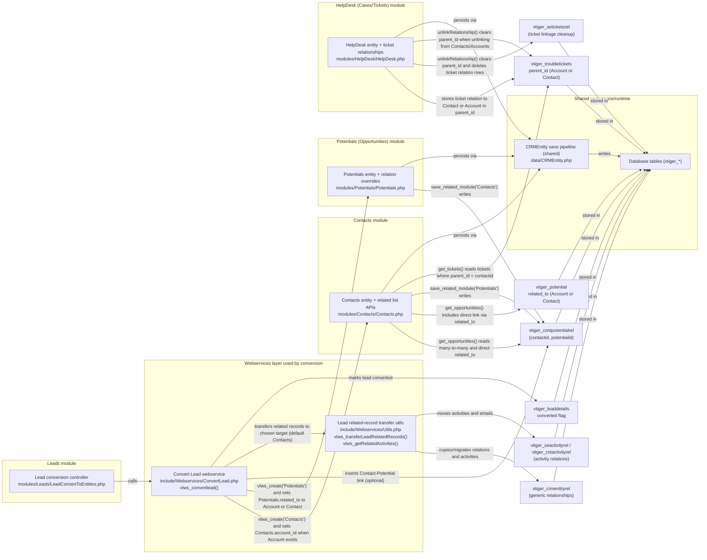

# Component Interaction Diagram: Leads, Contacts, Potentials, and Cases (HelpDesk)

## Overview

This document provides a code-grounded component interaction view of four core vtiger CRM modules in this repository: Leads, Contacts, Potentials (Opportunities), and HelpDesk (Cases/Tickets). The focus is on how these modules interact through the Lead Conversion workflow and through persistent cross-module relationships stored in vtiger’s relation tables and module tables.

The interactions in this diagram are based on the concrete PHP implementations in the referenced files, not on assumed vtiger behavior.

## Component interaction diagram (Mermaid)

## Notes on what the code is doing (grounded in files)

### Lead conversion is the primary creation/link bridge into Contacts and Potentials

The most concrete “module-to-module” interaction between Leads and the other modules in this codebase is Lead Conversion.

In `modules/Leads/LeadConvertToEntities.php`, the UI/controller layer builds an `$entityValues` payload and calls `vtws_convertlead(...)` (defined in `include/Webservices/ConvertLead.php`). Inside `vtws_convertlead()` the system creates new entities using the webservice CRUD layer (not direct SQL inserts for module records) and then performs explicit cross-module linking steps.

In particular, the conversion code explicitly sets:

1. The Opportunity/Potential link target by assigning `Potentials.related_to` to the created Account if an Account exists, otherwise to the created Contact.
2. The Contact-to-Account link by assigning `Contacts.account_id` when Accounts are part of the conversion.
3. The Contact-to-Potential many-to-many link by inserting into `vtiger_contpotentialrel(contactid, potentialid)` when Contact and Potential are created.

These behaviors are implemented in `include/Webservices/ConvertLead.php` (`vtws_convertlead()`).

### Contacts and Potentials interact through two relation mechanisms

The Contacts and Potentials modules implement a dual relationship model:

1. A direct, single reference from a Potential using `vtiger_potential.related_to`, which can point to either an Account or a Contact.
2. A many-to-many association table `vtiger_contpotentialrel(contactid, potentialid)`.

This duality is visible in `modules/Contacts/Contacts.php` in `get_opportunities()`, which joins via `vtiger_contpotentialrel` and also considers opportunities where `vtiger_potential.related_to` points to the contact.

The association table is also used for user-driven linking from related lists, implemented by module overrides:

1. `modules/Potentials/Potentials.php::save_related_module()` inserts into `vtiger_contpotentialrel` when linking Contacts from a Potential.
2. `modules/Contacts/Contacts.php::save_related_module()` inserts into `vtiger_contpotentialrel` when linking Potentials from a Contact.

### HelpDesk (Cases) relates to Contacts via `vtiger_troubletickets.parent_id`

HelpDesk tickets (Cases) use `vtiger_troubletickets.parent_id` as the primary “Related to” pointer. The HelpDesk export query in `modules/HelpDesk/HelpDesk.php::create_export_query()` joins both `vtiger_account` and `vtiger_contactdetails` on `vtiger_troubletickets.parent_id`, reflecting the polymorphic nature of that reference.

The Contacts module reads ticket relationships in `modules/Contacts/Contacts.php::get_tickets()` by selecting tickets where the ticket’s `parent_id` matches the contact.

### Unlink/cleanup behavior is implemented in module-specific ways

HelpDesk’s `unlinkRelationship()` contains module-specific unlink logic:

1. When unlinking a ticket from Contacts or Accounts, it clears `vtiger_troubletickets.parent_id` and also deletes rows from `vtiger_seticketsrel` for that ticket.
2. For other modules it uses the generic `vtiger_crmentityrel` deletion pattern.

This is implemented in `modules/HelpDesk/HelpDesk.php::unlinkRelationship()`.

Potentials also contains special unlink behavior for Contacts: when unlinking the many-to-many link (`vtiger_contpotentialrel`), it additionally checks whether the Potential is directly linked to that Contact via `vtiger_potential.related_to`, and if so it trashes (deletes) the Potential record. This is implemented in `modules/Potentials/Potentials.php::unlinkRelationship()`.

## Key source references

The diagram and notes are based on these implementation files:

1. `modules/Leads/LeadConvertToEntities.php`
2. `include/Webservices/ConvertLead.php`
3. `include/Webservices/Utils.php`
4. `modules/Contacts/Contacts.php`
5. `modules/Potentials/Potentials.php`
6. `modules/HelpDesk/HelpDesk.php`
7. `data/CRMEntity.php`
