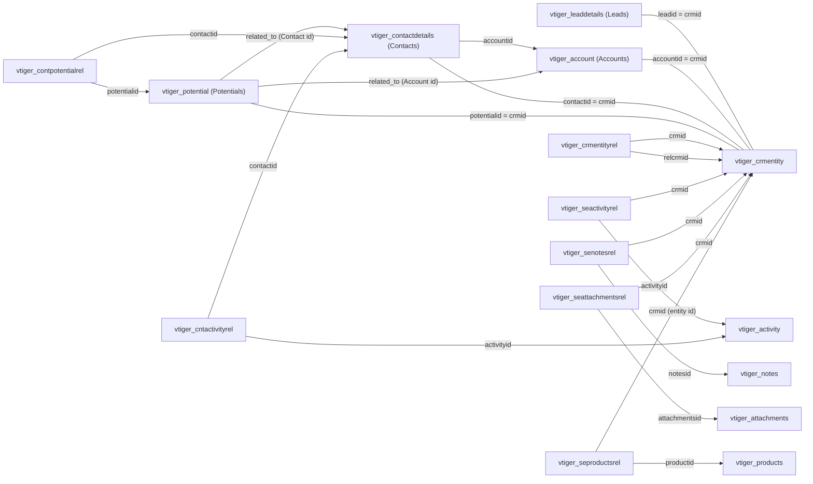

# vtiger CRM Data Model (tables, key fields, relationships)

## Overview

This repository implements vtiger CRM (v5.4.0) as a metadata-driven, MySQL-backed PHP application. The database model follows a consistent “CRM entity” pattern in which most business records have a row in a shared entity table (`vtiger_crmentity`) plus one or more module-specific tables. Relationships between modules are represented either by direct reference columns (for example, `vtiger_contactdetails.accountid`) or via dedicated relationship tables (for example, `vtiger_contpotentialrel`) and a generic cross-module relationship table (`vtiger_crmentityrel`).

The canonical installer schema source is `schema/DatabaseSchema.xml`, which is executed during installation via `$adb->createTables("schema/DatabaseSchema.xml")`.

## Modeling conventions used by this codebase

vtiger’s PHP modules declare their persistence model directly in each module’s `CRMEntity` subclass. Those declarations are a reliable way to identify tables, primary keys, and the “standard join path” used throughout the application.

Entity modules generally follow these conventions.

Each entity record has a corresponding row in `vtiger_crmentity`. The `vtiger_crmentity.crmid` value is reused as the primary key in the module’s base table (for example, `vtiger_account.accountid`) and is the key used by many relationship tables.

Soft deletion is modeled by `vtiger_crmentity.deleted`. Most queries include a `vtiger_crmentity.deleted = 0` predicate.

Many modules have a custom-field extension table (for example, `vtiger_accountscf`) that uses the module’s primary key as its own primary key, allowing custom fields to be added without altering the base table.

Ownership is modeled by `vtiger_crmentity.smownerid`, which may reference either a user (`vtiger_users.id`) or a group (`vtiger_groups.groupid`). The code routinely joins both tables and uses a “user-or-group display name” expression.

## Core entity and metadata tables

### vtiger_crmentity

`vtiger_crmentity` is the central table that provides identity, ownership, audit timestamps, and the soft-delete flag for most modules.

The save pipeline inserts or updates this table first during record creation and update.

Key fields used in this repository include `crmid` (the shared entity id), `setype` (the module name or a subtype label such as “Contacts Image”), `smcreatorid` (creator user id), `smownerid` (owner user or group id), `modifiedby` (user id of last modifier), `createdtime`, `modifiedtime`, and `deleted`. The code also references `viewedtime` for “record view” notification behavior.

### vtiger_tab, vtiger_field, vtiger_fieldmodulerel, vtiger_entityname

The application is heavily metadata-driven. Several tables define the module and field model used by UI rendering, query generation, import/export, and relationship handling.

`vtiger_tab` stores module metadata such as module name and ownership mode. `vtiger_field` stores per-module field metadata including `fieldname`, `tablename`, `columnname`, `uitype`, and `typeofdata`. `vtiger_fieldmodulerel` models “uitype 10” references (fields that can reference other modules). `vtiger_entityname` indicates which columns compose the “display name” for a module and which column is its entity id field.

These tables are also used in the generic dependency unlinking logic to find and clear “uitype 10” references when a record is deleted.

### vtiger_modentity_num

This table stores module sequence numbering configuration (prefix and current value). In module save logic, uitype `4` fields (module numbers) are populated via the sequence configuration in this table.

### vtiger_convertleadmapping

This table drives lead conversion field mapping. It is read during conversion to map Lead fields to Accounts/Contacts/Potentials fields via field ids (`leadfid`, `accountfid`, `contactfid`, `potentialfid`). The conversion implementation relies on this mapping to populate created records.

## Core sales modules (Leads, Accounts, Contacts, Potentials)

### Leads

The Leads module’s base table is `vtiger_leaddetails` keyed by `leadid`.

The Leads module uses the following module table set (as declared by the `Leads` class): `vtiger_crmentity`, `vtiger_leaddetails`, `vtiger_leadsubdetails`, `vtiger_leadaddress`, and `vtiger_leadscf`.

The conversion state is modeled by `vtiger_leaddetails.converted`. Conversion explicitly checks for `converted = 1` and updates the Lead to mark it as converted.

Leads can be related to other records through relationship tables described later in this document. During lead conversion, related records are transferred to the newly created Account or Contact via dedicated transfer functions.

### Accounts

The Accounts module’s base table is `vtiger_account` keyed by `accountid`.

The Accounts module uses the following module table set: `vtiger_crmentity`, `vtiger_account`, `vtiger_accountbillads`, `vtiger_accountshipads`, and `vtiger_accountscf`. In practice, `vtiger_accountbillads` and `vtiger_accountshipads` are joined using `accountaddressid` which matches the account id.

Important fields evidenced in code include `vtiger_account.accountname` and `vtiger_account.parentid` (used to build account hierarchy). Ownership and soft-delete follow `vtiger_crmentity`.

Account-centric relationships seen in module and webservice code include:

A one-to-many relationship from Account to Contact using `vtiger_contactdetails.accountid`.

A relationship from Account to Potential (Opportunity) through `vtiger_potential.related_to` when `related_to` holds an Account id.

A relationship to Campaigns via `vtiger_campaignaccountrel`.

A relationship to Products via `vtiger_seproductsrel` where `setype = 'Accounts'`.

A relationship to Activities (Tasks/Events and Emails) via `vtiger_seactivityrel` using the Account id as `crmid`.

The Accounts module also has explicit dependency unlinking logic: when an Account is deleted it clears or updates several dependent relationships (for example, it clears related contacts’ `accountid` and resets trouble tickets’ `parent_id`).

### Contacts

The Contacts module’s base table is `vtiger_contactdetails` keyed by `contactid`.

The Contacts module uses the following module table set: `vtiger_crmentity`, `vtiger_contactdetails`, `vtiger_contactaddress`, `vtiger_contactsubdetails`, `vtiger_contactscf`, and `vtiger_customerdetails`.

The primary Account relationship is `vtiger_contactdetails.accountid`, which points to `vtiger_account.accountid`. This is the canonical Account-to-Contact relationship used by the Accounts module’s related list queries.

Contacts can relate to Potentials (Opportunities) in two ways:

A dedicated many-to-many relationship table `vtiger_contpotentialrel(contactid, potentialid)`.

A polymorphic relationship where a Potential’s `vtiger_potential.related_to` can store a Contact id directly.

Contacts also relate to Campaigns via `vtiger_campaigncontrel`. The Contacts module joins `vtiger_campaigncontrel.campaignrelstatusid` to `vtiger_campaignrelstatus.campaignrelstatusid`, indicating that campaign membership carries a relation status.

Contacts relate to Activities using `vtiger_cntactivityrel(contactid, activityid)` for tasks and events, and they also relate to Emails using `vtiger_seactivityrel` (depending on the context).

Contacts relate to Products via `vtiger_seproductsrel` where `setype = 'Contacts'`.

### Potentials (Opportunities)

The Potentials module’s base table is `vtiger_potential` keyed by `potentialid`.

The Potentials module uses the following module table set: `vtiger_crmentity`, `vtiger_potential`, and `vtiger_potentialscf`.

The key “parent” field for a Potential is `vtiger_potential.related_to`. The code treats this field as polymorphic: it can contain either an Account id (`vtiger_account.accountid`) or a Contact id (`vtiger_contactdetails.contactid`).

Contacts can also be associated to Potentials via `vtiger_contpotentialrel`, enabling multiple contacts per opportunity.

Stage history is tracked in `vtiger_potstagehistory`. The base save pipeline inserts into this table when the Potential’s `sales_stage` changes.

## Relationship and linkage tables

### Generic cross-module relationship: vtiger_crmentityrel

`vtiger_crmentityrel` is used as the default generic relationship mechanism between modules when there is not a module-specific relationship table. The base implementation inserts rows with the tuple `(crmid, module, relcrmid, relmodule)`.

When “linking” records via related lists, many modules rely on this table unless they override relationship behavior for specific related modules.

Lead conversion explicitly migrates `vtiger_crmentityrel` links from the Lead to the chosen target (Account or Contact).

### Activities and emails: vtiger_activity, vtiger_seactivityrel, vtiger_cntactivityrel

`vtiger_activity` stores activities (Tasks, Events, Emails). The module code queries fields including `activityid`, `subject`, `activitytype`, `status`, `eventstatus`, `date_start`, `due_date`, `time_start`, and `time_end`.

`vtiger_seactivityrel(crmid, activityid)` is used to link activities to many module records, including Leads and Accounts.

`vtiger_cntactivityrel(contactid, activityid)` is used to link activities specifically to Contacts.

Lead conversion transfers related activities by removing `vtiger_seactivityrel` rows for the Lead and inserting new linkage rows for the Account and/or Contact, with special handling for Emails.

### Documents/notes: vtiger_notes and vtiger_senotesrel

`vtiger_notes` represents document/notes records that are treated as “Documents” in related lists.

`vtiger_senotesrel(crmid, notesid)` links notes/documents to an entity record.

The generic related list logic for attachments/documents uses `vtiger_senotesrel` to retrieve linked notes.

Lead conversion and generic linking rely on `vtiger_senotesrel` as the relationship table for Documents.

### Attachments: vtiger_attachments and vtiger_seattachmentsrel

`vtiger_attachments` stores attachment metadata (including `attachmentsid`, `name`, `type`, and `path` as evidenced by the upload/save implementation).

`vtiger_seattachmentsrel(crmid, attachmentsid)` links attachments to an entity record (or to a `vtiger_notes` record in the case of document attachments).

Lead conversion transfers attachments by copying `vtiger_seattachmentsrel` links from the Lead to the target entity.

### Products linkage: vtiger_products and vtiger_seproductsrel

`vtiger_products` stores product records (keyed by `productid`).

`vtiger_seproductsrel(crmid, productid, setype)` links products to different entity modules. The `setype` discriminator indicates which module the `crmid` refers to (for example, `Accounts`, `Contacts`, `Leads`, or `Potentials`).

Lead conversion migrates product links by copying rows from `vtiger_seproductsrel` from Lead to the target entity and setting `setype` to the destination module.

### Contacts to Potentials: vtiger_contpotentialrel

`vtiger_contpotentialrel(contactid, potentialid)` is a dedicated many-to-many link table used to associate contacts with opportunities.

Lead conversion inserts a row into this table when it creates Account, Contact, and Potential during a single conversion operation.

## Campaigns and campaign membership

`vtiger_campaign` is the campaign entity table (campaign records are also entity records in `vtiger_crmentity`).

Campaign membership is represented by module-specific relationship tables:

`vtiger_campaignleadrel` links Campaigns to Leads. Code inserts into this table with three values, indicating there is at least one additional status field (commonly a relation status id).

`vtiger_campaignaccountrel` links Campaigns to Accounts and is also inserted with three values in module code, again indicating an additional status field.

`vtiger_campaigncontrel` links Campaigns to Contacts and includes a relation status id that can be joined to `vtiger_campaignrelstatus`.

During lead conversion, campaign membership is migrated from `vtiger_campaignleadrel` to either `vtiger_campaignaccountrel` or `vtiger_campaigncontrel` depending on the selected transfer target.

## Users, groups, roles, and profiles (high-level)

The installer code populates a standard role/profile/group model, which is used throughout the CRM for access control and ownership.

The following tables are directly evidenced in install-time inserts:

`vtiger_users` stores users.

`vtiger_groups` stores groups.

`vtiger_role` stores roles. Role ids appear as strings starting with `H` (for example, `H12`), and roles model a hierarchy using `parentrole`.

`vtiger_profile` stores profiles.

`vtiger_user2role` links users to roles.

`vtiger_users2group` links users to groups.

`vtiger_role2profile` links roles to profiles.

`vtiger_profile2globalpermissions`, `vtiger_profile2tab`, `vtiger_profile2standardpermissions`, and `vtiger_profile2utility` store profile permissions and utilities.

The ownership model for business records is stored in `vtiger_crmentity.smownerid` and can point to either `vtiger_users.id` or `vtiger_groups.groupid`.

## Webservice metadata tables (for API exposure)

The webservice layer uses database tables to describe webservice entities and operations.

`vtiger_ws_entity` stores webservice entities and their handler classes.

`vtiger_ws_entity_name` stores name/display field composition for actor-type webservice entities.

`vtiger_ws_operation` and `vtiger_ws_operation_parameters` store webservice operation definitions and parameter metadata.

These are used by functions like `vtws_getWebserviceEntityId` and `vtws_getWebserviceEntities`.

## Tracker and audit-related tables

`vtiger_tracker` stores “recently viewed” tracking. Lead conversion explicitly removes tracker rows for a Lead when it is converted.

The `vtiger_crmentity` `modifiedtime`, `modifiedby`, and `viewedtime` fields are used as part of record view and change tracking behavior.

## Key relationship diagram (implementation-level view)

The following diagram summarizes the most important entities and relationship tables as evidenced by the PHP module code and lead conversion implementation.

## Relationship table quick reference

This section provides an at-a-glance list of relationship/link tables that appear frequently in this codebase.

| Table | Key fields (as used) | Relationship semantics |
|---|---|---|
| `vtiger_crmentityrel` | `crmid`, `module`, `relcrmid`, `relmodule` | Generic cross-module relationship store. |
| `vtiger_seactivityrel` | `crmid`, `activityid` | Links an entity record to an activity (Task/Event/Email). |
| `vtiger_cntactivityrel` | `contactid`, `activityid` | Links a contact record to an activity (Task/Event). |
| `vtiger_senotesrel` | `crmid`, `notesid` | Links an entity record to a note/document. |
| `vtiger_seattachmentsrel` | `crmid`, `attachmentsid` | Links an entity record to an attachment. |
| `vtiger_seproductsrel` | `crmid`, `productid`, `setype` | Links products to entities with a module discriminator (`setype`). |
| `vtiger_contpotentialrel` | `contactid`, `potentialid` | Many-to-many association between Contacts and Potentials. |
| `vtiger_campaignleadrel` | `campaignid`, `leadid` (+ status column) | Campaign membership for Leads. |
| `vtiger_campaignaccountrel` | `campaignid`, `accountid` (+ status column) | Campaign membership for Accounts. |
| `vtiger_campaigncontrel` | `campaignid`, `contactid` (+ status column) | Campaign membership for Contacts, including relation status id. |

## Notes and limitations of this extraction

This document focuses on tables, key fields, and relationships that are directly evidenced by the installer entrypoint and the inspected PHP implementation. vtiger CRM has many more tables (for inventory, email templates, workflows, reporting, etc.) that are present in the schema but are not exhaustively enumerated here.

For an authoritative full column list, consult `schema/DatabaseSchema.xml`, which is executed at installation time, and correlate it with module classes’ `$tab_name` and `$tab_name_index` declarations for how tables are joined in practice.
