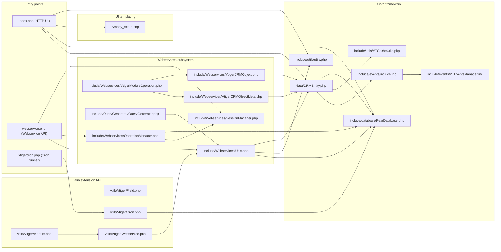
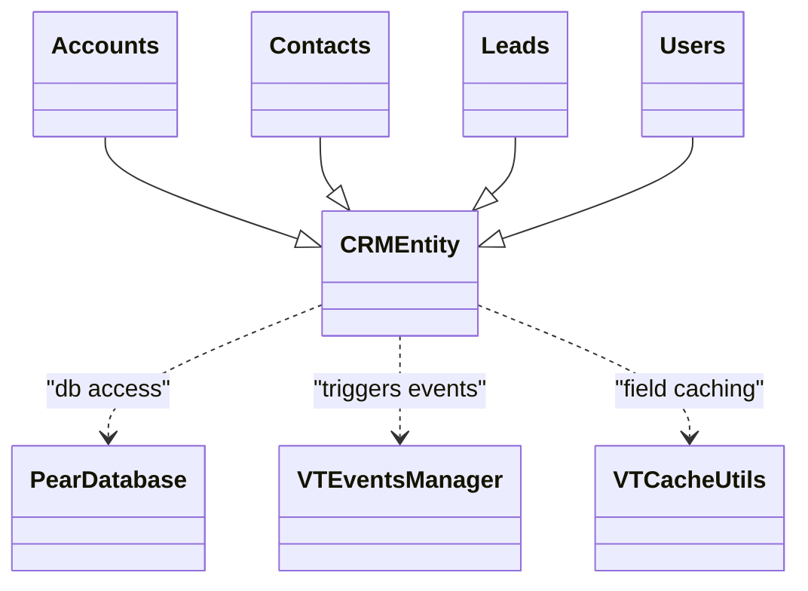
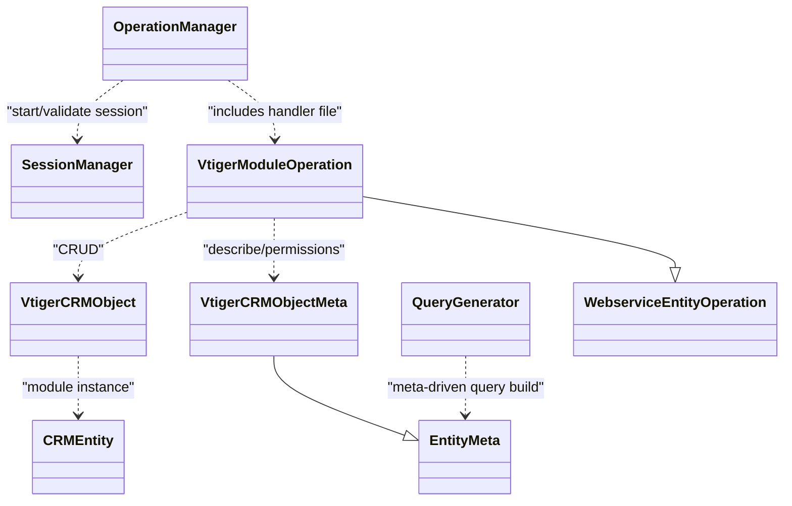

# vtiger CRM (v5.4.x) Dependency Map (Modules and Classes)

## Purpose and scope

This document provides an evidence-based dependency map of the vtiger CRM PHP codebase in this repository. It focuses on two levels:

First, it describes module-level dependencies between major directories and runtime entrypoints, so it is clear how requests (UI, webservices, cron) flow into the core framework.

Second, it describes class-level dependencies for the core framework classes and representative module entity classes, emphasizing inheritance (for example, `Accounts` extends `CRMEntity`) and critical “uses” relationships (for example, `CRMEntity` uses `PearDatabase` and triggers `VTEventsManager` events).

This is not a complete static call graph of the entire repository (the codebase is large and includes dynamic inclusion patterns). Where the framework loads module files dynamically (for example, `CRMEntity::getInstance()`), the map documents the mechanism and provides representative examples.

## Repository module decomposition (high-level)

At a high level, vtiger is organized into the following module groups:

The runtime entrypoints at the repository root (`index.php`, `webservice.php`, `vtigercron.php`) route requests into core utilities, the database layer, and then into module scripts under `modules/<ModuleName>/...`.

The application core is split across `include/` and `data/`. `data/CRMEntity.php` provides the base “entity model” class that most business modules extend. `include/` contains cross-cutting utilities, database abstractions, webservice infrastructure, and event infrastructure.

Third-party libraries are vendored into the repository (for example, `adodb/` for database access and `Smarty/` for templating).

## Primary runtime entrypoints and what they depend on

### HTTP UI entrypoint: `index.php`

The `index.php` script is the main web UI entrypoint. It is responsible for starting sessions, verifying installation (`config.inc.php`), loading configuration overrides, verifying DB version against `vtigerversion.php`, authenticating the user session, and routing to module action scripts.

It pulls in `include/utils/utils.php` early and then uses `modules/Users/Users.php` to load the current user from a flat privilege file via `Users::retrieveCurrentUserInfoFromFile()`. For certain requests (notably `DetailView`), it instantiates the module “focus” object using `CRMEntity::getInstance($currentModule)` and records view tracking.

Routing is performed by building a path like `modules/<module>/<action>.php` and then `include($currentModuleFile)` after security checks and header/footer decisions.

### Webservices entrypoint: `webservice.php`

The `webservice.php` entrypoint implements the HTTP JSON webservice API. It requires:

1. Core configuration (`config.inc.php`)
2. Session support (`include/HTTP_Session/Session.php`)
3. Webservice utility layer (`include/Webservices/Utils.php`)
4. Operation routing (`include/Webservices/OperationManager.php`)
5. Session management for webservice calls (`include/Webservices/SessionManager.php`)

It parses the `operation`, `format`, and `sessionName` parameters, initializes a `SessionManager`, and then creates an `OperationManager($adb, $operation, $format, $sessionManager)`. The `OperationManager` loads operation metadata from `vtiger_ws_operation` and operation parameter definitions from `vtiger_ws_operation_parameters`, includes the operation handler file, and executes the handler method.

### Cron runner entrypoint: `vtigercron.php`

The `vtigercron.php` entrypoint runs scheduled tasks (either all active tasks or a specific `service`). It includes the cron framework (`vtlib/Vtiger/Cron.php`) and requires `config.inc.php`.

It retrieves cron task instances via `Vtiger_Cron::listAllActiveInstances()` (or `Vtiger_Cron::getInstance($_REQUEST['service'])`), and for each task it performs:

1. `isRunnable()` checks
2. `markRunning()`
3. `require_once $cronTask->getHandlerFile()` (handler path stored in the DB-backed cron task record)
4. `markFinished()`

This means cron execution is “data-driven”: the scheduler framework reads task configuration from `vtiger_cron_task` and includes handler files at runtime.

## Module-level dependency map (Mermaid)

The following diagram shows the most important module-level dependencies between entrypoints and the core subsystems they use.

This diagram should be read left-to-right. Each edge indicates that the left node directly includes, instantiates, or calls into the right node’s API (for example, `webservice.php` instantiates `OperationManager` and `SessionManager`).

## Dynamic inclusion and why it matters

A central architectural trait is that vtiger uses dynamic file inclusion and module loading:

In `data/CRMEntity.php`, `CRMEntity::getInstance($module)` loads the module class at runtime by requiring `modules/<ModuleName>/<ClassName>.php` when the class is not already defined. This is why many dependencies exist “by convention” rather than via explicit static imports.

This mechanism makes vtiger highly extensible, but it also means a purely static dependency map will necessarily be incomplete unless it accounts for runtime configuration (database-driven operations, active modules, enabled handlers).

## Class-level dependency map (core framework)

### Entity model and module inheritance

Most business modules implement an entity class in `modules/<ModuleName>/<ModuleName>.php` that extends `CRMEntity`. This is the primary inheritance pattern used by vtiger’s module architecture.

Representative module entity classes include:

1. `modules/Accounts/Accounts.php` defines `class Accounts extends CRMEntity`
2. `modules/Contacts/Contacts.php` defines `class Contacts extends CRMEntity`
3. `modules/Leads/Leads.php` defines `class Leads extends CRMEntity`
4. `modules/Users/Users.php` defines `class Users extends CRMEntity`

The following Mermaid diagram summarizes this inheritance and the most important shared dependencies of `CRMEntity`.

In code terms, `CRMEntity` orchestrates transactional writes (`startTransaction()` / `completeTransaction()` via the `$adb`/`$this->db` database handle) and triggers lifecycle events in `CRMEntity::save()` by loading `include/events/include.inc` and using `VTEventsManager` (for example, `vtiger.entity.beforesave.*` and `vtiger.entity.aftersave.*`).

### Database layer: `PearDatabase`

`include/database/PearDatabase.php` provides the database abstraction. It embeds ADODB (`adodb/adodb.inc.php` and `adodb/adodb-xmlschema.inc.php`) and exposes vtiger’s standard query APIs:

1. `query($sql)` for direct execution
2. `pquery($sql, $params)` for prepared execution
3. transaction helpers (`startTransaction()`, `completeTransaction()`)

A key dependency at this level is `LoggerManager` (`include/logging.php`), which is used to create loggers for SQL and database timing.

### Caching utility: `VTCacheUtils`

`include/utils/VTCacheUtils.php` provides in-memory caching for module tab IDs, field info, module column fields, profile permissions, currency info, and certain report metadata. `CRMEntity::retrieve_entity_info()` explicitly uses the caching layer by calling `VTCacheUtils::lookupFieldInfo_Module($module)` and updating cache entries via `VTCacheUtils::updateFieldInfo(...)` when cache misses occur.

## Class-level dependency map (webservices subsystem)

The webservice subsystem revolves around a data-driven operation registry in the database and a set of manager and handler classes:

1. `OperationManager` loads operation metadata from DB tables (operation name, handler file, handler method, parameter list).
2. `SessionManager` manages session lifecycle, expiration, and idleness for webservice calls using `HTTP_Session`.
3. Module operations are implemented via handler classes (for example, `VtigerModuleOperation`) which perform CRUD actions by using `VtigerCRMObject` and metadata via `VtigerCRMObjectMeta`.

The diagram below summarizes the key class relationships.

The core implementation points that drive these dependencies are:

`webservice.php` creates `OperationManager($adb, $operation, $format, $sessionManager)` and then calls `runOperation(...)` after including operation handler files. The `OperationManager` consults `vtiger_ws_operation` and `vtiger_ws_operation_parameters` to determine the handler path and inputs.

`VtigerModuleOperation` creates and manipulates records using `VtigerCRMObject`, which internally instantiates module entity classes via `CRMEntity::getInstance($moduleName)`. This ties the webservice layer directly into the same entity framework used by the web UI.

`QueryGenerator` depends on both `modules/CustomView/CustomView.php` and webservice metadata helpers (via `include/Webservices/Utils.php`). It builds SQL based on module metadata (fields, owner fields, reference fields) and custom view filters. This design means list view and query construction logic is “meta-driven” rather than hardcoded per module.

## Class-level dependency map (events subsystem)

The events subsystem is bootstrapped via `include/events/include.inc`, which includes the parsing and event components (ANTLR-based condition parsing, entity wrappers, handlers, manager, triggers).

`CRMEntity::save()` explicitly loads this include and triggers events via:

1. `VTEventsManager::initTriggerCache()`
2. `VTEventsManager::triggerEvent(...)`

`VTEventsManager` itself is responsible for registering and managing event handlers through DB tables like `vtiger_eventhandlers` and coordinating event trigger cache through `VTEventTrigger`.

## Class-level dependency map (cron subsystem)

Cron scheduling and execution is primarily represented by:

1. `vtlib/Vtiger/Cron.php` which defines `Vtiger_Cron` (data-driven scheduled tasks stored in `vtiger_cron_task`).
2. `vtigercron.php` which loads cron task instances, checks `isRunnable()`, and includes each handler file.

At runtime, cron handler files become dependencies of the core system based on the DB configuration of enabled tasks. This is one of the primary “configuration-driven dependency edges” in the codebase.

## Representative module entity dependencies (Accounts / Contacts / Leads)

While each module differs in details, module entity classes show common dependency patterns:

They extend `CRMEntity` and therefore inherit database persistence, related list helpers, security filtering, event triggers, and import/export patterns.

They use shared utilities from `include/utils/utils.php` for cross-cutting concerns such as permissions, translations, relation query construction, and view helpers.

They frequently include other modules’ entity classes (for example, `modules/Accounts/Accounts.php` includes `modules/Contacts/Contacts.php` and `modules/Potentials/Potentials.php`) to implement related list queries and transfer/unlink logic.

As a result, the module layer is a dense graph over the `CRMEntity` core, with additional cross-module edges introduced by related list and relationship management logic.

## Notes and limitations

This dependency map is intentionally centered on the “core spine” of vtiger: entrypoints, database layer, core utilities, entity model, webservices, events, cron, and representative entity modules. The repository also includes many additional modules, UI scripts, and third-party libraries that can be mapped further using the same approach (identify entrypoints, identify includes/requires, and then identify key classes and their “extends/uses” relationships).

The presence of dynamic inclusion (`CRMEntity::getInstance`) and DB-driven operation/cron configuration means the complete runtime dependency graph varies by installation and database content.
