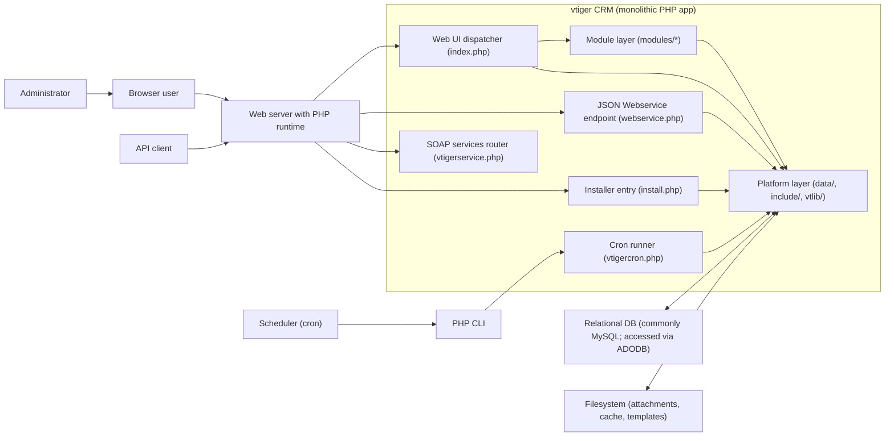
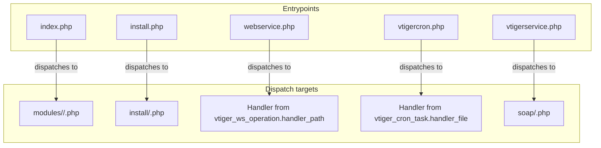
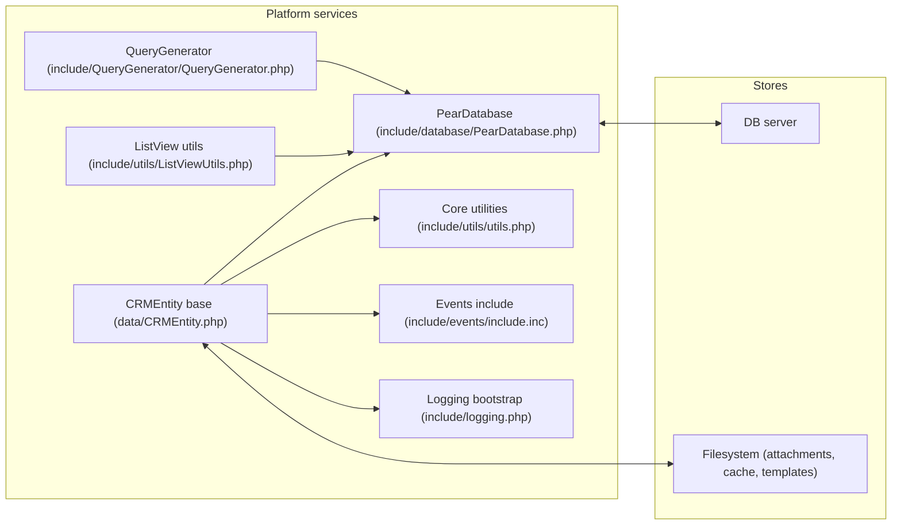
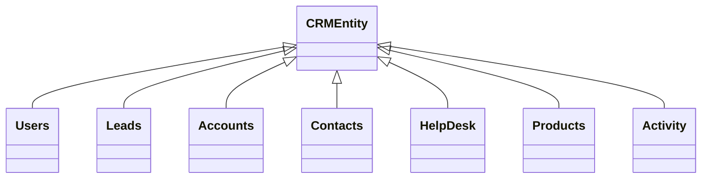
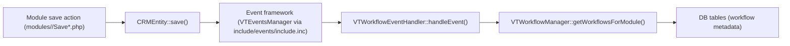

# vtiger CRM Repository Knowledge Graph

## 1. Purpose and scope

This document provides a repository-wide knowledge graph for the vtiger CRM v5.4.0 codebase contained in this repository. The goal is to map the most important runtime entrypoints, the shared platform/framework services, representative modules and their key entity classes, and the principal relationships and dependencies between them.

This is not a per-file call graph. The repository contains thousands of PHP files, especially under `modules/` and `include/`, and many execution paths are dynamically dispatched (for example, `index.php` including `modules/<Module>/<Action>.php`). For that reason, the knowledge graph is organized as a subsystem graph with an explicit “routing edge” for dynamic dispatch, and it highlights key “routing tables” in the database schema that enable metadata-driven behavior (webservice operations, cron tasks, event handlers, and related lists).

## 2. How to read this knowledge graph

The graph is expressed in three complementary ways.

First, there is a node catalog that identifies the major “things” in the system, including entrypoints, platform services, and representative module classes. Second, there is an edge catalog that lists the key relationships with the verb used (for example, “includes”, “dispatches to”, “reads/writes”, “registers”, “triggers”). Third, there are Mermaid diagrams that visualize the same information from several views (context, runtime entrypoints, platform core, automation, and representative inheritance).

When the code uses dynamic behavior (such as including module action scripts based on request parameters, or loading a webservice handler path from database metadata), the graph models that as an explicit edge and names the controlling source of truth (filesystem layout or database tables).

## 3. Node catalog (modules, key classes, and key runtime units)

This catalog lists the most architecturally significant nodes and where they are defined in the repository. The node names are used consistently throughout the edge catalog and diagrams.

### 3.1 Entrypoints (primary “front doors”)

| Node | Type | Responsibility | Evidence |
|---|---|---|---|
| `index.php` | HTTP entrypoint | Web UI front controller; starts session; enforces auth and permissions; validates module/action; includes module action scripts | `index.php` |
| `install.php` | HTTP entrypoint | Installation wizard dispatcher; chooses and includes `install/<step>.php` after file-access checks | `install.php` |
| `webservice.php` | HTTP entrypoint | JSON API dispatcher; resolves operations from DB metadata via `OperationManager`; manages sessions via `SessionManager` | `webservice.php`, `include/Webservices/OperationManager.php`, `include/Webservices/SessionManager.php` |
| `vtigerservice.php` | HTTP entrypoint | SOAP service router; includes a SOAP server script based on `service` parameter | `vtigerservice.php` |
| `vtigercron.php` | CLI/HTTP entrypoint | Cron runner; lists runnable tasks from `vtiger_cron_task` via `Vtiger_Cron`; includes handler files dynamically | `vtigercron.php`, `vtlib/Vtiger/Cron.php` |

### 3.2 Platform core (shared framework layer)

| Node | Type | Responsibility | Evidence |
|---|---|---|---|
| `CRMEntity` | Base class | Common entity CRUD, relationships, security query helpers, attachments, and event triggering; base for module entity classes | `data/CRMEntity.php` |
| `PearDatabase` | Service class | DB abstraction wrapper around ADODB; provides `query`, `pquery`, caching, transactions | `include/database/PearDatabase.php` |
| `VTCacheUtils` | Utility class | Cache layer for module/field/tab metadata to reduce DB lookups | `include/utils/utils.php` |
| ListView utilities | Utility module | Shared list view rendering/value formatting used by many module list views and popups | `include/utils/ListViewUtils.php` |
| `QueryGenerator` | Service class | Constructs module queries using custom views and metadata; used by list views, filters, and search flows | `include/QueryGenerator/QueryGenerator.php` |
| Logging bootstrap | Utility module | Initializes log4php; used by entrypoints and core services | `include/logging.php` |
| Events include | Include module | Loads event framework classes (VTEventsManager, VTEventHandler, condition parser, etc.) | `include/events/include.inc` |
| `Vtiger_Module` | vtlib API class | Module metadata operations; related lists; custom links; webservice enablement; module class resolution | `vtlib/Vtiger/Module.php` |
| `Vtiger_Event` | vtlib API class | Event registration helper and event trigger helper for CRM records | `vtlib/Vtiger/Event.php` |
| `Vtiger_Cron` | vtlib API class | Cron task registry backed by `vtiger_cron_task`; status/frequency control | `vtlib/Vtiger/Cron.php` |
| `Vtiger_Webservice` | vtlib API class | Helper to enable/disable webservice support for entity modules | `vtlib/Vtiger/Webservice.php` |

### 3.3 Webservice stack (JSON API)

| Node | Type | Responsibility | Evidence |
|---|---|---|---|
| `OperationManager` | Service class | Loads operation metadata from DB (`vtiger_ws_operation*`); sanitizes inputs; includes handler file and calls handler method | `include/Webservices/OperationManager.php` |
| `SessionManager` | Service class | Manages stateless webservice sessions via `HTTP_Session` with expiry and idle policies | `include/Webservices/SessionManager.php` |
| Webservices utilities | Utility module | Helper functions for IDs, entity metadata, access checks, entity operations registration, ownership transfer, etc. | `include/Webservices/Utils.php` |

### 3.4 Automation stack (events, workflows, cron)

| Node | Type | Responsibility | Evidence |
|---|---|---|---|
| `VTWorkflowEventHandler` | Event handler class | Evaluates workflows on entity events and performs tasks | `modules/com_vtiger_workflow/VTEventHandler.inc` |
| Install-time bootstrap | Installer logic | Creates schema; registers cron tasks and event handlers (including workflow handler) | `install/CreateTables.inc.php` |
| Cron task registry (`vtiger_cron_task`) | DB table | Defines which cron tasks exist, handler file paths, frequency, status, timestamps | `vtlib/Vtiger/Cron.php`, `vtigercron.php` |

### 3.5 Representative module entity classes (examples)

The repository contains many modules under `modules/`. The list below includes representative “core CRM” entity classes that illustrate the dominant module pattern and highlight high-fan-in modules.

| Module | Key entity class | Notes | Evidence |
|---|---|---|---|
| Users | `Users` | Authentication, preferences, privilege file loading, ownership transfer, admin utilities | `modules/Users/Users.php` |
| Leads | `Leads` | Related lists (activities, campaigns, emails, products), export, relationship operations | `modules/Leads/Leads.php` |
| Accounts | `Accounts` | Many related lists (contacts, potentials, tickets, inventory docs), hierarchy handling | `modules/Accounts/Accounts.php` |
| Contacts | `Contacts` | Many related lists and portal email template composition | `modules/Contacts/Contacts.php` |
| Calendar | `Activity` | Activities, reminders, recurrence, invitees, calendar sharing/access | `modules/Calendar/Activity.php` |
| HelpDesk | `HelpDesk` | Ticket lifecycle, comments, attachments, portal email contents | `modules/HelpDesk/HelpDesk.php` |
| Products | `Products` | Tax/currency/pricebook relations, many related lists, export | `modules/Products/Products.php` |

## 4. Edge catalog (key relationships and dependencies)

This section lists the important edges in a structured form. Each edge is stated as a sentence and then anchored to one or more evidence files.

### 4.1 Request dispatch edges

`index.php` includes `include/utils/utils.php` and `config.inc.php`, validates `module` and `action`, and then dispatches to `modules/<Module>/<Action>.php` via a dynamically constructed filepath.

This design makes filesystem layout (`modules/<Module>/...`) part of the routing contract, and it is the primary reason the module layer is modeled as a family rather than enumerated action files.

Evidence: `index.php`.

`install.php` dispatches to `install/<step>.php` after checking file access, which makes the installer a step-driven wizard whose “routing table” is the `install/` directory.

Evidence: `install.php`.

`webservice.php` dispatches to an operation handler based on database metadata, not on a hardcoded switch statement. It constructs `OperationManager`, which queries `vtiger_ws_operation` and `vtiger_ws_operation_parameters`, and then requires the handler path stored in the database.

Evidence: `webservice.php`, `include/Webservices/OperationManager.php`.

`vtigercron.php` dispatches to cron task handler files based on the database table `vtiger_cron_task`. Each task instance provides `handler_file`, which is then included at runtime.

Evidence: `vtigercron.php`, `vtlib/Vtiger/Cron.php`.

`vtigerservice.php` dispatches SOAP endpoints by including specific scripts under `soap/` based on `service` parameter.

Evidence: `vtigerservice.php`.

### 4.2 Core service dependency edges

Most module entity classes extend `CRMEntity`, and therefore inherit shared CRUD, relation management, attachment handling, and event triggering behavior. The inheritance relationship is part of the architectural contract of the module layer.

Evidence: `data/CRMEntity.php` (base class), representative module classes such as `modules/Leads/Leads.php`, `modules/Accounts/Accounts.php`, `modules/Contacts/Contacts.php`, `modules/Users/Users.php`.

`CRMEntity` uses the global database service `PearDatabase` (global `$adb`) to read and write both generic entity tables (`vtiger_crmentity`, relation tables, attachment tables) and module-specific tables specified by each module.

Evidence: `data/CRMEntity.php`, `include/database/PearDatabase.php`.

The event framework is integrated into entity lifecycle operations: `CRMEntity` triggers events via the vtiger event framework (loaded from `include/events/include.inc`) during save operations, which makes the event subsystem a cross-cutting dependency of all module entities.

Evidence: `data/CRMEntity.php`, `include/events/include.inc`.

### 4.3 Automation edges (events and workflows)

The workflow engine is implemented as an event handler (`VTWorkflowEventHandler`) that is invoked by the event subsystem. It evaluates workflows for a module and performs tasks based on configured conditions.

Evidence: `modules/com_vtiger_workflow/VTEventHandler.inc`, `vtlib/Vtiger/Event.php`.

Install-time bootstrap registers (and configures) many system behaviors including cron tasks and event handlers, making the installer part of the architecture for “dynamic behavior wiring”.

Evidence: `install/CreateTables.inc.php`, `vtlib/Vtiger/Cron.php`, `include/events/include.inc`.

### 4.4 Webservice edges (metadata-driven API)

`OperationManager` reads webservice operation definitions from the database (`vtiger_ws_operation` and `vtiger_ws_operation_parameters`) and uses those to sanitize input parameters and invoke a handler method. This makes the API surface extensible by DB metadata.

Evidence: `include/Webservices/OperationManager.php`, `webservice.php`.

`SessionManager` manages webservice sessions using `HTTP_Session`, with explicit max lifespan and idle time policies. This decouples webservice session identity from cookies by disabling cookie usage and allowing session IDs to be provided via request parameters.

Evidence: `include/Webservices/SessionManager.php`, `webservice.php`.

## 5. Graph views (Mermaid diagrams)

Each diagram is a view of the same underlying node/edge catalog. The diagrams are intentionally subsystem-level rather than per-file.

### 5.1 System context diagram

This diagram shows the vtiger CRM monolith boundary and the main external actors and infrastructure dependencies. The “bundled dependencies” are shown as external libraries from the point of view of vtiger’s application code even though they are vendored into this repository.

The key takeaway is that all runtime modes (UI, API, cron, install) converge on the same platform layer and the same database and filesystem.

### 5.2 Runtime entrypoints and dispatch mechanisms

This view focuses on the concrete dispatch mechanics evidenced in the entrypoint scripts: filesystem-based module dispatch, DB-driven webservice operations, DB-driven cron tasks, and request-parameter-driven SOAP routing.

This diagram is a concise expression of the monolith’s “routing contracts”, which are primarily a mix of filesystem conventions and database metadata tables.

### 5.3 Platform core services and dependencies

This view highlights the platform layer as a set of shared services that all runtime units depend on, with `PearDatabase` and the events system as especially central.

In practical terms, this means that changes to `CRMEntity`, `PearDatabase`, events, or shared utilities have wide blast radius across modules.

### 5.4 Module inheritance view (representative key classes)

This class diagram captures the dominant inheritance relationship: module entity classes extend `CRMEntity`. It is representative, not exhaustive, but it includes high-fan-in modules and the most common CRM entities.

The key reason this matters architecturally is that `CRMEntity` is where shared CRUD behavior, relationship maintenance, attachment persistence, and event triggering live.

### 5.5 Automation view: entity events and workflow execution

This diagram shows the main “automation spine” that connects entity lifecycle changes to workflow execution. The lower-level event framework classes are loaded via `include/events/include.inc`, and workflow evaluation is implemented in `VTWorkflowEventHandler`.

In practice, the event framework makes it possible for module behavior to be modified by configuration and handler registration without changing module controller scripts.

## 6. Dependencies and integration seams

vtiger is a monolith, but it has strong internal “seams” that define integration points and dependencies.

### 6.1 Database dependency seam (ADODB via PearDatabase)

The entire application depends on database access mediated through `PearDatabase`. Because this wrapper uses ADODB internally, the platform can support multiple DB backends in principle, but vtiger deployments commonly use MySQL. The knowledge graph models “DB server” as a single dependency because the entrypoints and platform services all converge on the same `$adb` usage model.

Evidence: `include/database/PearDatabase.php`, `data/CRMEntity.php`.

### 6.2 Webservice metadata seam (operation registry)

The JSON webservice surface is not just code; it is also database metadata. The operational reality is that adding or changing webservice behavior involves both code (handler methods) and DB rows (`vtiger_ws_operation` and `vtiger_ws_operation_parameters`), and the runtime dispatcher (`webservice.php`) is stable.

Evidence: `webservice.php`, `include/Webservices/OperationManager.php`.

### 6.3 Cron metadata seam (task registry)

The cron runner is similarly metadata-driven: tasks are rows in `vtiger_cron_task` that reference handler files. This makes task enabling/disabling and frequency changes a DB operation, and it makes handler-file inclusion part of the execution contract.

Evidence: `vtigercron.php`, `vtlib/Vtiger/Cron.php`, `install/CreateTables.inc.php`.

### 6.4 Events seam (handler registration and triggering)

The event system uses DB-backed registration (`vtiger_eventhandlers` and related mapping tables) and runtime triggering during entity lifecycle. This is a central extensibility mechanism because it can inject behavior into module CRUD without modifying module scripts.

Evidence: `vtlib/Vtiger/Event.php`, `include/events/include.inc`, `data/CRMEntity.php`.

## 7. Notes on completeness and how to extend this graph

This knowledge graph is “complete at the architecture level” in the sense that it captures the major dispatch mechanisms, core services, automation spines, and representative module patterns that apply across the whole repository. It is not complete at the level of enumerating every module action script, every related-list implementation, or every third-party library entrypoint, because doing so would require producing a dense, unstable graph that is not practically readable.

If you need to extend this knowledge graph for a particular feature area, the most effective approach in vtiger is to pick the feature’s entrypoint (usually a module action script), identify its module entity class (usually extending `CRMEntity`), and then trace through either (a) relation tables, (b) QueryGenerator usage, or (c) event/workflow hooks, depending on the feature. The diagrams and catalogs in this document are intended to be the stable “map” that guides that deeper drill-down.

## 8. Sources (evidence trail)

This knowledge graph is grounded in these concrete sources.

### 8.1 Entrypoints

1. `index.php`
2. `install.php`
3. `vtigercron.php`
4. `webservice.php`
5. `vtigerservice.php`

### 8.2 Core platform components

1. `data/CRMEntity.php`
2. `include/database/PearDatabase.php`
3. `include/utils/utils.php`
4. `include/utils/ListViewUtils.php`
5. `include/QueryGenerator/QueryGenerator.php`
6. `include/events/include.inc`
7. `include/logging.php`
8. `vtlib/Vtiger/Module.php`
9. `vtlib/Vtiger/Cron.php`
10. `vtlib/Vtiger/Webservice.php`
11. `vtlib/Vtiger/Event.php`

### 8.3 Webservice stack

1. `include/Webservices/Utils.php`
2. `include/Webservices/OperationManager.php`
3. `include/Webservices/SessionManager.php`

### 8.4 Automation (workflows, events, cron bootstrap)

1. `modules/com_vtiger_workflow/VTEventHandler.inc`
2. `install/CreateTables.inc.php`

### 8.5 Representative modules used for concrete examples

1. `modules/Users/Users.php`
2. `modules/Leads/Leads.php`
3. `modules/Accounts/Accounts.php`
4. `modules/Contacts/Contacts.php`
5. `modules/Calendar/Activity.php`
6. `modules/HelpDesk/HelpDesk.php`
7. `modules/Products/Products.php`

### 8.6 Supporting repository docs used for terminology alignment

1. `Docs/VTigerCRM-Architecture-Overview.md`
2. `Docs/VTigerCRM-Modules-MindMap.md`
