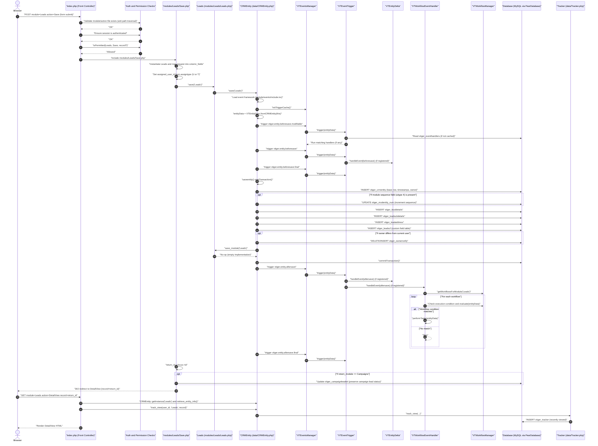

# Lead Creation Flow (Sequence Diagram)

## Overview

This document describes the lead creation flow in vtiger CRM (v5.4.x) from the initial browser request, through `index.php` routing, into the Leads save controller, through the `CRMEntity` save pipeline and database writes, and finally through post-save event and workflow hooks. The diagram also includes the redirect to the Lead DetailView and the “recently viewed” tracking write that happens when the DetailView is opened.

## Mermaid sequence diagram

## Notes on hooks and extensibility

The pre-save and post-save hook points shown in the diagram are implemented in `CRMEntity::save()` using the `VTEventsManager` and `VTEventTrigger` classes. Which handlers execute is determined by rows in the `vtiger_eventhandlers` table, and vtiger caches the active handler set via `VTEventsManager::initTriggerCache()` / `VTEventTrigger` caching logic. In a default installation, `install/CreateTables.inc.php` registers `VTEntityDelta` on both `vtiger.entity.beforesave` and `vtiger.entity.aftersave`, and it registers `VTWorkflowEventHandler` on `vtiger.entity.aftersave` with a dependency on `VTEntityDelta`, which ensures the delta calculation runs before workflows are evaluated.

The actual workflow tasks are data-driven: `VTWorkflowEventHandler` loads workflows for the module (for Leads, the module name resolves to `Leads`) and evaluates each workflow’s execution condition and expression-based rule. When a workflow matches, it calls `performTasks`, which may send emails, update fields, or execute entity methods depending on how workflows are configured in the database.

Although the flow above covers the most common “create lead from UI” path, the same `CRMEntity::save()` pipeline (including events) is also used by other entry points that call `$focus->save($module)` for Leads.
