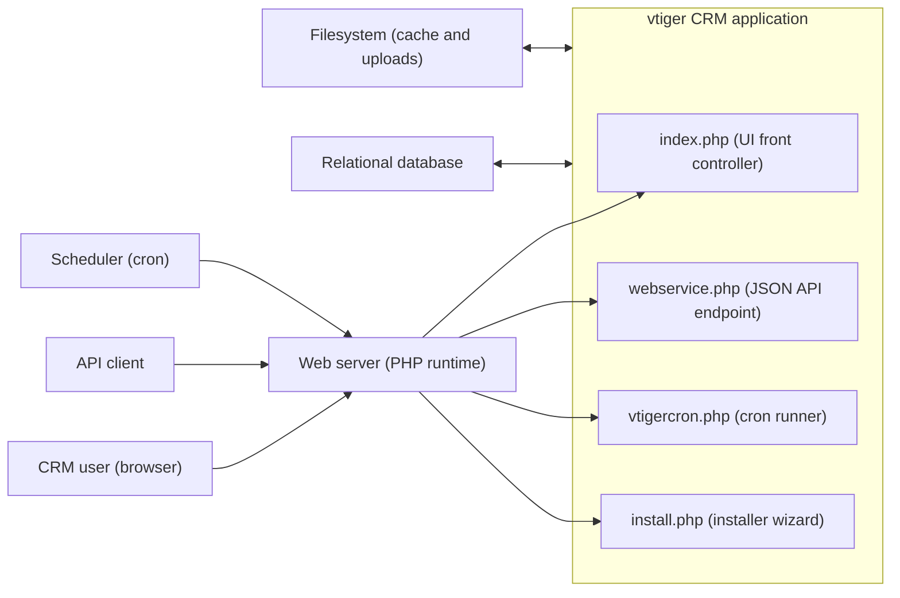
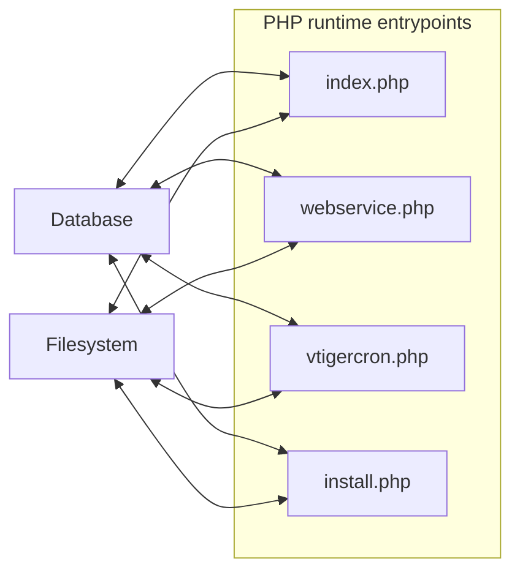
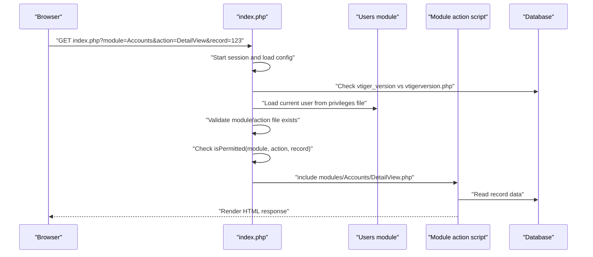
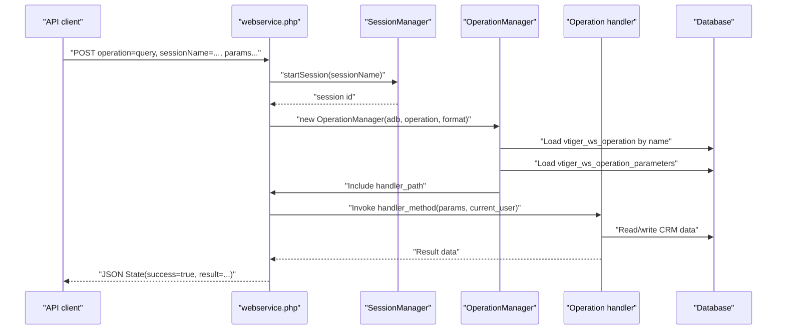
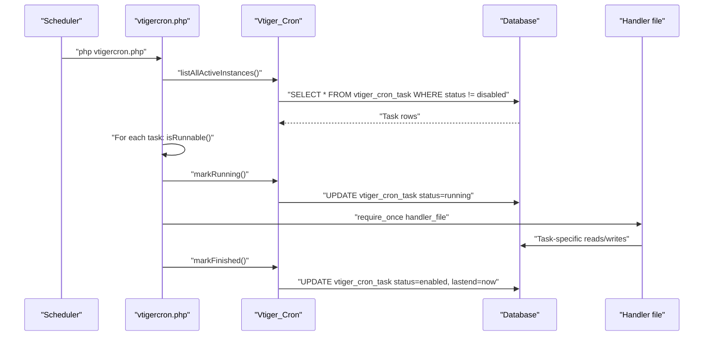

# vtiger CRM v5.4.0 System Documentation

## Overview

This repository contains vtiger CRM v5.4.0, a monolithic, server-rendered PHP CRM application. It is organized as a classic vtiger/SugarCRM-style codebase in which the main front controller (`index.php`) dispatches browser requests to module-specific PHP scripts under `modules/`, while shared platform services (database abstraction, utilities, events/workflows, webservices, cron scheduling, templating, and third-party libraries) live under `include/`, `data/`, `vtlib/`, and vendored library directories such as `adodb/`, `Smarty/`, and `log4php/`.

From an operational perspective, the system supports three primary runtime modes.

The first mode is interactive UI usage via HTTP requests handled by `index.php`. The second mode is programmatic access through a JSON-based webservice endpoint implemented by `webservice.php`. The third mode is scheduled/background execution driven by `vtigercron.php` and the cron framework in `vtlib/Vtiger/Cron.php`, which loads and runs task handler files stored in the database-backed cron registry.

Installation and initial schema and metadata bootstrapping are performed through the browser-based installer (`install.php` and `install/`), which creates database tables from `schema/DatabaseSchema.xml` (via `$adb->createTables("schema/DatabaseSchema.xml")`) and registers key runtime metadata such as event handlers, entity methods, workflows, and cron tasks.

## Architecture and runtime topology

### System context

At a high level, vtiger CRM is a single PHP application (one deployable codebase) that interacts with a relational database and uses the local filesystem for caching and uploads. Humans and API clients interact over HTTP, and a scheduler (or administrator) triggers periodic background execution.

This diagram should be read as “all entrypoints run in the same PHP codebase and talk to the same database and filesystem.” The repository does not include web server configuration (for example, Apache/Nginx vhost configuration), so the web server is shown as an external runtime dependency.

### Runtime units (entrypoints)

The system has multiple entrypoint scripts, each of which should be treated as a distinct “runtime unit” in documentation and operations.

`index.php` is the main UI entrypoint and front controller. It starts sessions, validates installation state, performs authentication and authorization checks, chooses headers/footers behavior, and includes module action scripts like `modules/<Module>/<Action>.php`.

`webservice.php` exposes the JSON API. It resolves the requested “operation” using metadata stored in the database (`vtiger_ws_operation` and `vtiger_ws_operation_parameters`) and then loads and invokes the associated handler implementation.

`vtigercron.php` runs scheduled tasks registered in the cron table (`vtiger_cron_task`). It includes each task’s handler file (as stored in the database) and tracks task state and timestamps.

`install.php` is the installation wizard entrypoint. It includes a specific wizard step file from `install/` and coordinates generation of runtime configuration and schema initialization.

### Key internal subsystems and directories

The repository is structured in layers that are used consistently across all modules.

The `modules/` directory contains the functional CRM modules (for example, Accounts, Contacts, Leads, Calendar, Documents, HelpDesk, Reports, and Settings). Module “controller” actions are typically implemented as PHP scripts such as `ListView.php`, `DetailView.php`, `EditView.php`, `Save.php`, `Delete.php`, and `*Ajax.php`.

The `data/` directory contains core data model infrastructure. In particular, `data/CRMEntity.php` defines the base class that most entity modules inherit from and implements the shared persistence pipeline and event triggers.

The `include/` directory contains cross-cutting framework services. Examples include database abstraction (`include/database/PearDatabase.php`), webservice infrastructure (`include/Webservices/*`), UI libraries and scripts (`include/js`, `include/jquery`, `include/scriptaculous`, `include/ckeditor`), and sanitization (`include/htmlpurifier` used by `vtlib_purify` in `include/utils/VtlibUtils.php`).

The `vtlib/` directory provides vtiger’s extension framework. It includes, among other things, the cron task abstraction (`vtlib/Vtiger/Cron.php`) and module management APIs (for example, module enable/disable and link registration, as seen in installation logic that uses `Vtiger_Module` and `Vtiger_Field`).

Vendored third-party libraries are included directly in the repository, including ADODB (`adodb/`), Smarty (`Smarty/`), log4php (`log4php/` and `log4php.debug/`), Zend JSON (`include/Zend/Json.php`), HTMLPurifier (`include/htmlpurifier/`), CKEditor (`include/ckeditor/`), and TCPDF (`tcpdf/`).

## Core modules and functional areas

vtiger CRM organizes functionality into modules located under `modules/`. Each module generally provides both UI action scripts and an entity class that extends `CRMEntity`. The module list is large in this repository; the sections below describe the most important functional groupings and how they fit into the architecture.

### Sales and customer management modules

The core CRM “records” are implemented as entity modules which follow vtiger’s shared entity pattern: the record has a row in `vtiger_crmentity` plus rows in module-specific tables declared by the module’s entity class. The installer and data model documentation show that vtiger’s schema and module persistence are designed around this pattern.

The Leads, Accounts, Contacts, and Potentials (Opportunities) modules are key examples of these modules. They are also referenced by the installer (`install/CreateTables.inc.php` requires module entity files such as `modules/Leads/Leads.php`, `modules/Contacts/Contacts.php`, and `modules/Accounts/Accounts.php`) because installation performs initial bootstrapping that depends on module classes being available.

Inventory-related modules such as Quotes, SalesOrder, PurchaseOrder, and Invoice follow the same module pattern. The installer registers entity methods and workflows that apply to these modules, including inventory update entity methods and default workflows for invoice stock updates.

### Support and service modules

HelpDesk provides ticketing support. It is notable in installation because `install/CreateTables.inc.php` registers an event handler for HelpDesk records (`vtiger.entity.aftersave.final` mapped to `modules/HelpDesk/HelpDeskHandler.php`) and also registers entity methods used by workflows (for example, portal-related ticket notifications and owner/parent notifications).

The Calendar module manages tasks and events. It is used both as a user-facing module and in the background through reminder cron tasks (`registerCronTasks` registers `cron/SendReminder.service` under the `Calendar` module).

### Marketing and analytics modules

Campaigns supports marketing campaign records and relationships to leads, contacts, and accounts. Reports provides reporting and scheduled report generation (the installer registers a `ScheduleReports` cron task at `cron/modules/Reports/ScheduleReports.service`).

Dashboard and Home provide user home pages and widgets, and these areas interact with performance configuration such as `HOME_PAGE_WIDGET_GROUP_SIZE` in `config.performance.php`.

### Administration modules

The Settings module provides administrative functions including system configuration, module management, mail scanner configuration, and other setup. The installer registers a `MailScanner` cron task under the Settings module (`cron/MailScanner.service`), reflecting that some administrative features run in the background.

Users is the authentication and identity module used by the main entrypoint. `index.php` requires `modules/Users/Users.php` and loads the current user session through `Users::retrieveCurrentUserInfoFromFile(...)`.

### Workflow engine

The workflow engine is implemented by the `com_vtiger_workflow` module under `modules/com_vtiger_workflow/`. It is integrated at multiple levels.

During installation, `install/CreateTables.inc.php` registers workflow-related event handlers, including `VTWorkflowEventHandler` mapped to `modules/com_vtiger_workflow/VTEventHandler.inc` on entity “aftersave” and “afterrestore” events. The installer also registers a dedicated `Workflow` cron task at `cron/modules/com_vtiger_workflow/com_vtiger_workflow.service`.

In addition to event-driven workflows, the installer calls `populateDefaultWorkflows($adb)` to create default workflows and tasks in the workflow tables (for example, email tasks and entity method tasks).

## Key workflows and request lifecycles

### Installation workflow

Installation is initiated when `index.php` detects that `config.inc.php` is missing or uninitialized and redirects the browser to `install.php`. The installer then chooses a step file from `install/` based on `$_REQUEST['file']` and includes it.

`install/CreateTables.php` is one of the final steps. It validates a session `auth_key` and then includes `install/CreateTables.inc.php` to create tables and populate essential metadata. After module installation steps, it optionally populates demo/seed data by triggering an Ajax request to `install.php` with `file=PopulateSeedData.php` before completing the installation.

The installer’s schema creation is performed by calling `$adb->createTables("schema/DatabaseSchema.xml")` (as shown in `install/CreateTables.inc.php`). After schema creation, the installer sets up roles/profiles, creates an admin user, populates picklist and non-picklist combo tables, writes tab metadata files, and registers events, entity methods, default workflows, and cron jobs.

### Web UI request lifecycle (index.php dispatch)

The web UI is fronted by `index.php`, which performs a predictable set of steps before it includes and runs module code.

It ensures the PHP version is at least 5.2.0 and sets the response charset header based on the current language or default charset configuration. It normalizes request globals when `magic_quotes_gpc` is enabled. It starts a PHP session and configures KCFinder session settings (used for file browsing / uploads integration).

It checks installation state by verifying `config.inc.php` exists and contains initialized database configuration values. If not, it redirects to `install.php`.

It compares the code version from `vtigerversion.php` (which sets `$vtiger_current_version = '5.4.0'`) with the database version stored in `vtiger_version`. If versions do not match, it halts with a migration-incomplete message.

It initializes logging via `include/logging.php` and then checks whether there is an authenticated user in the session. Authentication is validated by checking both `$_SESSION["authenticated_user_id"]` and that `$_SESSION["app_unique_key"]` matches `$application_unique_key` from configuration. If authentication is missing, it forces a login by including `modules/Users/Login.php`.

Once authenticated, it evaluates whether the requested module and action are valid and safe to include. `index.php` includes an explicit path traversal / file disclosure defense by scanning `modules/` and verifying that `module` is a real directory and that `action.php` exists in that module directory, while also rejecting module names with path separators. It also checks that `record` IDs are numeric when provided.

It decides whether to render standard headers/footers. Many actions are treated as “skip headers” (popups, downloads, Ajax-like endpoints, exports, etc.). For standard requests, it includes `modules/Vtiger/header.php` and later `modules/Vtiger/footer.php`.

It enforces authorization by calling `isPermitted($module, $action, [$record])` unless the request qualifies for `skipSecurityCheck` (for example, some `Users`, `Home`, or `uploads` paths). If permission is denied or if the module is disabled (`vtlib_isModuleActive($currentModule)` returns false), it prints a styled denial page.

Finally, it includes the module action file determined by `modules/<module>/<action>.php` (with some special cases such as unified search) and lets that script render output.

The following sequence diagram shows the “happy path” for a typical page request with an already-authenticated session.

### Authentication and authorization workflow

Authentication for the web UI is session-based. `index.php` considers the session authenticated when both an authenticated user ID is present and the session “application key” matches the configured `$application_unique_key`. This is a guard against reusing sessions across different deployments with different application keys.

Authorization is enforced by `isPermitted(...)` for most modules and actions. The code determines whether the action should be treated as an “Ajax” operation, and for Ajax requests it may choose the permission action based on `$_REQUEST['file']` or `$_REQUEST['ajxaction']`. The permission system relies on user privilege and sharing files stored under `user_privileges/`, which are generated and updated by the system (for example, the installer calls `createUserPrivilegesfile(...)` and `createUserSharingPrivilegesfile(...)` for the admin user).

### Persistence workflow (CRMEntity save pipeline)

vtiger’s persistence model is module-driven but uses a shared base class. `data/CRMEntity.php` implements the default `save(...)` pipeline, which wraps entity saving in event triggers and database transactions.

When a module entity’s `save($module_name)` is invoked, it initializes the events subsystem (`include/events/include.inc`) and triggers a set of events, including `vtiger.entity.beforesave.modifiable`, `vtiger.entity.beforesave`, and `vtiger.entity.beforesave.final`. It then calls `saveentity(...)` which starts a transaction, inserts or updates the record’s row in `vtiger_crmentity`, and then inserts or updates module-specific tables listed in the entity’s `$tab_name` array. After the module-specific `save_module` hook is called, the transaction is completed. Finally, “after save” events are triggered (`vtiger.entity.aftersave` and `vtiger.entity.aftersave.final`).

This design is important for workflows and automation because workflow and event handlers can be triggered both before and after the record is persisted.

### Webservice API workflow (webservice.php)

The JSON webservice endpoint is implemented by `webservice.php`. It is designed as a metadata-driven dispatcher.

The endpoint reads the requested operation from `$_REQUEST["operation"]` and uses `include/Webservices/OperationManager.php` to look up operation metadata from the database table `vtiger_ws_operation`. The operation parameters are read from `vtiger_ws_operation_parameters` and used for input sanitization and type handling.

Webservice sessions are managed by `include/Webservices/SessionManager.php`, which uses `include/HTTP_Session/Session.php`. Cookies are disabled for this session subsystem (`HTTP_Session::useCookies(false)`), and the session identifier is passed explicitly (as `sessionName` or via `PHPSESSID` in some extend-session cases). The session manager enforces both a maximum lifespan (default 86400 seconds) and an idle timeout (default 1800 seconds), and throws webservice exceptions when sessions expire, idle out, or are invalid.

A typical authenticated operation flow is shown below.

The combination of `vtiger_ws_operation` metadata and dynamic `require_once($handlerPath)` means the API surface can be extended (or modified) by updating operation metadata and deploying handler code, without changing the `webservice.php` dispatcher.

### Cron workflow (vtigercron.php and Vtiger_Cron)

Scheduled background work is driven by `vtigercron.php`, which is expected to be run by the system scheduler (for example, Linux cron) using the PHP CLI. The script also contains a web-access guard: it permits execution only when either `PHP_SAPI === "cli"` or the request is associated with an authenticated vtiger session whose `app_unique_key` matches configuration.

Cron tasks are stored in the database table `vtiger_cron_task` and exposed through the `Vtiger_Cron` class in `vtlib/Vtiger/Cron.php`. If the cron table does not exist, `Vtiger_Cron` can create it automatically (schema initialization occurs within `Vtiger_Cron::initializeSchema`).

During installation, `install/CreateTables.inc.php` registers several default cron tasks through `Vtiger_Cron::register(...)`, including workflow processing, recurring invoice creation, reminders, scheduled reports, and mail scanner execution.

At runtime, `vtigercron.php` either runs a specific service (`?service=<name>`) or runs all active instances (`Vtiger_Cron::listAllActiveInstances()`). For each task it checks whether it is runnable based on `frequency` and last-run timestamps, marks it running, includes the handler file, and then marks it finished.

## Data model and storage

### Database modeling conventions

vtiger uses a consistent “CRM entity” pattern for most business records. A record typically has a corresponding row in `vtiger_crmentity` (identity, audit fields, ownership, and soft delete flag) and one or more module-specific tables that share the same ID value as the primary key.

Soft deletion is implemented via `vtiger_crmentity.deleted`, and most queries filter out deleted records (`deleted = 0`). Ownership is implemented via `vtiger_crmentity.smownerid`, which can reference either a user (`vtiger_users.id`) or a group (`vtiger_groups.groupid`).

Field metadata is stored in tables such as `vtiger_tab` (module metadata) and `vtiger_field` (field metadata including `tablename`, `columnname`, `uitype`, and `typeofdata`). This metadata-driven design supports consistent query generation, UI rendering, webservice entity introspection, and import/export behavior.

### Database initialization and schema creation

During installation, `install/CreateTables.inc.php` calls `$adb->createTables("schema/DatabaseSchema.xml")` to create the initial schema. The installer then populates required seed metadata such as roles, profiles, and permissions, and registers runtime metadata for events, workflows, entity methods, and cron tasks.

The repository includes an existing documentation extract of the model in `Docs/data_model.md`. That document describes both table conventions and key relationship tables (for example, `vtiger_crmentityrel`, `vtiger_seactivityrel`, `vtiger_senotesrel`, and `vtiger_seattachmentsrel`) that are used to link records across modules.

### Webservice metadata tables

The webservice layer is driven by database metadata. `include/Webservices/OperationManager.php` queries `vtiger_ws_operation` by name to resolve an operation’s handler type, handler file path, handler method, and whether it is a pre-login operation. It then loads parameter metadata from `vtiger_ws_operation_parameters` and uses that to sanitize input and decode complex types.

This means webservice capabilities are not only a code concern but also a database configuration concern; changes to these tables change which operations are available and how they are invoked.

### Cron metadata table

Cron tasks are stored in `vtiger_cron_task`, which includes fields such as task name, handler file, frequency, last-start/end timestamps, and status. The `Vtiger_Cron` class provides methods to register and deregister tasks, check runnability, and update status.

### Version tracking table

The main entrypoint uses the database table `vtiger_version` to validate that the database schema/version matches the code version defined in `vtigerversion.php`. If they do not match, the UI halts and instructs the operator to complete migration.

### Filesystem storage

vtiger uses the filesystem for multiple purposes that are exposed by configuration and code.

Caching and temporary data directories are configured in `config.template.php` using values such as `$cache_dir`, `$tmp_dir`, `$import_dir`, and `$upload_dir`. The repository includes `cache/` subdirectories like `cache/images/`, `cache/import/`, and `cache/upload/` in the default layout.

File uploads and attachments are represented in the database via `vtiger_attachments` and linked to records through `vtiger_seattachmentsrel`. `data/CRMEntity.php` shows an `uploadAndSaveFile(...)` implementation that uses `move_uploaded_file` to store uploaded file content under a file path resolved by application logic and then records metadata and the relationship in the database.

The UI entrypoint initializes KCFinder settings in the session, including `uploadURL` and `uploadDir` values, indicating that file browsing and uploads can be mediated through that library.

## Configuration and tuning

### Primary runtime configuration

The application expects a runtime configuration file `config.inc.php`. `index.php` treats a missing `config.inc.php` as “not installed” and redirects to the installer. In this repository snapshot, `config.inc.php` is present but empty, which is consistent with it being generated by the installer during a real deployment.

The repository includes `config.template.php`, which contains the configuration keys that the installer populates. This includes database connection details (`$dbconfig[...]`), file paths (`$root_directory`, `$cache_dir`, `$upload_dir`), UI defaults (`$default_module`, `$default_action`, `$default_theme`, `$default_language`, `$default_charset`), and other runtime toggles such as export controls and upload size limits.

The installer also supports a database config file `config.db.php` (referenced by `install.php`), which contains installation-time database connection configuration and optional quickbuild settings (`$vtconfig['quickbuild']`).

### Overrides

`index.php` optionally loads `config_override.php` if it exists. This file is intended to provide default user settings and overrides without editing generated configuration.

### Performance configuration

The repository includes `config.performance.php`, which defines `$PERFORMANCE_CONFIG` tuning values. This file controls behaviors such as whether log4php debugging is enabled (`LOG4PHP_DEBUG`), whether SQL logging captures caller information, whether `SET NAMES` can be avoided (`DB_DEFAULT_CHARSET_UTF8`), and list view/detail view behaviors that can affect performance as datasets grow.

### Logging configuration

Logging is initialized in `include/logging.php`, which selects between `log4php/` and `log4php.debug/` based on `config.performance.php` (`LOG4PHP_DEBUG`). It configures logging using `log4php.properties`.

`log4php.properties` defines multiple loggers and rolling file appenders, writing to files under `logs/`, including `logs/vtigercrm.log`, `logs/security.log`, `logs/installation.log`, `logs/migration.log`, `logs/soap.log`, `logs/platform.log`, and `logs/sqltime.log`.

## Dependencies

vtiger CRM vendors many of its third-party dependencies directly in this repository. The list below summarizes the most important dependencies as evidenced by includes and directory presence.

### Bundled libraries

The system uses ADODB as its primary database abstraction and schema toolset (the installer and platform layer rely on it). It uses Smarty for server-side templating. It uses log4php for logging. It uses Zend JSON for JSON encoding/decoding in the webservice layer. It uses HTMLPurifier as a core sanitization mechanism, which is wrapped by `vtlib_purify(...)` in `include/utils/VtlibUtils.php`. It includes CKEditor for rich text editing and TCPDF for PDF generation.

The repository also includes a webservice session library (`include/HTTP_Session/Session.php`) used by the JSON API. It includes various JavaScript/UI libraries (Prototype/Scriptaculous, jscalendar) and a file manager (KCFinder) used by the UI/editor stack.

| Dependency | Location in repo | Primary purpose in system |
|---|---|---|
| ADODB | `adodb/` | Database abstraction and schema creation (used by installer and DB layer). |
| Smarty | `Smarty/` | Server-rendered templates and module UI rendering. |
| log4php | `log4php/`, `log4php.debug/`, `log4php.properties` | Structured application logging to rolling files under `logs/`. |
| Zend JSON | `include/Zend/Json.php` | JSON encoding/decoding for webservices and other utilities. |
| HTMLPurifier | `include/htmlpurifier/` | Input sanitization used by `vtlib_purify`. |
| CKEditor | `include/ckeditor/` | Rich text editor integration in the UI. |
| TCPDF | `tcpdf/`, `include/tcpdf/` | PDF generation for CRM documents and inventory modules. |
| HTTP_Session | `include/HTTP_Session/Session.php` | Webservice session management (cookie-less sessions). |
| KCFinder | `kcfinder/` | Browser-based file manager for uploads and editor file selection. |
| NuSOAP / SOAP support | `include/nusoap/`, `soap/` | SOAP-related integration support (legacy/alternate interfaces). |

### External runtime dependencies

Because this is a PHP web application, it requires a PHP-capable web server runtime. The repository does not provide web server configuration, so operator choices (Apache vs Nginx, PHP-FPM configuration, etc.) are environment-specific.

A relational database is required. Configuration templates support multiple database types (`$dbconfig['db_type']`), and ADODB drivers for multiple DBs are present. The most common deployment is MySQL, but exact DB choice is a deployment decision.

Scheduled execution requires a scheduler that periodically runs `php vtigercron.php`. The minimum recommended cron frequency is set by `$MINIMUM_CRON_FREQUENCY = 15` (minutes) in `config.template.php`, and the installer registers default tasks whose recommended frequencies match that expectation (for example, 900 seconds for workflow, reminders, report scheduling, and mail scanner tasks).

## Operational notes

### Running the application

The UI entrypoint is `index.php`. It expects a valid installation and configuration; if configuration is absent or incomplete it redirects to `install.php`.

The JSON API is accessed through `webservice.php`. Clients must perform a login-like operation (a pre-login operation) to obtain a session name, and then include that session identifier on subsequent calls. Session idle and lifetime behavior is enforced by `include/Webservices/SessionManager.php`.

Cron execution is performed through `vtigercron.php`, typically by the PHP CLI. The script can run all services or a specific named service (via the `service` request parameter).

### Logs

Log files are configured through `log4php.properties` and written under `logs/`. The effective log directory configuration depends on whether log4php debug mode is enabled (controlled by `config.performance.php`).

### Security model (high-level)

The UI entrypoint includes explicit file inclusion validation to prevent module/action path traversal and also enforces record ID numeric validation for `record` parameters.

Input sanitization is supported by `vtlib_purify(...)`, which uses HTMLPurifier and recursively purifies array inputs as well as scalar inputs. This function is used by `index.php` for some printing-related request-string construction and is used widely throughout the codebase.

Authorization is enforced by `isPermitted(...)` with module/action context, and module activation state is enforced by `vtlib_isModuleActive(...)` which checks module presence/presence flags.

The webservice endpoint enforces authentication for non-prelogin operations and enforces session expiry and idleness.

Cron execution is restricted to CLI execution or to an authenticated session context with a matching application unique key.

## References and related repository documents

This consolidated document is intended to be a top-level “system view.” The repository includes more focused documentation artifacts that can be used for deeper dives.

`Docs/VTigerCRM-Architecture-Overview.md` provides a narrative architecture overview of the monolith and its major entrypoints and subsystems.

`Docs/dependency_map.md` provides a module-level and class-level dependency map, including Mermaid diagrams describing major internal dependencies and dynamic inclusion behavior.

`Docs/data_model.md` provides a data-model-focused view of key tables and relationships and includes a relationship diagram.

## Appendix: entrypoint quick reference

The following files are the most important “starting points” for understanding how code executes at runtime.

`index.php` is the front controller for server-rendered UI.

`webservice.php` is the JSON webservice API endpoint.

`vtigercron.php` is the scheduled task runner.

`install.php` is the installation wizard entrypoint.

`install/CreateTables.inc.php` creates tables from `schema/DatabaseSchema.xml` and registers events, entity methods, workflows, and cron tasks.

`data/CRMEntity.php` is the base entity persistence and event trigger implementation.

`include/Webservices/OperationManager.php` is the DB-driven operation dispatcher for the webservice layer.

`vtlib/Vtiger/Cron.php` is the DB-driven cron task registry and state model.
